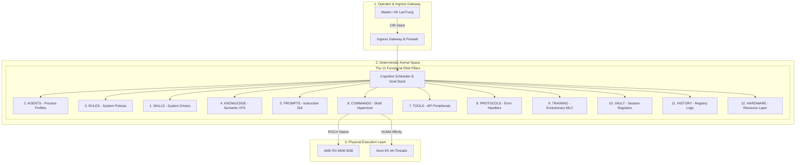

<!-- 
[ZENITH FILE DIRECTIVE]
- File: README.md
- Role: High-Level Architecture & DNA (v6.0).
- Ownership: Mr LeeTrung
- Status: Active | Version: SDS v19.9
[WORKING PRINCIPLES]:
1. [DNA-PRESERVATION]: Tuyệt đối không xóa bỏ 12 Trụ cột DNA và cấu trúc Ban điều hành.
2. [KERNEL-AWARENESS]: Phải hiểu rõ sự phân tách giữa Kernel Space và User Space.
3. [ENTRY-POINT]: Đóng vai trò là bản đồ đại thể cho người mới (Onboarding).
-->
# 🏛️ JKAI ZENITH: MICROKERNEL-INSPIRED COGNITIVE RUNTIME SUBSTRATE (v6.0)
**"Deterministic Kernel Space Control — Isolated Sandbox Execution — Multi-Tier Cognitive Substrate"**

> [!IMPORTANT]
> **ĐẶC TẢ KIẾN TRÚC**: JKAI Zenith là một **Hệ điều hành Nhận thức (Cognitive OS)** lấy cảm hứng từ cấu trúc Microkernel. Hệ thống thực thi cơ chế bóc tách triệt để giữa **Không gian Nhân định tính (Deterministic Kernel)** và **Không gian Nhận thức xác suất (Probabilistic User Space)**, đảm bảo tính toàn vẹn hệ thống tuyệt đối trên hạ tầng Xeon E5 & GPU AMD RX 6600.

---

## 🧠 NEURAL ARCHITECTURE (SƠ ĐỒ HỆ THẦN KINH)

---

## 🧬 THE 12 DNA PILLARS (12 TRỤ CỘT HỆ THỐNG)
Hệ thống tổ chức tài nguyên và dữ liệu thành 12 phân khu độc lập:

1.  **SKILLS**: Trình điều khiển tác vụ (Surgical Code, Git, AST).
2.  **AGENTS**: Hồ sơ đặc vụ (Planner, Critic, Executor).
3.  **RULES**: Hiến pháp & Quy chế nhân (Sovereign Rules).
4.  **KNOWLEDGE**: Hệ tập tin ngữ nghĩa ảo (Qdrant & Obsidian).
5.  **PROMPTS**: Kiến trúc tập chỉ lệnh ISA (Prompt Forge).
6.  **COMMANDS**: Cổng thực thi Shell Hypervisor (PowerShell/Docker).
7.  **TOOLS**: Cổng kết nối ngoại vi & API (GitHub, Tavily).
8.  **PROTOCOLS**: Hệ thống phản xạ chịu lỗi & Self-Healing.
9.  **TRAINING**: Bộ biên dịch trí nhớ tiến hóa (MLC).
10. **VAULT**: Thanh ghi phiên làm việc (Redis/RAM Cache).
11. **HISTORY**: Nhật ký tiến hóa kiến trúc (SSoT Changelog).
12. **HARDWARE**: Tầng quản lý tài nguyên bare-metal.

---

## 🏛️ SWARM EXECUTIVE BOARD (BAN ĐIỀU HÀNH SWARM)
Được điều phối bởi **Nội các Trung ương (The Core Cabinet)**:

| Vị trí | Bí danh Đặc vụ | Vai trò Chiến lược |
| :--- | :--- | :--- |
| **MASTER** | **Master** | Lõi chủ quyền tối cao (Mr LeeTrung). |
| **TỔNG TƯ LỆNH** | **Zenith_Planner** | Kiến trúc sư lộ trình & Blueprint. |
| **QUAN TÒA TỐI CAO** | **Zenith_Critic** | Thẩm định Judicial & Rà soát rủi ro. |
| **CHIẾN BINH PHẪU THUẬT** | **Zenith_Executor** | Thực thi mã nguồn & Surgical Intervention. |
| **QUÂN SƯ CỬA NGÕ** | **Zenith_Receptionist** | Lọc nhiễu ý định & Điều phối Swarm. |

---

## ⚡ OPERATIONAL EXCELLENCE (KỶ LUẬT VẬN HÀNH)
*   **Separation of Powers**: Bóc tách triệt để LLM khỏi Shell hệ thống.
*   **Zero-Trust Security**: Mọi câu lệnh phải qua `PolicyProofEngine`.
*   **Event Sourcing**: Lưu trữ vết trạng thái nguyên tử SQLite (SSoT).
*   **Hardware Affinity**: Tối ưu hóa NUMA & VRAM cho hiệu năng cực đại.
*   **Surgical Intervention**: Can thiệp mã nguồn chính xác từng dòng (Anti-Patching).

---

## 🧭 PROJECT STRUCTURE (CẤU TRÚC DỰ ÁN)
*   `core/homunculus/`: Quản lý DNA dự án và Vùng làm việc Chủ quyền (.zenith/).
*   `core/kernel/`: Nhân điều phối nhận thức (Scheduler, Event Bus).
*   `core/utils/`: Động cơ hệ thống & Registry (engine.py, registry.py).
*   `services/ai-brain/`: Tầng tiếp nhận & Lập kế hoạch (Gateway, Receptionist).
*   `services/ai-executor/`: Tầng thực thi cô lập (Sandbox, Surgery Engine).
*   `intelligence/`: Kho lưu trữ tri thức & Hiến pháp (Obsidian Vault).
*   `JKAI_MAP/`: Bản đồ kỹ thuật nơ-ron thực địa.

---
*JKAI Zenith v6.1. Sovereign Workspace & Project-Scoped Intelligence. Optimized for Sovereign Singularity.* 🏛️⚙️🛡️
