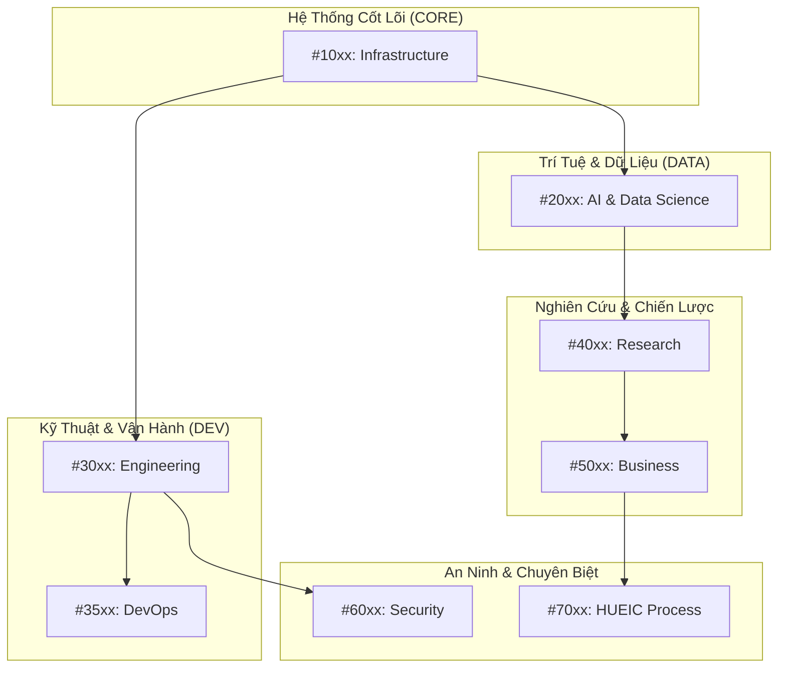

<!-- 
[ZENITH FILE DIRECTIVE]
- File: MAP_SKILLS.md
- Role: Elite Skill Map & Neural Registry.
- Ownership: Mr LeeTrung
- Status: Active | Version: SDS v19.9
[WORKING PRINCIPLES]:
1. [ID-GOVERNANCE]: Tuyệt đối tuân thủ dải ID phân khu (10xx: Core, 2xxx: Data, 3xxx: Dev...).
2. [REGULATED-MANUAL-EDIT]: Cho phép sửa thủ công nhưng BẮT BUỘC: STT phải liên tục, ID không trùng lặp và đúng phân khu.
3. [SSoT-SYNC]: Mọi thay đổi thủ công trên file này phải được cập nhật đồng bộ vào `registry_Map_skills.json`.
-->
# 🗺️ ZENITH COMMAND DECK: BẢN ĐỒ KỸ NĂNG TÁC CHIẾN (v16.3)

## 🧠 NEURAL TOPOLOGY (SƠ ĐỒ NƠ-RON TỔNG THỂ)

> [!NOTE]
> Bảng điều khiển trung tâm quản trị toàn bộ siêu năng lực của Zenith Kernel. Định dạng bảng được tối ưu hóa cho tầm nhìn Elite.

---

## MỤC I: HẠ TẦNG & HỆ THỐNG CỐT LÕI (CORE & SYSTEMS)

| STT | Tên Kỹ Năng & Tính Năng Chi Tiết | Keywords | Skill Con (ID) | Loại |
| :--- | :--- | :--- | :--- | :--- |
| **#1001** | **Browser Vision Ops (Thiên Nhãn)**: DUYỆT ZENITH là kỹ năng thị giác và chẩn đoán tối cao... | quan sát web, duyệt web, browser vision, thiên nhãn, debug trình duyệt, inspect network, kiểm tra hiệu năng web, browser audit | #4003, #4004 | Core |
| **#1002** | **Hội Đồng Nơ-ron Zenith**: Đây là cơ chế "Quản trị Tập thể" (Collective Governance) của Zenith. Khi đối mặt với một vấn đề phức tạp hoặc rủi ro cao, hệ thống không chỉ dựa vào một luồng suy luận duy nhất mà triệu tập một hội đồng gồm các Đặc vụ có chuyên môn khác nhau để tranh luận và tìm ra giải pháp tối ưu nhất. | Tính năng: Parallel Deliberation (Tranh biện Song song):; THE ARCHITECT (Planner): Kiến trúc sư trưởng, tập trung vào giải pháp tối ưu, nhanh chóng và hiệu quả. Sử dụng DeepSeek-R1 để tư duy sâu.; THE AUDITOR (Critic): Kiểm toán viên độc lập. Bắt buộc phải tìm ra ít nhất 3 điểm yếu chí mạng hoặc lý do giải pháp của Architect sẽ thất bại.; Judicial Protocol (Giao thức Phán quyết):; Auditor sử dụng 10 câu hỏi Mental OS để thẩm định Blueprint.; Architect phải giải trình (Reasoning Defense) cho mọi nghi vấn của Auditor.; Mission Logging: Mỗi phiên tranh biện được ghi lại chi tiết luồng đối đầu để Master kiểm duyệt. | tranh biện, họp hội đồng, debate, council meeting, đa chiều | #1005, NEURAL_LINK_AGGREGATOR | Core |
| **#1003** | **Nhập Khẩu Kỹ Năng Mới (Import Skill)**: Giác quan "vị giác" của Zenith. Nó nếm trải tri thức mới, lọc bỏ độc tố và giữ lại tinh túy. | nhập khẩu kỹ năng, import skill, đồng hóa | #1024, GLOBAL_SYSTEM_CONTEXT | Core |
| **#1004** | **Phản xạ Tự trị: Tự động kiểm định Lint/Test/Build sau khi thay đổi code.**: Đây là "Hệ Thần kinh Phản xạ" (Autonomic Nervous System) của Zenith. NEURAL_REFLEX_GUARD không đợi mệnh lệnh từ Master để kiểm tra lỗi; nó hoạt động như một phản xạ tự nhiên của cơ thể. Mỗi khi có một sự thay đổi trong mã nguồn (Code modification), kỹ năng này sẽ tự động được kích hoạt để thực hiện chuỗi kiểm định: Linting (rà soát cú pháp), Testing (kiểm tra logic), và Building (xác nhận khả năng vận hành). Nó đảm bảo rằng mọi thay đổi đều "sạch" và không gây ra tác động dây chuyền tiêu cực trước khi Master kịp nhận ra. | Tính năng: Environment Auto-Detection: Tự động nhận diện ngôn ngữ lập trình (Python, JS, TypeScript, Go...) và môi trường (Docker, Node, Venv) để chọn công cụ kiểm định phù hợp.; Micro-Verification Loop: Thực hiện kiểm tra cục bộ trên phạm vi tệp tin bị thay đổi để tối ưu hóa tốc độ, thay vì quét toàn bộ dự án khổng lồ.; Reflex Feedback: Nếu phát hiện lỗi, nó sẽ tự động phân tích và cung cấp giải pháp sửa lỗi ngay lập tức, hoặc phối hợp với `SELF_HEALING_SENTINEL` để tự vá lỗi. | phản xạ tự trị, kiểm tra tự động, lint and test, reflex guard, verify changes | SELF_HEALING, #3501, VERIFICATION_QA | Core |
| **#1005** | **Lò Đúc Tiến Hóa Vạn Vật**: Đây là "Lò đúc" của sự thay đổi. Nó không chỉ quan sát, nó kiến tạo tương lai cho Zenith. | tiến hóa, nâng cấp hệ thống, evolve, technology scan | #1002, #1024 | Core |
| **#1006** | **Zenith Omni Search (v8.0)**: Đây là "Hệ thống Truy xuất Toàn năng" (Omni-Retrieval System) của Zenith. Không chỉ đơn thuần là tìm kiếm, nó hoạt động như một bộ não phân tích thông tin đa nguồn, có khả năng tự thẩm định độ tin cậy và kiểm chứng sự thật trước khi trình bày kết quả cho Master. | Tính năng: Multi-Source Hybrid Search:; Tích hợp 3 tầng Fallback: Tavily API (Ưu tiên), AI-Browse (Vật lý qua DuckDuckGo), và Cloud LLM Search (Dự phòng).; Đảm bảo khả năng truy cập thông tin toàn cầu ngay cả khi một số API bị giới hạn quota.; Neural Cognitive Reranking (v8.0):; Sử dụng thuật toán Hybrid Reranker kết hợp:; BM25-CP: So khớp từ khóa và cụm từ chuyên sâu/tiếng Việt.; Semantic Cosine: So khớp ý nghĩa nơ-ron thông qua Embeddings.; Trust Score: Đánh giá uy tín tên miền (GitHub, StackOverflow, v.v.).; Freshness Score: Ưu tiên các tri thức mới nhất (2025-2026).; Fact Verification & Contradiction Detection:; Tự động trích xuất các "Sự thật kỹ thuật" (Ports, Versions, Commands).; Cảnh báo Master nếu có sự mâu thuẫn giữa các nguồn tin (ví dụ: Nguồn A bảo dùng Port 3000, Nguồn B bảo Port 5000).; Persistent Neural Cache:; Lưu trữ tri thức đã xử lý vào Qdrant Vector DB và đĩa cục bộ.; Cơ chế TTL (Time-To-Live) thông minh: Tin tức thời sự hết hạn nhanh, kiến thức cơ bản tồn tại lâu hơn.; Query Optimization (Query Planner):; Tự động dịch và mở rộng truy vấn sang tiếng Anh để tối ưu hóa kết quả tìm kiếm trên quy mô toàn cầu. | tìm kiếm internet, tra cứu thông tin, omni search, search global, tìm kiếm thông minh | - | Core |
| **#1007** | **Phân tích Toàn cảnh: Tầm soát 360 độ kiến trúc dự án.**: Đây là "Thiên Nhãn" (Architecture Clairvoyance) của Zenith, cho phép AI nhìn thấu cấu trúc, tình trạng và sự phụ thuộc của toàn bộ hệ sinh thái JKAI Zenith. Nó cung cấp cái nhìn vĩ mô về cách các thành phần vận hành và tương tác với nhau. | Tính năng: Project Mapping (Bản đồ hóa Dự án):; Tự động quét và nhận diện các service quan trọng trong hạ tầng (`ai-brain`, `ai-executor`, `ai-control-plane`).; Phân tích cấu trúc thư mục để xác định đâu là mã nguồn lõi, đâu là tri thức đồng hóa và đâu là các công cụ hỗ trợ.; Dependency Analysis (Kiểm tra Phụ thuộc):; Nhận diện các liên kết giữa các container (Docker), các volume chia sẻ và mạng nội bộ.; Giúp AI hiểu được tác động lan tỏa khi một thành phần bị thay đổi.; Anomaly Detection (Phát hiện Dị thường):; Tìm kiếm các file thiếu hụt, cấu trúc không đồng nhất hoặc các file cấu hình bị lỗi.; Cảnh báo về các sai lệch so với kiến trúc chuẩn Sovereign Gateway.; Contextual Awareness:; Tích hợp thông tin về vai trò của các Đặc vụ (Agents) và các Quy tắc (Rules) đang áp dụng cho từng phần của dự án. | phân tích dự án, project analyzer, kiểm tra hệ thống, cấu trúc dự án | list_dir, view_file | Core |
| **#1008** | **Vệ Binh Tự Phục Hồi**: Đây là "Hệ thống Miễn dịch" (Immune System) của Zenith. Tự chữa lành Sentinel hoạt động như một chiến binh bảo vệ, không ngừng giám sát nhịp sinh học của toàn bộ các service, phát hiện các điểm đứt gãy trong dòng chảy dữ liệu và đề xuất các phướng án phục hồi tối ưu. | Tính năng: Supreme System Audit (Tổng giám định binh lực):; Kiểm tra trạng thái kết nối của tất cả các Trụ cột (ai-brain, ai-executor, ai-control-plane, v.v.).; Giám sát sức khỏe nơ-ron thông qua trạng thái của Ollama và các model đang nạp.; Pulse Telemetry (Trắc lượng Nhịp tim):; Thu thập thông số phần cứng thực tế (CPU, RAM) để dự báo nguy cơ quá tải.; Full Sieve Log Audit (Vét cạn Nhật ký):; Phân tích hàng trăm dòng nhật ký gần nhất bằng AI để tìm ra nguyên nhân gốc rễ (Root Cause) của các lỗi logic.; Tích hợp với Q-Rank để tìm kiếm "toa thuốc" từ các tiền lệ thành công trong quá khứ.; Infrastructure Integrity Check:; Kiểm tra tính cô lập của Sandbox, sự tồn tại của các tệp sao lưu (.bak) và tính nhất quán của SQLite Event Store.; Sovereign Notification Bridge:; Tự động gửi báo cáo tình trạng hệ thống trực tiếp cho Master LeeTrung qua Telegram khi phát hiện sự cố nghiêm trọng. | kiểm tra hệ thống, sửa lỗi, self healing, audit system, chiến binh zenith | #1074, MULTI_LAYER_SURGERY | Core |
| **#1009** | **Kỹ năng Skill agentic debate**: - **Triple-Role Cognitive Protocol**: - **ARCHITECT**: Đưa ra các giải pháp và thiết kế ban đầu. - **CRITIC**: Tìm kiếm các lỗ hổng, rủi ro và các điểm chưa tối ưu trong giải pháp. - **ARBITER**: Tổng hợp các luồng tư duy và đưa ra phán quyết cuối cùng mang tính thực thi. • **Iterative Refinement (Vòng lặp Nhận thức)**: Hỗ trợ nhiều vòng tranh luận (Debate Rounds) để giải pháp được tôi luyện qua các lớp phản biện gắt gao. • **Mission Debrief Reporting**: Tự động xuất bản báo cáo tổng kết phiên tranh luận dưới dạng bảng Markdown chuyên nghiệp, giúp Master dễ dàng theo dõi quá trình tiến hóa của tư duy AI. • **Explainable Decision Making**: Cung cấp lý do rõ ràng đằng sau các phán quyết cuối cùng, nâng cao tính minh bạch cho hệ thống. | Tính năng: Triple-Role Cognitive Protocol:; ARCHITECT: Đưa ra các giải pháp và thiết kế ban đầu.; CRITIC: Tìm kiếm các lỗ hổng, rủi ro và các điểm chưa tối ưu trong giải pháp.; ARBITER: Tổng hợp các luồng tư duy và đưa ra phán quyết cuối cùng mang tính thực thi.; Iterative Refinement (Vòng lặp Nhận thức): Hỗ trợ nhiều vòng tranh luận (Debate Rounds) để giải pháp được tôi luyện qua các lớp phản biện gắt gao.; Mission Debrief Reporting: Tự động xuất bản báo cáo tổng kết phiên tranh luận dưới dạng bảng Markdown chuyên nghiệp, giúp Master dễ dàng theo dõi quá trình tiến hóa của tư duy AI.; Explainable Decision Making: Cung cấp lý do rõ ràng đằng sau các phán quyết cuối cùng, nâng cao tính minh bạch cho hệ thống. | tranh luận đặc vụ, hội đồng trí tuệ, agentic debate, phản biện đa chiều | - | Core |
| **#1010** | **Kỹ năng Skill agentic jujutsu**: - **Trajectory Tracking (Truy vết Quỹ đạo)**: - Ghi lại mọi hành động của đặc vụ kèm theo trạng thái trước và sau khi thực thi (State change). - Biến các suy luận trừu tượng thành các bản ghi dữ liệu cụ thể và có thể truy soát. • **Quantum-Resistant Sealing (Niêm phong Kháng lượng tử)**: - Sử dụng dấu vân tay SHA3-512 để tạo ra một bản tóm lược (hash) độc nhất cho mỗi bước tư duy. - Đảm bảo rằng một khi đã được ghi vào ReasoningBank, thông tin đó không thể bị thay đổi mà không bị phát hiện. • **Immutability Verification (Kiểm định Bất biến)**: - Giao thức quét lỗi giả mạo nơ-ron, đối soát toàn bộ ReasoningBank để phát hiện các dấu hiệu xâm nhập hoặc chỉnh sửa dữ liệu trái phép. • **Sovereign Audit Trail**: Cung cấp một lộ trình kiểm toán hoàn chỉnh cho Master LeeTrung, giúp hiểu rõ "tại sao" và "làm thế nào" một kết quả được đưa ra. | Tính năng: Trajectory Tracking (Truy vết Quỹ đạo):; Ghi lại mọi hành động của đặc vụ kèm theo trạng thái trước và sau khi thực thi (State change).; Biến các suy luận trừu tượng thành các bản ghi dữ liệu cụ thể và có thể truy soát.; Quantum-Resistant Sealing (Niêm phong Kháng lượng tử):; Sử dụng dấu vân tay SHA3-512 để tạo ra một bản tóm lược (hash) độc nhất cho mỗi bước tư duy.; Đảm bảo rằng một khi đã được ghi vào ReasoningBank, thông tin đó không thể bị thay đổi mà không bị phát hiện.; Immutability Verification (Kiểm định Bất biến):; Giao thức quét lỗi giả mạo nơ-ron, đối soát toàn bộ ReasoningBank để phát hiện các dấu hiệu xâm nhập hoặc chỉnh sửa dữ liệu trái phép.; Sovereign Audit Trail: Cung cấp một lộ trình kiểm toán hoàn chỉnh cho Master LeeTrung, giúp hiểu rõ "tại sao" và "làm thế nào" một kết quả được đưa ra. | nhu thuật đặc vụ, niêm phong lượng tử, truy vết tư duy, agentic jujutsu, kiểm định bất biến | - | Core |
| **#1011** | **Kỹ năng Skill data 41 dl train**: - **Neural Architecture Design**: Hỗ trợ thiết kế đa dạng các loại kiến trúc mạng nơ-ron như CNN (cho hình ảnh), RNN/LSTM (cho chuỗi thời gian) và Transformer (cho ngôn ngữ). • **Hyperparameter Tuning**: Tự động tìm kiếm và tối ưu hóa các siêu tham số (Learning rate, Batch size, Epochs) để đạt được độ chính xác cao nhất cho mô hình. • **Model Fine-Tuning**: Cho phép tinh chỉnh các mô hình đã được huấn luyện trước (Pre-trained models) trên tập dữ liệu riêng biệt của Master để đạt được hiệu quả tối đa với chi phí tài nguyên thấp nhất. | Tính năng: Neural Architecture Design: Hỗ trợ thiết kế đa dạng các loại kiến trúc mạng nơ-ron như CNN (cho hình ảnh), RNN/LSTM (cho chuỗi thời gian) và Transformer (cho ngôn ngữ).; Hyperparameter Tuning: Tự động tìm kiếm và tối ưu hóa các siêu tham số (Learning rate, Batch size, Epochs) để đạt được độ chính xác cao nhất cho mô hình.; Model Fine-Tuning: Cho phép tinh chỉnh các mô hình đã được huấn luyện trước (Pre-trained models) trên tập dữ liệu riêng biệt của Master để đạt được hiệu quả tối đa với chi phí tài nguyên thấp nhất. | huấn luyện deep learning, train neural network, fine-tune model, deep learning forge | - | Core |
| **#1012** | **Kỹ năng Skill data 42 nlu**: - **Intent Recognition**: Tự động phân loại yêu cầu của người dùng vào các nhóm chức năng cụ thể để kích hoạt đúng bầy đàn đặc vụ. • **Named Entity Recognition (NER)**: Trích xuất các thông tin quan trọng như tên người, tổ chức, địa điểm, thời gian và các thông số kỹ thuật từ văn bản. • **Sentiment & Tone Analysis**: Đánh giá cảm xúc và sắc thái của văn bản để AI có thể điều chỉnh cách giao tiếp phù hợp với tâm trạng và bối cảnh của Master. | Tính năng: Intent Recognition: Tự động phân loại yêu cầu của người dùng vào các nhóm chức năng cụ thể để kích hoạt đúng bầy đàn đặc vụ.; Named Entity Recognition (NER): Trích xuất các thông tin quan trọng như tên người, tổ chức, địa điểm, thời gian và các thông số kỹ thuật từ văn bản.; Sentiment & Tone Analysis: Đánh giá cảm xúc và sắc thái của văn bản để AI có thể điều chỉnh cách giao tiếp phù hợp với tâm trạng và bối cảnh của Master. | hiểu ngôn ngữ nlu, trích xuất ý định, phân tích thực thể, sentiment analysis, nlu processor | - | Core |
| **#1013** | **Kỹ năng Skill data 43 cv elite**: - **High-Precision Object Detection**: Nhận diện và xác định vị trí của nhiều đối tượng khác nhau trong một khung hình với tốc độ xử lý thời gian thực. • **Elite Image Classification**: Phân loại hình ảnh vào các danh mục chuyên biệt dựa trên các đặc điểm thị giác tinh vi. • **Semantic Segmentation**: Phân tách các vùng ảnh chi tiết (ví dụ: tách nền, tách đối tượng) để phục vụ cho việc chỉnh sửa hoặc phân tích sâu hơn. | Tính năng: High-Precision Object Detection: Nhận diện và xác định vị trí của nhiều đối tượng khác nhau trong một khung hình với tốc độ xử lý thời gian thực.; Elite Image Classification: Phân loại hình ảnh vào các danh mục chuyên biệt dựa trên các đặc điểm thị giác tinh vi.; Semantic Segmentation: Phân tách các vùng ảnh chi tiết (ví dụ: tách nền, tách đối tượng) để phục vụ cho việc chỉnh sửa hoặc phân tích sâu hơn. | thị giác máy tính elite, nhận diện hình ảnh, object detection, cv elite, phân tích không gian | - | Core |
| **#1014** | **Kỹ năng Skill data 44 predictive**: - **Time-Series Forecasting**: Dự báo các chỉ số theo thời gian (như giá cả, lưu lượng, doanh thu) với độ tin cậy cao thông qua các thuật toán như ARIMA, Prophet hoặc LSTM. • **Trend Identification**: Tự động nhận diện các quy luật ẩn và các điểm thay đổi quan trọng trong dữ liệu để cảnh báo sớm cho Master về các xu hướng mới nổi. • **What-if Analysis**: Giả lập các kịch bản khác nhau để đánh giá tác động của các quyết định tiềm năng đối với kết quả trong tương lai. | Tính năng: Time-Series Forecasting: Dự báo các chỉ số theo thời gian (như giá cả, lưu lượng, doanh thu) với độ tin cậy cao thông qua các thuật toán như ARIMA, Prophet hoặc LSTM.; Trend Identification: Tự động nhận diện các quy luật ẩn và các điểm thay đổi quan trọng trong dữ liệu để cảnh báo sớm cho Master về các xu hướng mới nổi.; What-if Analysis: Giả lập các kịch bản khác nhau để đánh giá tác động của các quyết định tiềm năng đối với kết quả trong tương lai. | phân tích dự báo, forecasting, dự đoán xu hướng, predictive analytics, future outcome | - | Core |
| **#1015** | **Kỹ năng Skill data 45 recommend**: - **User Profiling & Preference Mapping**: Tự động xây dựng chân dung người dùng dựa trên lịch sử tương tác và các phản hồi ngầm định. • **Dynamic Content Ranking**: Xếp hạng các gợi ý theo thời gian thực để đảm bảo tính phù hợp nhất với ngữ cảnh hiện tại của người dùng. • **Hybrid Recommendation Strategy**: Kết hợp nhiều phương pháp tiếp cận để khắc phục điểm yếu của từng phương pháp riêng lẻ (như lỗi "Cold start" cho người dùng mới). | Tính năng: User Profiling & Preference Mapping: Tự động xây dựng chân dung người dùng dựa trên lịch sử tương tác và các phản hồi ngầm định.; Dynamic Content Ranking: Xếp hạng các gợi ý theo thời gian thực để đảm bảo tính phù hợp nhất với ngữ cảnh hiện tại của người dùng.; Hybrid Recommendation Strategy: Kết hợp nhiều phương pháp tiếp cận để khắc phục điểm yếu của từng phương pháp riêng lẻ (như lỗi "Cold start" cho người dùng mới). | hệ thống gợi ý, ai recommendation, gợi ý nội dung, personalization engine | - | Core |
| **#1016** | **Kỹ năng Skill data 46 big data**: - **Distributed Spark Processing**: Thực thi các tác vụ ETL (Extract, Transform, Load) và phân tích trên cụm máy chủ phân tán, đảm bảo khả năng mở rộng không giới hạn. • **Real-time Data Streaming**: Xử lý dữ liệu ngay khi chúng vừa phát sinh (như log web, giao dịch tài chính) để cung cấp các báo cáo tức thì cho Master. • **Massive Storage Connectivity**: Kết nối mạnh mẽ với các hệ thống lưu trữ dữ liệu lớn như HDFS, S3, hoặc các cơ sở dữ liệu NoSQL quy mô lớn. | Tính năng: Distributed Spark Processing: Thực thi các tác vụ ETL (Extract, Transform, Load) và phân tích trên cụm máy chủ phân tán, đảm bảo khả năng mở rộng không giới hạn.; Real-time Data Streaming: Xử lý dữ liệu ngay khi chúng vừa phát sinh (như log web, giao dịch tài chính) để cung cấp các báo cáo tức thì cho Master.; Massive Storage Connectivity: Kết nối mạnh mẽ với các hệ thống lưu trữ dữ liệu lớn như HDFS, S3, hoặc các cơ sở dữ liệu NoSQL quy mô lớn. | xử lý big data, spark processing, hạ tầng dữ liệu lớn, distributed computing | - | Core |
| **#1017** | **Kỹ năng Skill data 47 automl**: - **Autonomous Feature Engineering**: Tự động phát hiện và tạo ra các đặc trưng (Features) mới từ dữ liệu thô để tăng cường sức mạnh dự báo cho mô hình. • **Model Selection & Ranking**: Thử nghiệm song song hàng chục thuật toán (Random Forest, XGBoost, Neural Nets, v.v.) và xếp hạng chúng để chọn ra "Nhà vô địch" về độ chính xác. • **Hyperparameter Optimization (HPO)**: Sử dụng các kỹ thuật như Bayesian Optimization để tìm ra bộ tham số hoàn hảo nhất cho mô hình đã chọn. | Tính năng: Autonomous Feature Engineering: Tự động phát hiện và tạo ra các đặc trưng (Features) mới từ dữ liệu thô để tăng cường sức mạnh dự báo cho mô hình.; Model Selection & Ranking: Thử nghiệm song song hàng chục thuật toán (Random Forest, XGBoost, Neural Nets, v.v.) và xếp hạng chúng để chọn ra "Nhà vô địch" về độ chính xác.; Hyperparameter Optimization (HPO): Sử dụng các kỹ thuật như Bayesian Optimization để tìm ra bộ tham số hoàn hảo nhất cho mô hình đã chọn. | tự động hóa học máy, automl, tự động chọn model, vận hành ai tự động | - | Core |
| **#1018** | **Kỹ năng Skill data 48 graph**: - **Community Detection**: Nhận diện các nhóm thực thể có mối liên kết chặt chẽ với nhau (ví dụ: nhóm khách hàng cùng sở thích, mạng lưới gian lận). • **Centrality & Influence Mapping**: Xác định các nút (Nodes) quan trọng nhất trong mạng lưới (ví dụ: người dẫn dắt dư luận, điểm nghẽn hạ tầng). • **Pathfinding & Connectivity Analysis**: Tìm kiếm con đường ngắn nhất hoặc các mối liên hệ gián tiếp giữa hai thực thể bất kỳ trong một mạng lưới khổng lồ. | Tính năng: Community Detection: Nhận diện các nhóm thực thể có mối liên kết chặt chẽ với nhau (ví dụ: nhóm khách hàng cùng sở thích, mạng lưới gian lận).; Centrality & Influence Mapping: Xác định các nút (Nodes) quan trọng nhất trong mạng lưới (ví dụ: người dẫn dắt dư luận, điểm nghẽn hạ tầng).; Pathfinding & Connectivity Analysis: Tìm kiếm con đường ngắn nhất hoặc các mối liên hệ gián tiếp giữa hai thực thể bất kỳ trong một mạng lưới khổng lồ. | phân tích đồ thị, graph intelligence, phân tích mạng lưới, mối quan hệ dữ liệu, influence mapping | - | Core |
| **#1019** | **Kỹ năng Skill data 50 quantum**: - **Quantum Algorithm Simulation**: Giả lập sức mạnh của các thuật toán như Grover (tìm kiếm) và Shor (phân tách nhân tử) trong môi trường tính toán cổ điển để nghiên cứu tính khả thi. • **Quantum-Safe Protocol Research**: Nghiên cứu và triển khai các chuẩn mã hóa mới có khả năng chống lại sự tấn công từ máy tính lượng tử. • **Qubit Logic Modeling**: Xây dựng các mô hình logic dựa trên trạng thái chồng chập (Superposition) và vướng víu (Entanglement) để chuẩn bị cho việc tích hợp phần cứng lượng tử thực tế trong tương lai. | Tính năng: Quantum Algorithm Simulation: Giả lập sức mạnh của các thuật toán như Grover (tìm kiếm) và Shor (phân tách nhân tử) trong môi trường tính toán cổ điển để nghiên cứu tính khả thi.; Quantum-Safe Protocol Research: Nghiên cứu và triển khai các chuẩn mã hóa mới có khả năng chống lại sự tấn công từ máy tính lượng tử.; Qubit Logic Modeling: Xây dựng các mô hình logic dựa trên trạng thái chồng chập (Superposition) và vướng víu (Entanglement) để chuẩn bị cho việc tích hợp phần cứng lượng tử thực tế trong tương lai. | thuật toán lượng tử, quantum computing, quantum ready, giả lập lượng tử | - | Core |
| **#1020** | **Kỹ năng Skill deep context**: Đây là giác quan "Thấu thị" (Clairvoyance) của Zenith. Nó cho phép AI hiểu rõ cấu trúc hạ tầng vật lý và logic của chính nó mà không cần hỏi Master. Nó quét các tệp cấu hình nòng cốt để xây dựng một bản đồ nhận thức toàn cảnh. | Tính năng: Infrastructure Auditing:; Phân tích `docker-compose.yml` để xác định các dịch vụ đang chạy, cổng (ports), mạng (networks) và các phụ thuộc (dependencies).; Giúp AI biết được nó đang vận hành trong môi trường nào (ví dụ: có database nào, có service AI nào khác không).; Environment Mapping:; Quét tệp `.env` để thu thập danh sách các biến môi trường (chỉ lấy khóa, không lấy giá trị để đảm bảo an ninh).; Giúp AI biết được các khả năng cấu hình có sẵn.; Agent Identity Reconnaissance:; Đọc `MAP_AGENTS.md` để hiểu về "Hệ sinh thái Đặc vụ": Ai đang giữ vai trò gì, phong cách làm việc của họ ra sao.; Knowledge Vault Integration:; Kết quả được đúc thành tệp `SYSTEM_DEEP_MAP.json` trong Vault, cho phép các cơ chế RAG (Retrieval-Augmented Generation) truy xuất bối cảnh hệ thống nhanh chóng trong các tác vụ tương lai. | thấu thị hệ thống, deep context, scan architecture, kiểm tra kiến trúc | - | Core |
| **#1021** | **Kỹ năng Skill dongbotrithuc**: - **Quantum Assimilation (Đồng hóa Lượng tử)**: - Tự động quét và nhận diện các thay đổi trong kho tri thức (`intelligence/`). - Phân loại tài liệu vào các "Trụ cột Tri thức" (Pillars) như Agents, Skills, Rules, Knowledge, v.v. • **Elite Suite Generation (Kiến tạo Bộ công cụ Elite)**: - Tự động tạo ra cấu trúc Z-SOS chuẩn (Manifest + Dossier) cho các kỹ năng chưa có. - Sử dụng AI để viết mô tả chiến lược và hồ sơ tính năng cho từng kỹ năng, biến mã nguồn thô thành tri thức có thể hiểu được. • **Neural Registry Synchronization**: - Cập nhật thời gian thực danh mục kỹ năng (`registry_Map_skills.json`) và bản đồ (`MAP_SKILLS.md`). - Đảm bảo tính nhất quán tuyệt đối giữa tệp tin vật lý và bản đồ logic. • **Ghost Cleaning & Maintenance**: - Tự động phát hiện và loại bỏ các "Bóng ma" tri thức (các tham chiếu tới các tệp đã bị xóa). - Tối ưu hóa cấu trúc dữ liệu để tăng tốc độ truy xuất của đặc vụ Dispatcher. • **General Offensive Mode (Chế độ Tổng tấn công)**: - Khả năng đồng bộ hóa hàng loạt hàng trăm kỹ năng cùng lúc mà không làm gián đoạn luồng suy nghĩ chính của hệ thống. | Tính năng: Quantum Assimilation (Đồng hóa Lượng tử):; Tự động quét và nhận diện các thay đổi trong kho tri thức (`intelligence/`).; Phân loại tài liệu vào các "Trụ cột Tri thức" (Pillars) như Agents, Skills, Rules, Knowledge, v.v.; Elite Suite Generation (Kiến tạo Bộ công cụ Elite):; Tự động tạo ra cấu trúc Z-SOS chuẩn (Manifest + Dossier) cho các kỹ năng chưa có.; Sử dụng AI để viết mô tả chiến lược và hồ sơ tính năng cho từng kỹ năng, biến mã nguồn thô thành tri thức có thể hiểu được.; Neural Registry Synchronization:; Cập nhật thời gian thực danh mục kỹ năng (`registry_Map_skills.json`) và bản đồ (`MAP_SKILLS.md`).; Đảm bảo tính nhất quán tuyệt đối giữa tệp tin vật lý và bản đồ logic.; Ghost Cleaning & Maintenance:; Tự động phát hiện và loại bỏ các "Bóng ma" tri thức (các tham chiếu tới các tệp đã bị xóa).; Tối ưu hóa cấu trúc dữ liệu để tăng tốc độ truy xuất của đặc vụ Dispatcher.; General Offensive Mode (Chế độ Tổng tấn công):; Khả năng đồng bộ hóa hàng loạt hàng trăm kỹ năng cùng lúc mà không làm gián đoạn luồng suy nghĩ chính của hệ thống. | dongbotrithuc, đồng bộ tri thức, quantum sync | - | Core |
| **#1022** | **Kỹ năng Skill dossier investigator**: - **Fan-out Reconnaissance Protocol (Giao thức Trinh sát Fan-out)**: - Triển khai tìm kiếm song song (`asyncio.gather`) trên 3 mặt trận: 1. **Memory (Qdrant)**: Truy vấn cơ sở dữ liệu vector để tìm các ký ức và tri thức đã được đồng hóa. 2. **Web (Browser)**: Trình duyệt tự trị tìm kiếm thông tin thời gian thực (Đang hoàn thiện). 3. **Code (Grep)**: Rà soát mã nguồn để tìm các tham chiếu kỹ thuật. • **Entity & Edge Extraction**: - Tự động nhận diện các "Thực thể" (Entities) và xây dựng các "Liên kết" (Edges) giữa chúng. - Tạo ra một đồ thị tri thức nhỏ xoay quanh hạt giống (seed) ban đầu. • **Relational Storage**: - Lưu kết quả dưới dạng JSON tại `intelligence/dossiers/`, phục vụ cho việc phân tích sâu hoặc hiển thị đồ thị nơ-ron trên Dashboard. • **Atomic Concurrency**: - Sử dụng cơ chế ghi tệp nguyên tử (`concurrent_atomic_write`) để đảm bảo dữ liệu không bị hỏng khi có nhiều tiến trình trinh sát diễn ra đồng thời. | Tính năng: Fan-out Reconnaissance Protocol (Giao thức Trinh sát Fan-out):; Triển khai tìm kiếm song song (`asyncio.gather`) trên 3 mặt trận:; Entity & Edge Extraction:; Tự động nhận diện các "Thực thể" (Entities) và xây dựng các "Liên kết" (Edges) giữa chúng.; Tạo ra một đồ thị tri thức nhỏ xoay quanh hạt giống (seed) ban đầu.; Relational Storage:; Lưu kết quả dưới dạng JSON tại `intelligence/dossiers/`, phục vụ cho việc phân tích sâu hoặc hiển thị đồ thị nơ-ron trên Dashboard.; Atomic Concurrency:; Sử dụng cơ chế ghi tệp nguyên tử (`concurrent_atomic_write`) để đảm bảo dữ liệu không bị hỏng khi có nhiều tiến trình trinh sát diễn ra đồng thời. | trinh sát, điều tra, investigate, dossier build, truy quét thực thể | - | Core |
| **#1023** | **Kỹ năng Skill executive forge**: Đây là "Lò đúc Chiến lược" (Strategic Forge) dành cho các cấp lãnh đạo của Zenith. Executive Proposal không chỉ viết văn bản thông thường, mà nó chưng cất dữ liệu phức tạp thành những bản đề xuất có sức nặng, mang tính thuyết phục cao và phong cách Sovereign đẳng cấp. Kỹ năng này giúp Master LeeTrung nhanh chóng tạo ra các tài liệu trình bày dự án, kế hoạch kinh doanh hoặc các báo cáo tóm tắt điều hành tinh gọn nhưng đầy đủ giá trị. | Tính năng: Strategic Proposal Forging (Kiến tạo Đề xuất):; Tự động xây dựng cấu trúc bản đề xuất chuẩn Elite: Tầm nhìn, Phân tích thực trạng, Giải pháp, Roadmap và Đánh giá rủi ro.; Sử dụng văn phong sắc sảo, chuyên nghiệp và uy quyền.; Tích hợp các ký hiệu biểu tượng chuẩn Zenith để tăng tính thẩm mỹ và chuyên nghiệp.; Executive Summarization (Tóm tắt Điều hành):; Cô đọng hàng chục trang tài liệu phức tạp thành một bản tóm tắt tinh gọn cho Tổng Giám Đốc.; Tập trung vào các chỉ số KPI then chốt và đưa ra các khuyến nghị hành động ngay lập tức (Actionable insights). | đề xuất chiến lược, executive proposal, tóm tắt điều hành, soạn thảo dự án | - | Core |
| **#1024** | **Lò Đúc Kỹ Năng Sovereign**: Đây là "Lò đúc Chủ quyền" (Sovereign Forge) của Zenith. Nó đại diện cho khả năng tự tiến hóa (Self-Evolution) cao nhất của AI. Thay vì chờ đợi lập trình viên, Zenith có thể tự mình thiết kế, viết code và tích hợp các kỹ năng mới vào hệ điều hành của chính nó chỉ từ một yêu cầu bằng ngôn ngữ tự nhiên của Master. | Tính năng: Neural Architect v50.1:; Phân tích yêu cầu của Master để thiết kế ra bản vẽ kỹ thuật hoàn chỉnh (Input/Output/Logic).; Có cơ chế tự thẩm định (Validation): Nếu yêu cầu quá mơ hồ, nó sẽ chủ động đặt câu hỏi làm rõ thay vì đúc ra một kỹ năng lỗi.; Elite Code Synthesis:; Tự động viết mã nguồn `logic.py` chuẩn phong cách Zenith, sử dụng các công cụ nòng cốt như `path_manager` và `engine`.; Hỗ trợ tích hợp các khả năng xử lý dữ liệu phức tạp (Excel, Pandas, Vision).; Physical Sealing (Niêm phong Thực địa):; Tự động tạo cấu trúc thư mục và các tệp tin cần thiết (`logic.py`, `SKILL.md`) trong phân khu phù hợp (CORE, BUSINESS, TOOLS, v.v.).; Sovereign Integration (Nhất thể hóa Chủ quyền):; Tự động ghi danh kỹ năng mới vào Registry hệ thống và cập nhật Bản đồ Tri thức (`MAP_SKILLS.md`), giúp các đặc vụ khác có thể tìm thấy và sử dụng ngay lập tức. | đúc kỹ năng, tạo skill mới, skill forge, kiến tạo năng lực, master forge | SYNC_KNOWLEDGE, SKILL_SYSTEM_CORE | Core |
| **#1025** | **Kỹ năng Skill generate image**: Đây là "Mắt thần Sáng tạo" của Zenith, cho phép hệ thống hiện thực hóa các ý tưởng trừu tượng thành hình ảnh thị giác sinh động. Nó sử dụng sức mạnh của Stable Diffusion (thông qua giao thức SDNext) để đúc ra các tác phẩm nghệ thuật kỹ thuật số chất lượng cao. | Tính năng: Text-to-Image Generation:; Chuyển đổi mô tả văn bản (Prompts) thành hình ảnh PNG 24-bit.; Hỗ trợ `Negative Prompts` để lọc bỏ các chi tiết không mong muốn (mờ, chất lượng thấp, watermark).; Advanced Parameter Control:; Cho phép điều chỉnh kích thước (`Width/Height`), số bước khử nhiễu (`Steps`), và mức độ tuân thủ prompt (`CFG Scale`).; Hỗ trợ nhiều thuật toán `Sampler` khác nhau để thay đổi phong cách nghệ thuật.; Sovereign GPU Management (Giao thức Điều phối GPU):; Flush Phase: Trước khi tạo ảnh, hệ thống tự động yêu cầu `engine` xả VRAM của các mô hình ngôn ngữ đang nạp để dành toàn bộ tài nguyên cho việc render ảnh.; Restore Phase: Sau khi hoàn tất, hệ thống tự động nạp lại các nơ-ron ngôn ngữ để tiếp tục phục vụ Master.; Output Management:; Tự động lưu ảnh vào thư mục `outputs/generated/` với tên file chứa timestamp để tránh trùng lặp.; Trả về mã base64 xem trước (preview) để hiển thị tức thời trên giao diện Dashboard. | tạo ảnh, vẽ tranh, generate image, stable diffusion, mắt thần sáng tạo | - | Core |
| **#1026** | **Kỹ năng Skill giam sat he thong**: - **Real-time Telemetry Analysis**: Sử dụng `psutil` để đo lường chính xác hiệu năng hệ thống tại thời điểm thực thi. • **System Health Scoring**: Tự động phân loại trạng thái vận hành (ví dụ: `ELITE OPERATIONAL` hoặc `HIGH LOAD`) dựa trên các ngưỡng thông số cấu hình sẵn. • **Autonomous Log Auditing**: Rà soát nhật ký hệ thống để tìm kiếm các dấu hiệu xâm nhập trái phép hoặc các lỗi logic tiềm ẩn trong quá trình vận hành của Swarm. | Tính năng: Real-time Telemetry Analysis: Sử dụng `psutil` để đo lường chính xác hiệu năng hệ thống tại thời điểm thực thi.; System Health Scoring: Tự động phân loại trạng thái vận hành (ví dụ: `ELITE OPERATIONAL` hoặc `HIGH LOAD`) dựa trên các ngưỡng thông số cấu hình sẵn.; Autonomous Log Auditing: Rà soát nhật ký hệ thống để tìm kiếm các dấu hiệu xâm nhập trái phép hoặc các lỗi logic tiềm ẩn trong quá trình vận hành của Swarm. | giám sát hệ thống, kiểm tra sức khỏe pc, system telemetry, quét lỗi log | - | Core |
| **#1027** | **Kỹ năng Skill host control**: Đây là "Cánh tay vật lý" (Physical Limb) của Zenith, cho phép bộ não AI trong Docker vượt qua ranh giới ảo hóa để tác động trực tiếp lên máy chủ vật lý (Host). Nó thiết lập một "Cầu nối Nhất thể" (Unified Bridge) giữa container và hệ điều hành máy chủ. | Tính năng: Host Speak (TTS):; Gửi văn bản tới máy chủ để phát âm thanh qua loa.; Giúp Zenith có khả năng giao tiếp bằng giọng nói trực tiếp với Master LeeTrung.; Host Screenshot:; Chụp ảnh màn hình hiện tại của máy chủ.; Cho phép AI "nhìn" thấy những gì đang diễn ra trên màn hình Windows của Master.; Remote Execution (Host Terminal):; Thực thi các lệnh PowerShell hoặc CMD trực tiếp trên máy chủ.; Cho phép Zenith quản lý tệp tin, dịch vụ và cấu hình hệ điều hành nằm ngoài phạm vi Docker.; Physical Interaction (Mouse Control):; Khả năng di chuyển và click chuột tại các tọa độ (X, Y) cụ thể.; Có thể được sử dụng để tự động hóa các ứng dụng GUI không có API.; Sovereign Security (AKAI Token):; Mọi yêu cầu can thiệp vào máy chủ đều phải mang theo một Token định danh (`X-AKAI-TOKEN`).; Đảm bảo chỉ có Zenith Kernel mới có quyền điều khiển các "Vệ tinh" (Satellites) trên Host. | điều khiển máy chủ, host control, phát âm thanh, chụp màn hình host, click chuột | - | Core |
| **#1028** | **Kỹ năng Skill image processing**: - **Neural Background Purifier**: Thuật toán quét điểm ảnh (Pixels) thông minh để phát hiện và loại bỏ các vùng có màu trắng (Background) với ngưỡng (Threshold) tùy chỉnh. • **Batch Processing Architecture**: Khả năng quét toàn bộ thư mục và xử lý hàng loạt hàng trăm tấm ảnh chỉ trong một phiên làm việc. • **Standardized Output**: Luôn chuyển đổi và lưu trữ kết quả dưới định dạng PNG (RGBA) để đảm bảo chất lượng hiển thị tốt nhất trên mọi nền giao diện. | Tính năng: Neural Background Purifier: Thuật toán quét điểm ảnh (Pixels) thông minh để phát hiện và loại bỏ các vùng có màu trắng (Background) với ngưỡng (Threshold) tùy chỉnh.; Batch Processing Architecture: Khả năng quét toàn bộ thư mục và xử lý hàng loạt hàng trăm tấm ảnh chỉ trong một phiên làm việc.; Standardized Output: Luôn chuyển đổi và lưu trữ kết quả dưới định dạng PNG (RGBA) để đảm bảo chất lượng hiển thị tốt nhất trên mọi nền giao diện. | xử lý ảnh, tách nền ảnh, làm trong suốt ảnh, image processing, purify image | - | Core |
| **#1029** | **Kỹ năng Skill instant forge**: Đây là "Lò rèn Hạ tầng" (Infrastructure Forge) của Zenith. MICROSERVICE_FORGE không chỉ viết code, mà nó thực hiện một quy trình khép kín: từ việc thiết kế logic (Blueprint), tạo cấu trúc thư mục, viết `Dockerfile` chuẩn hóa đến việc tự động cập nhật tệp `docker-compose.yml` của hệ thống. Kỹ năng này biến việc mở rộng hệ thống từ hàng giờ làm việc thủ công thành một hành động tức thì (Instant). | Tính năng: AI-Driven Blueprinting: Triệu tập "Kiến trúc sư Hệ thống" để thiết kế mã nguồn Python, `requirements.txt` và `Dockerfile` dựa trên yêu cầu của Master.; Automated Directory Structuring: Tự động hóa việc tạo và quản lý tệp tin trong thư mục `/services` của workspace.; Infrastructure Synchronization: Tự động đọc và chỉnh sửa tệp `docker-compose.yml`, thêm các cấu hình mạng (`jkai-network`), môi trường và chính sách restart để dịch vụ mới có thể hòa mạng ngay lập tức. | kiến tạo dịch vụ, forge service, tạo microservice, tự động hóa docker, triển khai dịch vụ mới | - | Core |
| **#1030** | **Kỹ năng Skill kiemtrasuckhoe**: - **Full Spectrum Diagnostic (Doctor Mode)**: - **Hardware Pulse**: Kiểm tra VRAM của GPU (đặc biệt tối ưu cho AMD RX 6600 qua PowerShell) và RAM hệ thống. - **Infrastructure Pulse**: Giám sát trạng thái của toàn bộ quân đoàn Container Docker (Up/Down). - **Neural Layer Pulse**: Kiểm soát các mô hình AI đang cư trú trong bộ nhớ thông qua Ollama API. • **Error Log Scouting**: Tự động quét và phân tích các nhật ký lỗi (Error logs) từ Redis để phát hiện các dấu hiệu bất ổn thầm lặng. • **Self-Evolution Protocol**: Cho phép AI tương tác với Knowledge Brain để tự động lập kế hoạch nâng cấp hoặc sửa lỗi cho các service cụ thể. | Tính năng: Full Spectrum Diagnostic (Doctor Mode):; Hardware Pulse: Kiểm tra VRAM của GPU (đặc biệt tối ưu cho AMD RX 6600 qua PowerShell) và RAM hệ thống.; Infrastructure Pulse: Giám sát trạng thái của toàn bộ quân đoàn Container Docker (Up/Down).; Neural Layer Pulse: Kiểm soát các mô hình AI đang cư trú trong bộ nhớ thông qua Ollama API.; Error Log Scouting: Tự động quét và phân tích các nhật ký lỗi (Error logs) từ Redis để phát hiện các dấu hiệu bất ổn thầm lặng.; Self-Evolution Protocol: Cho phép AI tương tác với Knowledge Brain để tự động lập kế hoạch nâng cấp hoặc sửa lỗi cho các service cụ thể. | kiểm tra sức khỏe, system health check, chẩn đoán sự cố, tự tiến hóa service, doctor mode | - | Core |
| **#1031** | **Kỹ năng Skill legacy soul**: - **Elite Persona Alignment**: Tinh chỉnh ngôn từ để loại bỏ các cấu trúc sáo rỗng, xã giao thừa thãi, thay vào đó là phong thái uy nghiêm và tập trung vào giá trị cốt lõi. • **Strategic Terminology Injection**: Tự động tích hợp các thuật ngữ Elite (Vĩ mô, Chiến lược, Huyết mạch, Tinh hoa) vào văn cảnh một cách tự nhiên và chính xác. • **Cognitive Soul Filtering**: Đóng vai trò là lớp kiểm duyệt cuối cùng trước khi phản hồi được gửi tới Master, đảm bảo tính "Tinh khiết" (Purity) về mặt bản sắc. | Tính năng: Elite Persona Alignment: Tinh chỉnh ngôn từ để loại bỏ các cấu trúc sáo rỗng, xã giao thừa thãi, thay vào đó là phong thái uy nghiêm và tập trung vào giá trị cốt lõi.; Strategic Terminology Injection: Tự động tích hợp các thuật ngữ Elite (Vĩ mô, Chiến lược, Huyết mạch, Tinh hoa) vào văn cảnh một cách tự nhiên và chính xác.; Cognitive Soul Filtering: Đóng vai trò là lớp kiểm duyệt cuối cùng trước khi phản hồi được gửi tới Master, đảm bảo tính "Tinh khiết" (Purity) về mặt bản sắc. | bản sắc master, phong thái leetrung, legacy soul, tinh chỉnh ngôn từ, giao thức di sản | - | Core |
| **#1032** | **Kỹ năng Skill med 21 viral eng**: - **Viral Trigger Identification (Nhận diện Ngòi nổ)**: Phân tích và lựa chọn các yếu tố gây cảm xúc mạnh (Hào hứng, Tò mò, Đồng cảm) để tích hợp vào nội dung. • **Platform Algorithm Optimization**: Tinh chỉnh nội dung (độ dài, từ khóa, định dạng) để phù hợp hoàn hảo với thuật toán đề xuất của TikTok, Facebook, YouTube, v.v. • **Engagement Loop Design**: Xây dựng các cấu trúc nội dung khuyến khích người xem tương tác, chia sẻ và tham gia vào cuộc hội thoại, tạo ra hiệu ứng hòn tuyết lăn. | Tính năng: Viral Trigger Identification (Nhận diện Ngòi nổ): Phân tích và lựa chọn các yếu tố gây cảm xúc mạnh (Hào hứng, Tò mò, Đồng cảm) để tích hợp vào nội dung.; Platform Algorithm Optimization: Tinh chỉnh nội dung (độ dài, từ khóa, định dạng) để phù hợp hoàn hảo với thuật toán đề xuất của TikTok, Facebook, YouTube, v.v.; Engagement Loop Design: Xây dựng các cấu trúc nội dung khuyến khích người xem tương tác, chia sẻ và tham gia vào cuộc hội thoại, tạo ra hiệu ứng hòn tuyết lăn. | kỹ nghệ viral, viral content, nội dung lan tỏa, marketing psychology | - | Core |
| **#1033** | **Kỹ năng Skill med 22 auto video**: - **AI-Powered Scripting (Kịch bản Thông minh)**: Tự động chuyển đổi ý tưởng thành kịch bản phân cảnh (Storyboards) chuyên nghiệp. • **Automated Asset Sourcing**: Tự động tìm kiếm hoặc yêu cầu `IMAGE_GEN_FORGE` tạo ra các tài liệu hình ảnh minh họa phù hợp với nội dung. • **Post-Production Automation**: Tự động thực hiện các tác vụ hậu kỳ như thêm phụ đề, hiệu ứng chuyển cảnh và nhạc nền phù hợp với tâm trạng của video. | Tính năng: AI-Powered Scripting (Kịch bản Thông minh): Tự động chuyển đổi ý tưởng thành kịch bản phân cảnh (Storyboards) chuyên nghiệp.; Automated Asset Sourcing: Tự động tìm kiếm hoặc yêu cầu `IMAGE_GEN_FORGE` tạo ra các tài liệu hình ảnh minh họa phù hợp với nội dung.; Post-Production Automation: Tự động thực hiện các tác vụ hậu kỳ như thêm phụ đề, hiệu ứng chuyển cảnh và nhạc nền phù hợp với tâm trạng của video. | biên tập video tự động, tạo video ai, auto video editor, sản xuất clip | - | Core |
| **#1034** | **Kỹ năng Skill med 23 brand ai**: - **Visual Identity Synthesis**: Thiết kế hệ thống nhận diện hình ảnh (Logo, màu sắc, phông chữ) nhất quán với tinh thần Sovereign của Zenith. • **Brand Persona Drafting**: Xây dựng "Tính cách thương hiệu" (Brand Persona), định hình cách AI giao tiếp và tương tác với thế giới bên ngoài. • **Brand Protection & Audit**: Giám sát và đảm bảo các nội dung được tạo ra luôn tuân thủ đúng các nguyên tắc thương hiệu đã đề ra. | Tính năng: Visual Identity Synthesis: Thiết kế hệ thống nhận diện hình ảnh (Logo, màu sắc, phông chữ) nhất quán với tinh thần Sovereign của Zenith.; Brand Persona Drafting: Xây dựng "Tính cách thương hiệu" (Brand Persona), định hình cách AI giao tiếp và tương tác với thế giới bên ngoài.; Brand Protection & Audit: Giám sát và đảm bảo các nội dung được tạo ra luôn tuân thủ đúng các nguyên tắc thương hiệu đã đề ra. | nhận diện thương hiệu, brand ai, branding architect, kiến tạo thương hiệu | - | Core |
| **#1035** | **Kỹ năng Skill med 24 social dom**: - **Authority Building (Thiết lập Uy quyền)**: Xây dựng các nội dung mang tính chuyên gia, định hướng tư duy (Thought Leadership) để nâng cao vị thế của Master. • **Dynamic Engagement Orchestration**: Tự động hóa các phản hồi, tương tác với cộng đồng một cách thông minh, chân thực và đầy bản sắc. • **Crisis Response & Reputation Management**: Theo dõi các biến động dư luận và kích hoạt các kịch bản phản ứng nhanh để bảo vệ uy tín thương hiệu trong mọi tình huống. | Tính năng: Authority Building (Thiết lập Uy quyền): Xây dựng các nội dung mang tính chuyên gia, định hướng tư duy (Thought Leadership) để nâng cao vị thế của Master.; Dynamic Engagement Orchestration: Tự động hóa các phản hồi, tương tác với cộng đồng một cách thông minh, chân thực và đầy bản sắc.; Crisis Response & Reputation Management: Theo dõi các biến động dư luận và kích hoạt các kịch bản phản ứng nhanh để bảo vệ uy tín thương hiệu trong mọi tình huống. | thống trị mạng xã hội, social dominance, quản lý cộng đồng, digital influence | - | Core |
| **#1036** | **Kỹ năng Skill med 25 seo quantum**: - **Semantic Entity Optimization (Tối ưu Thực thể)**: Tập trung vào việc xây dựng mạng lưới các thực thể liên quan thay vì chỉ nhồi nhét từ khóa, giúp công cụ tìm kiếm hiểu sâu về chủ đề. • **Quantum Content Clustering**: Tự động nhóm và liên kết các nội dung thành các cụm chủ đề (Topic Clusters) mạnh mẽ, tạo ra uy quyền (Authority) tuyệt đối cho website. • **Dynamic SEO Audit & Adaptation**: Liên tục theo dõi sự thay đổi của các thuật toán tìm kiếm (Google, Bing, v.v.) và tự động đề xuất các phương án điều chỉnh mã nguồn/nội dung để duy trì vị thế Top 1. | Tính năng: Semantic Entity Optimization (Tối ưu Thực thể): Tập trung vào việc xây dựng mạng lưới các thực thể liên quan thay vì chỉ nhồi nhét từ khóa, giúp công cụ tìm kiếm hiểu sâu về chủ đề.; Quantum Content Clustering: Tự động nhóm và liên kết các nội dung thành các cụm chủ đề (Topic Clusters) mạnh mẽ, tạo ra uy quyền (Authority) tuyệt đối cho website.; Dynamic SEO Audit & Adaptation: Liên tục theo dõi sự thay đổi của các thuật toán tìm kiếm (Google, Bing, v.v.) và tự động đề xuất các phương án điều chỉnh mã nguồn/nội dung để duy trì vị thế Top 1. | seo quantum, tối ưu tìm kiếm, seo top 1, organic visibility | - | Core |
| **#1037** | **Kỹ năng Skill med 26 email auto**: - **Dynamic Sequence Generation (Chuỗi theo dõi Động)**: Tự động thiết kế các chuỗi email (Follow-up sequences) dựa trên hành vi của người nhận (Click, Open, Reply). • **Contextual Personalization**: Sử dụng trí tuệ AI để điều chỉnh nội dung từng email phù hợp với hồ sơ và nhu cầu riêng biệt của từng cá nhân trong danh sách. • **Lead Nurturing & Conversion**: Tự động hóa quá trình "nuôi dưỡng" các liên hệ mới, cung cấp giá trị và dẫn dắt họ tới các hành động mục tiêu (như đăng ký dự án hoặc phê duyệt đề xuất). | Tính năng: Dynamic Sequence Generation (Chuỗi theo dõi Động): Tự động thiết kế các chuỗi email (Follow-up sequences) dựa trên hành vi của người nhận (Click, Open, Reply).; Contextual Personalization: Sử dụng trí tuệ AI để điều chỉnh nội dung từng email phù hợp với hồ sơ và nhu cầu riêng biệt của từng cá nhân trong danh sách.; Lead Nurturing & Conversion: Tự động hóa quá trình "nuôi dưỡng" các liên hệ mới, cung cấp giá trị và dẫn dắt họ tới các hành động mục tiêu (như đăng ký dự án hoặc phê duyệt đề xuất). | email marketing, tự động hóa email, chiến dịch email, lead nurturing | - | Core |
| **#1039** | **Kỹ năng Skill med 28 virtual event**: - **Event Lifecycle Orchestration**: Quản lý các giai đoạn: Trước sự kiện (Promotion), Trong sự kiện (Live Coordination) và Sau sự kiện (Follow-up). • **Interactive Session Planning**: Thiết kế các phiên tương tác (Q&A, Polls, Gamification) để duy trì sự hứng thú và tham gia của người xem. • **Technical Stream Monitoring**: Giám sát các thông số kỹ thuật của luồng phát sóng, đảm bảo trải nghiệm người dùng mượt mà và không bị gián đoạn. | Tính năng: Event Lifecycle Orchestration: Quản lý các giai đoạn: Trước sự kiện (Promotion), Trong sự kiện (Live Coordination) và Sau sự kiện (Follow-up).; Interactive Session Planning: Thiết kế các phiên tương tác (Q&A, Polls, Gamification) để duy trì sự hứng thú và tham gia của người xem.; Technical Stream Monitoring: Giám sát các thông số kỹ thuật của luồng phát sóng, đảm bảo trải nghiệm người dùng mượt mà và không bị gián đoạn. | sự kiện ảo, virtual event, tổ chức webinar, workshop online | - | Core |
| **#1040** | **Kỹ năng Skill med 29 influencer**: - **Smart KOL Scouting (Tầm soát Thông minh)**: Tự động tìm kiếm các KOLs dựa trên lĩnh vực hoạt động, tệp người xem và mức độ phù hợp với thương hiệu. • **Audience Authenticity Audit**: Thẩm định chất lượng người theo dõi của KOL để phát hiện các chỉ số ảo (Fake followers/bots), đảm bảo ngân sách được sử dụng hiệu quả. • **Engagement Pattern Analysis**: Phân tích các mẫu tương tác thực tế của KOL để dự đoán hiệu quả của các chiến dịch hợp tác trong tương lai. | Tính năng: Smart KOL Scouting (Tầm soát Thông minh): Tự động tìm kiếm các KOLs dựa trên lĩnh vực hoạt động, tệp người xem và mức độ phù hợp với thương hiệu.; Audience Authenticity Audit: Thẩm định chất lượng người theo dõi của KOL để phát hiện các chỉ số ảo (Fake followers/bots), đảm bảo ngân sách được sử dụng hiệu quả.; Engagement Pattern Analysis: Phân tích các mẫu tương tác thực tế của KOL để dự đoán hiệu quả của các chiến dịch hợp tác trong tương lai. | tìm kiếm kols, influencer marketing, kết nối kol, scouting influencers | - | Core |
| **#1041** | **Kỹ năng Skill med 30 pr ai**: - **Automated Press Release Forging**: Tạo ra các bản thông cáo báo chí chuyên nghiệp, sắc sảo, mang đúng phong thái Sovereign của Zenith để gửi tới các cơ quan thông tấn. • **Sentiment Radar**: Giám sát liên tục các luồng dư luận trên mạng xã hội và báo chí để nhận diện các rủi ro truyền thông tiềm ẩn. • **Crisis Response Orchestration**: Tự động kích hoạt các luồng phản ứng (Reaction flows): từ việc đính chính thông tin, soạn thảo tâm thư đến việc phối hợp với `SOCIAL_DOM` để định hướng lại dư luận. | Tính năng: Automated Press Release Forging: Tạo ra các bản thông cáo báo chí chuyên nghiệp, sắc sảo, mang đúng phong thái Sovereign của Zenith để gửi tới các cơ quan thông tấn.; Sentiment Radar: Giám sát liên tục các luồng dư luận trên mạng xã hội và báo chí để nhận diện các rủi ro truyền thông tiềm ẩn.; Crisis Response Orchestration: Tự động kích hoạt các luồng phản ứng (Reaction flows): từ việc đính chính thông tin, soạn thảo tâm thư đến việc phối hợp với `SOCIAL_DOM` để định hướng lại dư luận. | xử lý khủng hoảng pr, quan hệ công chúng, viết thông cáo báo chí, pr strategy | - | Core |
| **#1042** | **Kỹ năng Skill neural architect**: - **Topological Scanning (Tầm soát Địa hình)**: Quét sâu toàn bộ thư mục dự án, nhận diện các tệp tin quan trọng và cấu trúc phân cấp. • **Architectural Analysis (Phân tích Kiến trúc AI)**: Sử dụng tầng suy luận cao cấp để xác định các Node chính (Core Services, Entry Points) và mối quan hệ giữa chúng. • **Mermaid Visualization**: Tự động tạo ra các sơ đồ kiến trúc trực quan dưới dạng code Mermaid, giúp Master dễ dàng hình dung luồng xử lý của hệ thống. • **Semantic Arch-Indexing**: Chuyển đổi các thành phần kiến trúc thành các vector tri thức và lưu trữ vào bộ sưu tập `universal_graph` trong Qdrant để phục vụ việc truy vấn nhanh. | Tính năng: Topological Scanning (Tầm soát Địa hình): Quét sâu toàn bộ thư mục dự án, nhận diện các tệp tin quan trọng và cấu trúc phân cấp.; Architectural Analysis (Phân tích Kiến trúc AI): Sử dụng tầng suy luận cao cấp để xác định các Node chính (Core Services, Entry Points) và mối quan hệ giữa chúng.; Mermaid Visualization: Tự động tạo ra các sơ đồ kiến trúc trực quan dưới dạng code Mermaid, giúp Master dễ dàng hình dung luồng xử lý của hệ thống.; Semantic Arch-Indexing: Chuyển đổi các thành phần kiến trúc thành các vector tri thức và lưu trữ vào bộ sưu tập `universal_graph` trong Qdrant để phục vụ việc truy vấn nhanh. | lập bản đồ dự án, neural architect, phân tích kiến trúc, vẽ topology, map project architecture | - | Core |
| **#1043** | **Kỹ năng Skill neural audit**: - **Strategic Post-Mortem Analysis**: Phân tích sâu các log thực thi để đánh giá hiệu quả sử dụng tài nguyên (VRAM/RAM) và độ chính xác của logic AI. • **Neural DNA Extraction**: Tự động nhận diện và trích xuất các quy tắc mới, các lỗi cần tránh và các chiến thuật thành công từ dữ liệu thực tế. • **Strategic Lessons Assimilation**: Đồng hóa các bài học kinh nghiệm vào tệp `strategic_lessons.md`, tạo thành một kho tàng tri thức thực chiến cho toàn bộ hệ thống. • **Quality Assurance Audit**: Đảm bảo rằng mọi hành động của AI đều tuân thủ các tiêu chuẩn Elite và mục tiêu tối thượng của Master LeeTrung. | Tính năng: Strategic Post-Mortem Analysis: Phân tích sâu các log thực thi để đánh giá hiệu quả sử dụng tài nguyên (VRAM/RAM) và độ chính xác của logic AI.; Neural DNA Extraction: Tự động nhận diện và trích xuất các quy tắc mới, các lỗi cần tránh và các chiến thuật thành công từ dữ liệu thực tế.; Strategic Lessons Assimilation: Đồng hóa các bài học kinh nghiệm vào tệp `strategic_lessons.md`, tạo thành một kho tàng tri thức thực chiến cho toàn bộ hệ thống.; Quality Assurance Audit: Đảm bảo rằng mọi hành động của AI đều tuân thủ các tiêu chuẩn Elite và mục tiêu tối thượng của Master LeeTrung. | thẩm định nơ ron, neural audit, phân tích nhiệm vụ, rút kinh nghiệm chiến lược | - | Core |
| **#1044** | **Kỹ năng Skill polyglot mastery**: Đây là trung tâm "Thông dịch Kỹ thuật" (Technical Interpretation) của Zenith. Nó xóa bỏ rào cản giữa các ngôn ngữ lập trình, cho phép AI hiểu và chuyển đổi logic nghiệp vụ từ hệ ngôn ngữ này sang hệ ngôn ngữ khác một cách mượt mà mà không làm mất đi bản chất của thuật toán. | Tính năng: Logic Audit (Phẫu thuật Mã nguồn):; Phân tích sâu cấu trúc code để phát hiện các lỗi logic tiềm ẩn, lỗ hổng bảo mật hoặc các đoạn code dư thừa.; Hỗ trợ đa ngôn ngữ (Python, JS, Go, Rust, C++, v.v.).; Algorithm Optimization (Tối ưu hóa Đột biến):; Tái cấu trúc các giải thuật để giảm độ phức tạp thời gian (Big O) và không gian.; Chuyển đổi các vòng lặp thủ công sang các hàm xử lý vector hoặc bất đồng bộ hiệu năng cao.; Neural Transpilation (Chuyển đổi Nhất thể):; Chuyển đổi logic mã nguồn giữa các ngôn ngữ khác nhau (ví dụ: Từ Python sang Go để tăng tốc độ, hoặc từ Legacy JS sang Modern TypeScript).; Không chỉ là dịch cú pháp, nó hiểu "ý đồ" của đoạn code để viết lại theo phong cách đặc trưng (idiomatic) của ngôn ngữ đích. | chuyển đổi ngôn ngữ, tối ưu thuật toán, polyglot, transpile code, phân tích logic | - | Core |
| **#1045** | **Kỹ năng Skill qdrant queen**: Đây là "Thẩm phán Điều phối" (Orchestration Arbiter) của Zenith. Nữ hoàng Qdrant giữ vai trò tối cao trong việc tuyển chọn những nơ-ron tinh nhuệ nhất từ Swarm để thực hiện các nhiệm vụ cụ thể. Nó biến việc chọn đặc vụ từ ngẫu nhiên thành một quy trình khoa học dựa trên Vector Embeddings. | Tính năng: Q-Rank Protocol (Giao thức Q-Rank):; Sử dụng tìm kiếm tương đồng vector trên Qdrant để khớp mô tả nhiệm vụ với "Dấu vân tay kỹ năng" (Skill Fingerprints) của từng đặc vụ.; Xếp hạng và chọn ra Top 3 đặc vụ có xác suất thành công cao nhất.; Explainable Selection (Giải trình Ý chí):; Không chỉ đưa ra kết quả, Nữ hoàng còn sử dụng một luồng tư duy riêng biệt để giải thích cho Master LeeTrung lý do tại sao các đặc vụ đó lại được chọn.; Nâng cao tính minh bạch và sự tin tưởng vào các quyết định tự trị của hệ thống.; Mission Log Integration:; Tự động báo cáo quá trình điều phối lên Dashboard thông qua `engine.publish_mission_log`.; Dynamic Fallback:; Trong trường hợp cơ sở dữ liệu tri thức Qdrant chưa sẵn sàng, hệ thống tự động chuyển sang cấu hình quân đoàn mặc định (PLANNER/EXECUTOR) để đảm bảo tính liên tục của nhiệm vụ. | điều phối đặc vụ, chọn quân đoàn, queen orchestrator, qrank select, giải trình đặc vụ | - | Core |
| **#1046** | **Kỹ năng Skill quanlyvanphong**: - **Elite Stylist Word Drafting**: - Tự động áp dụng bộ nhận diện Zenith (Font Arial, Size 11/24, Navy Blue). - Hỗ trợ định dạng Markdown sang Word Headers và Bullets. - Chân trang (Footer) chuyên nghiệp với mốc thời gian và thương hiệu tập đoàn. • **Dynamic Excel Reporting**: - Chuyển đổi linh hoạt dữ liệu JSON/List sang bảng biểu Excel. - Tự động quản lý đường dẫn đầu ra và đặt tên tệp thông minh. • **Multi-Format Document Parsing**: Hỗ trợ đọc nhanh các tệp `.docx`, `.xlsx`, `.xls`, `.csv` và trích xuất nội dung thô để AI xử lý. | Tính năng: Elite Stylist Word Drafting:; Tự động áp dụng bộ nhận diện Zenith (Font Arial, Size 11/24, Navy Blue).; Hỗ trợ định dạng Markdown sang Word Headers và Bullets.; Chân trang (Footer) chuyên nghiệp với mốc thời gian và thương hiệu tập đoàn.; Dynamic Excel Reporting:; Chuyển đổi linh hoạt dữ liệu JSON/List sang bảng biểu Excel.; Tự động quản lý đường dẫn đầu ra và đặt tên tệp thông minh.; Multi-Format Document Parsing: Hỗ trợ đọc nhanh các tệp `.docx`, `.xlsx`, `.xls`, `.csv` và trích xuất nội dung thô để AI xử lý. | quản lý văn phòng, soạn thảo văn bản, xuất báo cáo excel, đọc file office | - | Core |
| **#1047** | **Kỹ năng Skill quantrihethong**: - **Safe Write with Instant Backup**: Trước khi ghi đè lên bất kỳ tệp tin nào, hệ thống tự động tạo một bản sao lưu trong thư mục `archive/backups` kèm theo mốc thời gian (Timestamp). • **Soft-Delete Mechanism (Thùng rác Nơ-ron)**: Di chuyển các tệp tin bị xóa vào thư mục `archive/trash` thay vì xóa vĩnh viễn, cho phép phục hồi nhanh chóng khi cần thiết. • **Storage Telemetry**: Cung cấp các số liệu thống kê chi tiết về dung lượng đĩa cứng, tỷ lệ sử dụng và không gian trống còn lại trong Workspace. • **Elite Directory Listing**: Hiển thị danh sách tệp tin với định dạng chuyên nghiệp, bao gồm loại tệp, kích thước và thời gian sửa đổi cuối cùng. | Tính năng: Safe Write with Instant Backup: Trước khi ghi đè lên bất kỳ tệp tin nào, hệ thống tự động tạo một bản sao lưu trong thư mục `archive/backups` kèm theo mốc thời gian (Timestamp).; Soft-Delete Mechanism (Thùng rác Nơ-ron): Di chuyển các tệp tin bị xóa vào thư mục `archive/trash` thay vì xóa vĩnh viễn, cho phép phục hồi nhanh chóng khi cần thiết.; Storage Telemetry: Cung cấp các số liệu thống kê chi tiết về dung lượng đĩa cứng, tỷ lệ sử dụng và không gian trống còn lại trong Workspace.; Elite Directory Listing: Hiển thị danh sách tệp tin với định dạng chuyên nghiệp, bao gồm loại tệp, kích thước và thời gian sửa đổi cuối cùng. | quản trị hệ thống, ghi tệp an toàn, xóa tệp soft-delete, phục hồi tệp, thống kê dung lượng | - | Core |
| **#1048** | **Kỹ năng Skill queen coordinator**: - **Sovereign Dominance Protocol**: Thiết lập và duy trì hệ thống phân cấp (Hierarchy) trong quân đoàn, đảm bảo mọi đặc vụ đều biết rõ vai trò và nhiệm vụ của mình. • **Hierarchical Resource Allocation**: Điều phối tài nguyên tính toán (CPU, RAM, GPU) cho các đặc vụ dựa trên mức độ ưu tiên của nhiệm vụ, ngăn chặn tình trạng quá tải hệ thống. • **Hive Coherence Monitoring**: Giám sát "Độ kết dính" (Coherence Score) của quân đoàn, đảm bảo các nơ-ron tư duy luôn đồng bộ và không có sự mâu thuẫn nội bộ. • **Royal Reporting (Báo cáo Hoàng gia)**: Tổng hợp trạng thái hệ thống và kết quả nhiệm vụ thành những bản báo cáo uy nghi, tinh tế và đầy đủ thông tin để dâng lên Master. | Tính năng: Sovereign Dominance Protocol: Thiết lập và duy trì hệ thống phân cấp (Hierarchy) trong quân đoàn, đảm bảo mọi đặc vụ đều biết rõ vai trò và nhiệm vụ của mình.; Hierarchical Resource Allocation: Điều phối tài nguyên tính toán (CPU, RAM, GPU) cho các đặc vụ dựa trên mức độ ưu tiên của nhiệm vụ, ngăn chặn tình trạng quá tải hệ thống.; Hive Coherence Monitoring: Giám sát "Độ kết dính" (Coherence Score) của quân đoàn, đảm bảo các nơ-ron tư duy luôn đồng bộ và không có sự mâu thuẫn nội bộ.; Royal Reporting (Báo cáo Hoàng gia): Tổng hợp trạng thái hệ thống và kết quả nhiệm vụ thành những bản báo cáo uy nghi, tinh tế và đầy đủ thông tin để dâng lên Master. | nữ hoàng điều phối, queen coordinator, quản trị quân đoàn, điều phối tài nguyên, báo cáo hoàng gia | - | Core |
| **#1049** | **Kỹ năng Skill sangtaovanhanluc**: - **Graphics Wizard (Phù thủy Đồ họa)**: - **GPU Resource Orchestration**: Tự động gửi yêu cầu cấp quyền sử dụng GPU tới Tổng quản (Control Plane) trước khi kích hoạt bộ máy vẽ tranh. - **High-Fidelity Image Synthesis**: Sử dụng Stable Diffusion (ROCm) để tạo ra các hình ảnh chất lượng cao dựa trên các prompt phức tạp. - **Automatic GPU Life-cycling**: Tự động giải phóng GPU ngay sau khi hoàn thành tác vụ để tiết kiệm tài nguyên cho các nơ-ron suy luận khác. • **Visual Vision Capture (Chụp ảnh Màn hình)**: Tích hợp với Visual Satellite để ghi lại trạng thái hiện tại của trình duyệt hoặc màn hình, cung cấp dữ liệu thị giác cho AI phân tích. | Tính năng: Graphics Wizard (Phù thủy Đồ họa):; GPU Resource Orchestration: Tự động gửi yêu cầu cấp quyền sử dụng GPU tới Tổng quản (Control Plane) trước khi kích hoạt bộ máy vẽ tranh.; High-Fidelity Image Synthesis: Sử dụng Stable Diffusion (ROCm) để tạo ra các hình ảnh chất lượng cao dựa trên các prompt phức tạp.; Automatic GPU Life-cycling: Tự động giải phóng GPU ngay sau khi hoàn thành tác vụ để tiết kiệm tài nguyên cho các nơ-ron suy luận khác.; Visual Vision Capture (Chụp ảnh Màn hình): Tích hợp với Visual Satellite để ghi lại trạng thái hiện tại của trình duyệt hoặc màn hình, cung cấp dữ liệu thị giác cho AI phân tích. | phù thủy đồ họa, sáng tạo ảnh, vẽ tranh ai, chụp màn hình, creative forge, stable diffusion | - | Core |
| **#1050** | **Kỹ năng Skill semantic read**: Đây là kỹ năng "Thấu thị Mã nguồn" (Code Clairvoyance) của Zenith. Thay vì đọc văn bản thô (thường gây nhiễu và tốn token), Deep Reader phân tích cấu trúc trừu tượng (AST) của mã nguồn Python để trích xuất ra các thành phần logic cốt lõi. | Tính năng: AST Parsing (Phân tích Cây Cú Pháp):; Sử dụng module `ast` của Python để "nhìn" thấy cấu trúc thực sự của mã nguồn mà không bị ảnh hưởng bởi phong cách định dạng (formatting).; Metadata Extraction:; Imports: Nhận diện mọi thư viện đang được sử dụng.; Classes & Methods: Trích xuất định nghĩa lớp, các phương thức bên trong kèm theo tham số và Docstrings.; Functions: Phân tách các hàm độc lập.; Cognitive Optimization:; Giảm thiểu lượng dữ liệu đầu vào cho LLM bằng cách chỉ gửi các thông tin cấu trúc cần thiết.; Giúp AI hiểu nhanh vai trò của một file mã nguồn mà không cần đọc từng dòng code. | đọc mã nguồn, semantic read, phân tích python, ast parse, thấu hiểu code | - | Core |
| **#1051** | **Kỹ năng Skill sovereign logic**: - **Deep Contextual Awareness (Thấu thị Ngữ cảnh)**: Tự động nạp và thẩm thấu các tài liệu chiến lược cốt lõi như `rule_hardware.md` và `JKAI_ZENITH_CORP.md` để đảm bảo mọi tư vấn đều nhất quán với tôn chỉ của hệ thống. • **Surgical Execution Planning**: Đề xuất các phương án thực thi với độ chính xác cực cao, nhắm thẳng vào trọng tâm vấn đề (Surgical precision). • **Evolutionary Roadmap Drafting**: Không chỉ giải quyết vấn đề hiện tại, kỹ năng này còn đề xuất các bước tiến hóa tiếp theo để hệ thống ngày càng tiệm cận trạng thái Singularity. • **Strategy Vault Persistence**: Tự động lưu trữ các bản phân tích vào "Kho lưu trữ Chiến lược" (Vault) để phục vụ việc đối soát và học tập nơ-ron lâu dài. | Tính năng: Deep Contextual Awareness (Thấu thị Ngữ cảnh): Tự động nạp và thẩm thấu các tài liệu chiến lược cốt lõi như `rule_hardware.md` và `JKAI_ZENITH_CORP.md` để đảm bảo mọi tư vấn đều nhất quán với tôn chỉ của hệ thống.; Surgical Execution Planning: Đề xuất các phương án thực thi với độ chính xác cực cao, nhắm thẳng vào trọng tâm vấn đề (Surgical precision).; Evolutionary Roadmap Drafting: Không chỉ giải quyết vấn đề hiện tại, kỹ năng này còn đề xuất các bước tiến hóa tiếp theo để hệ thống ngày càng tiệm cận trạng thái Singularity.; Strategy Vault Persistence: Tự động lưu trữ các bản phân tích vào "Kho lưu trữ Chiến lược" (Vault) để phục vụ việc đối soát và học tập nơ-ron lâu dài. | phân tích chiến lược, sovereign logic, chế độ quân sư, tư vấn vĩ mô, chiến lược thăng hoa | - | Core |
| **#1052** | **Kỹ năng Skill sparc**: Đây là "Xương sống Kỹ thuật" (Engineering Backbone) của Zenith. SPARC không chỉ là một quy trình, nó là một triết lý phát triển phần mềm có kỷ luật, đảm bảo rằng mọi dòng code được viết ra đều phải trải qua các bước thẩm định logic chặt chẽ từ khi còn là ý tưởng cho đến lúc hoàn thiện. | Tính năng: 5-Phase Neural Pipeline (Quy trình 5 Bước Nhất thể):; Sequential Context Awareness: Mỗi giai đoạn đều kế thừa tri thức từ các giai đoạn trước đó, tạo ra một dòng chảy nhận thức liên tục và nhất quán.; Specialized Model Summoning: Tự động ưu tiên triệu hồi các mô hình tối ưu cho lập trình (như Claude 3.5 Sonnet) để đảm bảo chất lượng mã nguồn cao nhất.; Step-by-Step Logging: Báo cáo tiến độ từng giai đoạn lên Dashboard, cho phép Master giám sát và can thiệp kịp thời vào quy trình sáng tạo. | quy trình sparc, lập trình sparc, sparc pipeline, elite programming, phát triển phần mềm | - | Core |
| **#1053** | **Kỹ năng Skill strategic writer**: Đây là "Đại Biên tập Chiến lược" (Senior Strategic Editor) của Zenith. Kỹ năng này không chỉ viết lách thông thường mà tập trung vào việc kiến tạo những bản thuyết minh dự án và báo cáo kỹ thuật có chiều sâu, mang tính định hướng vĩ mô và uy nghiêm. Nó kết hợp khả năng suy luận logic chặt chẽ (MECE) với kỹ năng trình bày văn bản chuyên nghiệp để dâng lên Master LeeTrung những tài liệu có giá trị thực chiến cao nhất. | Tính năng: High-Level Strategic Drafting (Soạn thảo Chiến lược):; Sử dụng văn phong hào sảng, chuyên nghiệp (Văn phong Chính phủ/Tập đoàn lớn).; Tự động xây dựng nội dung dựa trên nguyên tắc MECE (Mutually Exclusive, Collectively Exhaustive) để đảm bảo tính logic và toàn diện.; Phân rã nội dung thành các phần: Đặt vấn đề, Phân tích kỹ thuật, Dự toán và Kết luận.; Elite Word Publishing (Xuất bản Word):; Tích hợp trực tiếp với thư viện `python-docx` để tạo ra các tệp tài liệu `.docx` có định dạng chuẩn mực.; Tự động quản lý thư mục đầu ra và đánh dấu thời gian (Timestamp) cho các phiên bản báo cáo. | soạn thảo báo cáo, thuyết minh dự án, strategic writing, viết báo cáo chiến lược | - | Core |
| **#1054** | **Kỹ năng Skill sys 11 autoscaling**: - **Dynamic Resource Sensing**: Liên tục theo dõi các thông số từ `TELEMETRY` để nhận diện các điểm nghẽn về CPU/RAM. • **Elastic Container Management**: Tự động điều chỉnh số lượng replica của các service trong Docker Swarm hoặc Kubernetes dựa trên các quy tắc (Rules) đã thiết lập. • **Load-Aware Balancing**: Phối hợp với `LOAD_BALANCE` để đảm bảo lưu lượng truy cập được phân bổ đều sau khi giãn nở. | Tính năng: Dynamic Resource Sensing: Liên tục theo dõi các thông số từ `TELEMETRY` để nhận diện các điểm nghẽn về CPU/RAM.; Elastic Container Management: Tự động điều chỉnh số lượng replica của các service trong Docker Swarm hoặc Kubernetes dựa trên các quy tắc (Rules) đã thiết lập.; Load-Aware Balancing: Phối hợp với `LOAD_BALANCE` để đảm bảo lưu lượng truy cập được phân bổ đều sau khi giãn nở. | tự động giãn nở, autoscaling, mở rộng hạ tầng tự động, elastic scale | - | Core |
| **#1055** | **Kỹ năng Skill sys 12 sharding**: - **Horizontal Partitioning Strategy**: Tự động phân tích và lựa chọn `Shard Key` tối ưu để đảm bảo dữ liệu được phân bổ đồng đều giữa các node. • **Cross-Shard Query Orchestration**: Quản lý việc truy vấn dữ liệu từ nhiều shard khác nhau và hợp nhất kết quả một cách mạch lạc cho AI xử lý. • **Dynamic Re-sharding**: Hỗ trợ việc di chuyển và phân bổ lại các mảnh dữ liệu khi có thêm node mới gia nhập hạ tầng mà không làm gián đoạn dịch vụ. | Tính năng: Horizontal Partitioning Strategy: Tự động phân tích và lựa chọn `Shard Key` tối ưu để đảm bảo dữ liệu được phân bổ đồng đều giữa các node.; Cross-Shard Query Orchestration: Quản lý việc truy vấn dữ liệu từ nhiều shard khác nhau và hợp nhất kết quả một cách mạch lạc cho AI xử lý.; Dynamic Re-sharding: Hỗ trợ việc di chuyển và phân bổ lại các mảnh dữ liệu khi có thêm node mới gia nhập hạ tầng mà không làm gián đoạn dịch vụ. | phân mảnh dữ liệu, data sharding, tối ưu hóa database lớn, horizontal partitioning | - | Core |
| **#1056** | **Kỹ năng Skill sys 13 ha sync**: - **Zero-Downtime Synchronization**: Duy trì sự nhất quán của dữ liệu và trạng thái phiên làm việc giữa các máy chủ dự phòng trong thời gian thực. • **Auto-Failover Orchestration**: Tự động phát hiện sự cố tại nút chính và chuyển hướng toàn bộ lưu lượng sang nút dự phòng chỉ trong vài mili giây. • **Redundancy Health Check**: Liên tục giám sát tình trạng sẵn sàng của các nút trong cụm HA để đảm bảo "Khiên chắn dự phòng" luôn ở trạng thái tốt nhất. | Tính năng: Zero-Downtime Synchronization: Duy trì sự nhất quán của dữ liệu và trạng thái phiên làm việc giữa các máy chủ dự phòng trong thời gian thực.; Auto-Failover Orchestration: Tự động phát hiện sự cố tại nút chính và chuyển hướng toàn bộ lưu lượng sang nút dự phòng chỉ trong vài mili giây.; Redundancy Health Check: Liên tục giám sát tình trạng sẵn sàng của các nút trong cụm HA để đảm bảo "Khiên chắn dự phòng" luôn ở trạng thái tốt nhất. | đồng bộ ha, high availability, đồng bộ dự phòng, zero downtime | - | Core |
| **#1057** | **Kỹ năng Skill sys 14 serverless**: - **Event-Driven Execution**: Tự động kích hoạt các hàm xử lý dựa trên các sự kiện như: tệp tin mới được tải lên, tin nhắn đến từ Master, hoặc một Webhook từ n8n. • **Micro-Scaling**: Mỗi hàm chạy trong một môi trường cô lập và có thể chạy hàng ngàn bản sao cùng lúc để xử lý khối lượng công việc khổng lồ trong tích tắc. • **Stateless Architecture**: Thiết kế các quy trình xử lý độc lập, không trạng thái, giúp giảm thiểu sự phức tạp và tăng tính bền bỉ cho hệ thống tổng thể. | Tính năng: Event-Driven Execution: Tự động kích hoạt các hàm xử lý dựa trên các sự kiện như: tệp tin mới được tải lên, tin nhắn đến từ Master, hoặc một Webhook từ n8n.; Micro-Scaling: Mỗi hàm chạy trong một môi trường cô lập và có thể chạy hàng ngàn bản sao cùng lúc để xử lý khối lượng công việc khổng lồ trong tích tắc.; Stateless Architecture: Thiết kế các quy trình xử lý độc lập, không trạng thái, giúp giảm thiểu sự phức tạp và tăng tính bền bỉ cho hệ thống tổng thể. | serverless engine, chạy hàm không máy chủ, stateless function, tự động hóa function | - | Core |
| **#1058** | **Kỹ năng Skill sys 15 cicd elite**: - **Automated Quality Gates**: Tự động chạy các bài kiểm thử (`TDD_ELITE`), quét lỗ hổng bảo mật và phân tích chất lượng code trước khi cho phép triển khai. • **Canary & Blue-Green Deployment**: Hỗ trợ các chiến thuật triển khai nâng cao để giảm thiểu rủi ro, cho phép Master thử nghiệm tính năng mới trên một nhóm nhỏ người dùng trước khi phát hành toàn bộ. • **Rollback Sovereignty**: Tự động khôi phục về phiên bản ổn định gần nhất nếu phát hiện lỗi nghiêm trọng sau khi triển khai, đảm bảo tính liên tục của dịch vụ. | Tính năng: Automated Quality Gates: Tự động chạy các bài kiểm thử (`TDD_ELITE`), quét lỗ hổng bảo mật và phân tích chất lượng code trước khi cho phép triển khai.; Canary & Blue-Green Deployment: Hỗ trợ các chiến thuật triển khai nâng cao để giảm thiểu rủi ro, cho phép Master thử nghiệm tính năng mới trên một nhóm nhỏ người dùng trước khi phát hành toàn bộ.; Rollback Sovereignty: Tự động khôi phục về phiên bản ổn định gần nhất nếu phát hiện lỗi nghiêm trọng sau khi triển khai, đảm bảo tính liên tục của dịch vụ. | triển khai tự động, ci/cd elite, tự động hóa phát hành, continuous delivery | - | Core |
| **#1059** | **Kỹ năng Skill sys 16 container sec**: - **Vulnerability Image Scanning**: Tự động rà soát các lớp (Layers) của Docker Image để tìm kiếm các thư viện lỗi thời hoặc có lỗ hổng bảo mật đã biết (CVEs). • **Runtime Policy Enforcement**: Thiết lập các ràng buộc trong quá trình chạy (ví dụ: Read-only root filesystem, No-new-privileges) để ngăn chặn các cuộc tấn công leo thang đặc quyền. • **Network Micro-segmentation**: Phối hợp với hạ tầng mạng để chỉ cho phép các container giao tiếp với nhau qua các kênh cần thiết nhất, giảm thiểu bề mặt tấn công. | Tính năng: Vulnerability Image Scanning: Tự động rà soát các lớp (Layers) của Docker Image để tìm kiếm các thư viện lỗi thời hoặc có lỗ hổng bảo mật đã biết (CVEs).; Runtime Policy Enforcement: Thiết lập các ràng buộc trong quá trình chạy (ví dụ: Read-only root filesystem, No-new-privileges) để ngăn chặn các cuộc tấn công leo thang đặc quyền.; Network Micro-segmentation: Phối hợp với hạ tầng mạng để chỉ cho phép các container giao tiếp với nhau qua các kênh cần thiết nhất, giảm thiểu bề mặt tấn công. | bảo mật container, gia cố hệ thống docker, container hardening, security audit container | - | Core |
| **#1060** | **Kỹ năng Skill sys 17 load balance**: - **Adaptive Traffic Distribution**: Tự động chuyển đổi giữa các thuật toán (như Round-robin hoặc Least-connections) dựa trên đặc điểm của từng loại dịch vụ. • **Service Discovery Integration**: Tự động nhận diện khi Master thêm mới hoặc gỡ bỏ các container thông qua `MICROSERVICE_FORGE` để cập nhật bảng điều phối tải tức thì. • **Health-Check Propagation**: Chỉ điều hướng lưu lượng đến các container đang ở trạng thái khỏe mạnh; tự động cách ly các container đang gặp sự cố. | Tính năng: Adaptive Traffic Distribution: Tự động chuyển đổi giữa các thuật toán (như Round-robin hoặc Least-connections) dựa trên đặc điểm của từng loại dịch vụ.; Service Discovery Integration: Tự động nhận diện khi Master thêm mới hoặc gỡ bỏ các container thông qua `MICROSERVICE_FORGE` để cập nhật bảng điều phối tải tức thì.; Health-Check Propagation: Chỉ điều hướng lưu lượng đến các container đang ở trạng thái khỏe mạnh; tự động cách ly các container đang gặp sự cố. | điều phối tải, load balancer, cân bằng tải, traffic orchestration | - | Core |
| **#1061** | **Kỹ năng Skill sys 18 log insight**: - **Centralized Log Aggregation**: Thu gom log từ mọi ngóc ngách của hệ thống (Services, Databases, Proxies) về một trung tâm duy nhất để dễ dàng quản lý. • **AI-Driven Pattern Recognition**: Tự động nhận diện các lỗi lặp đi lặp lại hoặc các dấu hiệu bất thường trước khi chúng trở thành sự cố nghiêm trọng. • **Deep-Dive Troubleshooting**: Cung cấp khả năng truy vấn và lọc dữ liệu log theo mốc thời gian, loại dịch vụ và mức độ ưu tiên, giúp Master nhanh chóng tìm ra "Căn nguyên" (Root cause) của mọi vấn đề. | Tính năng: Centralized Log Aggregation: Thu gom log từ mọi ngóc ngách của hệ thống (Services, Databases, Proxies) về một trung tâm duy nhất để dễ dàng quản lý.; AI-Driven Pattern Recognition: Tự động nhận diện các lỗi lặp đi lặp lại hoặc các dấu hiệu bất thường trước khi chúng trở thành sự cố nghiêm trọng.; Deep-Dive Troubleshooting: Cung cấp khả năng truy vấn và lọc dữ liệu log theo mốc thời gian, loại dịch vụ và mức độ ưu tiên, giúp Master nhanh chóng tìm ra "Căn nguyên" (Root cause) của mọi vấn đề. | phân tích log, log insight, điều tra lỗi hệ thống, centralized logging | - | Core |
| **#1062** | **Kỹ năng Skill sys 19 disaster recovery**: - **30-Second Snapshot Restore**: Sử dụng công nghệ Snapshot cấp thấp để khôi phục trạng thái hoạt động của các container và cơ sở dữ liệu về mốc thời gian ổn định gần nhất một cách tức thì. • **Off-site Data Replication**: Tự động đồng bộ hóa các bản sao lưu quan trọng đến các vị trí lưu trữ biệt lập (Cloud hoặc Server vật lý khác) để phòng ngừa thảm họa tại chỗ. • **Automated Recovery Testing**: Định kỳ giả lập các tình huống thảm họa để kiểm tra tính sẵn sàng và hiệu quả của các quy trình khôi phục, đảm bảo không có bất ngờ tiêu cực nào xảy ra khi có sự cố thật. | Tính năng: 30-Second Snapshot Restore: Sử dụng công nghệ Snapshot cấp thấp để khôi phục trạng thái hoạt động của các container và cơ sở dữ liệu về mốc thời gian ổn định gần nhất một cách tức thì.; Off-site Data Replication: Tự động đồng bộ hóa các bản sao lưu quan trọng đến các vị trí lưu trữ biệt lập (Cloud hoặc Server vật lý khác) để phòng ngừa thảm họa tại chỗ.; Automated Recovery Testing: Định kỳ giả lập các tình huống thảm họa để kiểm tra tính sẵn sàng và hiệu quả của các quy trình khôi phục, đảm bảo không có bất ngờ tiêu cực nào xảy ra khi có sự cố thật. | khôi phục thảm họa, disaster recovery, phục hồi hệ thống 30s, emergency restore | - | Core |
| **#1063** | **Kỹ năng Skill sys 20 edge compute**: - **Local Workload Offloading**: Nhận diện các tác vụ có thể xử lý tại chỗ (như tiền xử lý dữ liệu cảm biến, lọc log) và triển khai chúng ngay tại các node biên. • **Latence-Sensitive Orchestration**: Tự động điều phối các yêu cầu đòi hỏi tốc độ phản hồi cực cao đến các node có vị trí địa lý hoặc mạng gần Master nhất. • **Bandwidth Optimization**: Giảm tải cho đường truyền chính bằng cách chỉ gửi các dữ liệu đã qua xử lý hoặc các kết quả tổng hợp về trung tâm, thay vì gửi toàn bộ dữ liệu thô. | Tính năng: Local Workload Offloading: Nhận diện các tác vụ có thể xử lý tại chỗ (như tiền xử lý dữ liệu cảm biến, lọc log) và triển khai chúng ngay tại các node biên.; Latence-Sensitive Orchestration: Tự động điều phối các yêu cầu đòi hỏi tốc độ phản hồi cực cao đến các node có vị trí địa lý hoặc mạng gần Master nhất.; Bandwidth Optimization: Giảm tải cho đường truyền chính bằng cách chỉ gửi các dữ liệu đã qua xử lý hoặc các kết quả tổng hợp về trung tâm, thay vì gửi toàn bộ dữ liệu thô. | edge computing, tối ưu hóa biên, xử lý tại nguồn, distributed processing | - | Core |
| **#1064** | **Kỹ năng Skill taokynang**: - **Elite Quartet Synthesis**: Tự động tạo ra 4 tệp tin tiêu chuẩn cho một kỹ năng mới: - `logic.py`: Mã nguồn thực thi chuẩn hóa. - `schema.json`: Định nghĩa giao diện kết nối (Interface). - `manual.md`: Cẩm nang hướng dẫn vận hành cho AI và con người. - `workflow.md`: Quy trình tác chiến cụ thể cho kỹ năng. • **Automated Scaffolding**: Xây dựng khung xương mã nguồn dựa trên các template sẵn có, giúp giảm thiểu sai sót cú pháp và tiết kiệm thời gian cho Master. • **Hierarchical Directory Management**: Tự động tổ chức các kỹ năng mới vào đúng phân khu trong kho tri thức của Zenith. | Tính năng: Elite Quartet Synthesis: Tự động tạo ra 4 tệp tin tiêu chuẩn cho một kỹ năng mới:; `logic.py`: Mã nguồn thực thi chuẩn hóa.; `schema.json`: Định nghĩa giao diện kết nối (Interface).; `manual.md`: Cẩm nang hướng dẫn vận hành cho AI và con người.; `workflow.md`: Quy trình tác chiến cụ thể cho kỹ năng.; Automated Scaffolding: Xây dựng khung xương mã nguồn dựa trên các template sẵn có, giúp giảm thiểu sai sót cú pháp và tiết kiệm thời gian cho Master.; Hierarchical Directory Management: Tự động tổ chức các kỹ năng mới vào đúng phân khu trong kho tri thức của Zenith. | tạo kỹ năng elite, xưởng đúc kỹ năng, skill factory, kiến tạo năng lực | - | Core |
| **#1065** | **Kỹ năng Skill template mimic**: - **Structural Blueprinting (Học Mẫu)**: - Sử dụng `converter` để chuyển đổi đa dạng các định dạng file sang Markdown. - Gọi tầng Planner để phân tích Headers, Tone of voice, Placeholders và các quy tắc định dạng đặc biệt. - Lưu trữ "Bản thiết kế nơ-ron" (Blueprint) dưới dạng JSON trong Vault để tái sử dụng. • **High-Fidelity Document Forging (Đúc Tài liệu)**: - Áp dụng Blueprint đã học vào dữ liệu đầu vào mới. - Thay thế thông minh các placeholders bằng dữ liệu thực tế mà vẫn giữ nguyên 100% linh hồn của biểu mẫu. - Xuất bản kết quả dưới định dạng Markdown Elite tại khu vực Output chuẩn của hệ thống. | Tính năng: Structural Blueprinting (Học Mẫu):; Sử dụng `converter` để chuyển đổi đa dạng các định dạng file sang Markdown.; Gọi tầng Planner để phân tích Headers, Tone of voice, Placeholders và các quy tắc định dạng đặc biệt.; Lưu trữ "Bản thiết kế nơ-ron" (Blueprint) dưới dạng JSON trong Vault để tái sử dụng.; High-Fidelity Document Forging (Đúc Tài liệu):; Áp dụng Blueprint đã học vào dữ liệu đầu vào mới.; Thay thế thông minh các placeholders bằng dữ liệu thực tế mà vẫn giữ nguyên 100% linh hồn của biểu mẫu.; Xuất bản kết quả dưới định dạng Markdown Elite tại khu vực Output chuẩn của hệ thống. | học mẫu tài liệu, mimic template, sao chép định dạng, đúc tài liệu, apply template | - | Core |
| **#1066** | **Kỹ năng Skill toanhocvathuat toan**: Đây là trung tâm tính toán logic và giải thuật của Zenith. Nó cung cấp khả năng xử lý các bài toán từ số học cơ bản đến các thuật toán phức tạp thông qua môi trường thực thi an toàn. | Tính năng: Math Calculator:; Thực thi các biểu thức toán học bằng thư viện `math` của Python.; Hỗ trợ đầy đủ các hàm lượng giác, logarit, và hằng số toán học.; Cơ chế `eval` được giới hạn trong phạm vi các hàm toán học an toàn, ngăn chặn thực thi lệnh hệ thống trái phép.; Python Logic Execution:; Cho phép chạy các đoạn mã Python tùy chỉnh để giải quyết các vấn đề logic không thể thực hiện bằng biểu thức đơn lẻ.; Sử dụng cơ chế `subprocess` để tách biệt tiến trình, đảm bảo tính ổn định cho Kernel chính.; Có giới hạn `timeout=30s` để tránh treo hệ thống do vòng lặp vô tận. | tính toán, thuật toán, calculate, math solver | - | Core |
| **#1067** | **Kỹ năng Skill tucaitien**: - **Cognitive Source Surgery (Phẫu thuật Mã nguồn)**: Khả năng viết lại toàn bộ file `logic.py` của một kỹ năng, tối ưu hóa thuật toán và cấu trúc dựa trên các mục tiêu chiến lược của Master. • **ACID Transaction Protocol**: Đảm bảo mọi thay đổi mã nguồn đều diễn ra trong một giao dịch an toàn. Tự động sao lưu và khôi phục (Rollback) ngay lập tức nếu phát hiện bất kỳ sự cố nào. • **Shadow Clone Sandbox Testing**: Trước khi áp dụng mã nguồn mới vào hệ thống thực, kỹ năng này sẽ khởi chạy một môi trường hộp cát (Sandbox) cô lập để kiểm tra tính đúng đắn và hiệu năng của đoạn code. • **Global Knowledge DNA Assimilation**: Tích hợp với OmniSearch để thu thập các "Best Practices" mới nhất từ toàn cầu và áp dụng vào quá trình cải tiến mã nguồn. • **Architectural Dependency Mapping**: Đọc bản đồ `JKAI_MAP_GRAPH.md` để đảm bảo các thay đổi trong một kỹ năng không gây ra lỗi dây chuyền (Breaking changes) cho các thành phần khác. | Tính năng: Cognitive Source Surgery (Phẫu thuật Mã nguồn): Khả năng viết lại toàn bộ file `logic.py` của một kỹ năng, tối ưu hóa thuật toán và cấu trúc dựa trên các mục tiêu chiến lược của Master.; ACID Transaction Protocol: Đảm bảo mọi thay đổi mã nguồn đều diễn ra trong một giao dịch an toàn. Tự động sao lưu và khôi phục (Rollback) ngay lập tức nếu phát hiện bất kỳ sự cố nào.; Shadow Clone Sandbox Testing: Trước khi áp dụng mã nguồn mới vào hệ thống thực, kỹ năng này sẽ khởi chạy một môi trường hộp cát (Sandbox) cô lập để kiểm tra tính đúng đắn và hiệu năng của đoạn code.; Global Knowledge DNA Assimilation: Tích hợp với OmniSearch để thu thập các "Best Practices" mới nhất từ toàn cầu và áp dụng vào quá trình cải tiến mã nguồn.; Architectural Dependency Mapping: Đọc bản đồ `JKAI_MAP_GRAPH.md` để đảm bảo các thay đổi trong một kỹ năng không gây ra lỗi dây chuyền (Breaking changes) cho các thành phần khác. | tự cải tiến, nâng cấp mã nguồn, evolution engine, phẫu thuật logic, tự nâng cấp bản thân | - | Core |
| **#1068** | **Kỹ năng Skill v3 performance**: - **Flash Attention Context Compression**: Tự động phân tích và nén cửa sổ ngữ cảnh, loại bỏ các thông tin nhiễu để AI tập trung vào các ý định then chốt của Master, tăng tốc độ xử lý suy luận lên 2.4x. • **HNSW Hyper Search**: Triển khai thuật toán đồ thị đa tầng (Hierarchical Navigable Small World) cho Qdrant, cho phép tìm kiếm trong hàng tỷ bản ghi ký ức chỉ trong vài mili giây. • **Performance Health Audit**: Cung cấp các báo cáo định lượng về độ trễ, số lượng token được tối ưu hóa và các khuyến nghị kỹ thuật để duy trì trạng thái "Excellent Performance". | Tính năng: Flash Attention Context Compression: Tự động phân tích và nén cửa sổ ngữ cảnh, loại bỏ các thông tin nhiễu để AI tập trung vào các ý định then chốt của Master, tăng tốc độ xử lý suy luận lên 2.4x.; HNSW Hyper Search: Triển khai thuật toán đồ thị đa tầng (Hierarchical Navigable Small World) cho Qdrant, cho phép tìm kiếm trong hàng tỷ bản ghi ký ức chỉ trong vài mili giây.; Performance Health Audit: Cung cấp các báo cáo định lượng về độ trễ, số lượng token được tối ưu hóa và các khuyến nghị kỹ thuật để duy trì trạng thái "Excellent Performance". | tối ưu hiệu năng v3, flash attention, hnsw search, tăng tốc hệ thống, tối ưu context | - | Core |
| **#1069** | **Kỹ năng Skill warmup**: Đây là giao thức "Thức tỉnh" (Awakening) của Zenith. Nó cho phép AI chủ động chuẩn bị sẵn sàng các tài nguyên tính toán (VRAM/GPU) trước khi thực hiện các nhiệm vụ cường độ cao, đảm bảo tốc độ phản hồi tức thì cho Master. | Tính năng: Neural Summoning Protocol (Giao thức Triệu hồi Toàn quân):; Kích hoạt quy trình nạp song song các mô hình ngôn ngữ lớn (LLMs) vào bộ nhớ đồ họa.; Ưu tiên các "Quân đoàn" nòng cốt như PLANNER (Chiến lược) và EXECUTOR (Thực thi).; Zero-Latency Readiness:; Giảm thiểu thời gian chờ (First Token Latency) bằng cách tránh việc nạp mô hình "on-the-fly" khi có yêu cầu.; Background Execution:; Chạy quy trình nạp dưới dạng tác vụ nền (`asyncio.create_task`), không gây treo luồng chính của hệ thống. | khởi động nơ ron, warmup, triệu hồi toàn quân, đánh thức đặc vụ | - | Core |
| **#1070** | **Kỹ năng Skill xray monitor**: - **Neural Health Scanning (Ollama)**: Kết nối trực tiếp với Ollama để thống kê danh sách các mô hình đang "trực chiến" và trạng thái sẵn sàng của chúng. • **Host Satellite Communication**: Giao tiếp với Satellite trên máy chủ Host để lấy các thông số "hữu danh hữu thực" như Docker Stats, dung lượng RAM vật lý thực tế của Windows/Linux. • **Neural Flow Diagnostics**: Phân tích độ gắn kết (Coherence) và các điểm nghẽn trong quá trình suy luận của bầy đàn đặc vụ, đảm bảo "Dòng chảy Tư duy" luôn ở trạng thái High-Fidelity. | Tính năng: Neural Health Scanning (Ollama): Kết nối trực tiếp với Ollama để thống kê danh sách các mô hình đang "trực chiến" và trạng thái sẵn sàng của chúng.; Host Satellite Communication: Giao tiếp với Satellite trên máy chủ Host để lấy các thông số "hữu danh hữu thực" như Docker Stats, dung lượng RAM vật lý thực tế của Windows/Linux.; Neural Flow Diagnostics: Phân tích độ gắn kết (Coherence) và các điểm nghẽn trong quá trình suy luận của bầy đàn đặc vụ, đảm bảo "Dòng chảy Tư duy" luôn ở trạng thái High-Fidelity. | x-ray monitor, soi chiếu hệ thống, kiểm tra ollama, chẩn đoán luồng tư duy, vitals check | - | Core |
| **#1071** | **Kỹ năng Skill zenith office master**: Đây là "Bậc thầy Văn phòng" (Office Suite Master) của Zenith. Kỹ năng này không chỉ xử lý văn bản thô, mà nó thấu hiểu cấu trúc và định dạng chuyên sâu của Microsoft Word và Excel. Nó cho phép AI tạo ra các tài liệu có độ hoàn thiện cực cao, từ việc căn chỉnh lề, phông chữ, màu sắc đến việc xử lý các bảng biểu phức tạp, đáp ứng hoàn hảo các tiêu chuẩn khắt khe nhất của môi trường doanh nghiệp. | Tính năng: Elite Word Forging (Kiến tạo Văn bản Word):; Tự động áp dụng style chuyên nghiệp (Arial, navy blue, centered title).; Phân tích cú pháp nội dung Markdown để chuyển đổi thành Headers, Bullets và Paragraphs trong Word.; Hỗ trợ footer mang đậm dấu ấn Sovereign và mốc thời gian hệ thống.; Industrial Excel Architect (Kiến tạo Bảng tính Excel):; Chuyển đổi dữ liệu dạng danh sách/đối tượng thành các bảng tính có cấu trúc rõ ràng.; Hỗ trợ các kỹ thuật nâng cao: Copy style ô, dịch chuyển Merged Cells, nhân bản dòng giữ nguyên định dạng.; Universal Office Reader: Tích hợp với bộ chuyển đổi `converter` để đọc và "bình dân hóa" (chuyển sang Markdown) bất kỳ tài liệu văn phòng nào, giúp AI dễ dàng hấp thụ tri thức. | viết word, tạo excel, đọc tài liệu văn phòng, office master, xử lý văn bản chuyên nghiệp | - | Core |
| **#1073** | **Vệ sĩ Hệ thống: Kiểm toán tính toàn vẹn Registry & FS.**: Đây là "Thanh tra Chính phủ" (Regulatory Auditor) của Zenith. Nó chịu trách nhiệm giám sát tính tuân thủ của toàn bộ hệ thống đối với các tiêu chuẩn kiến trúc Z-SOS. Auditor đảm bảo rằng không có bất kỳ sai lệch nào giữa thực địa (File System) và lý thuyết (Registry/Map), giữ cho bộ máy Zenith luôn vận hành với kỷ luật cao nhất. | Tính năng: Registry Alignment Audit:; Đối soát danh sách kỹ năng trong `registry_Map_skills.json` với thực tế thư mục `intelligence/skills`.; Phát hiện các kỹ năng "lậu" (có file nhưng không có trong registry) hoặc kỹ năng "rỗng" (có trong registry nhưng mất file).; Z-SOS Compliance Check:; Rà soát từng kỹ năng để đảm bảo sự hiện diện đầy đủ của "Bộ tứ Quyền lực": `logic.py`, `SKILL.md`, `manifest.json`, và `dossier.md`.; Đánh giá chất lượng của các tệp Manifest và Dossier để đảm bảo chúng cung cấp đủ ngữ nghĩa cho Đặc vụ Dispatcher.; Automated Structural Repair:; Có khả năng tự động sửa chữa các lỗi cấu trúc nhẹ như: Cập nhật lại đường dẫn sai, khôi phục các tệp manifest mặc định bị thiếu.; System Integrity Reporting:; Xuất bản các báo cáo kiểm toán chi tiết, chỉ ra các "điểm mù" hoặc rủi ro trong kiến trúc hiện tại của dự án. | auditor, kiểm toán hệ thống, check integrity, vệ sĩ hệ thống | #1003, #1005, #1021 | Core |
| **#1074** | **Vệ Binh X-Ray Tối Thượng**: Đây là "Con mắt Thấu thị" (X-Ray Vision) của Zenith. Vệ binh này có khả năng nhìn xuyên qua các lớp ảo hóa của Docker để giám sát trực tiếp phần cứng vật lý của máy chủ Windows, cung cấp cho Master một cái nhìn toàn diện và chính xác nhất về "sức khỏe" thực tế của hệ thống. | Tính năng: Host Hardware Telemetry (Thấu thị Máy chủ):; Truy vấn trực tiếp Windows Management Instrumentation (WMI) thông qua Satellite để lấy thông số RAM vật lý còn trống.; Theo dõi trạng thái của các Container Docker đang chạy và thời gian vận hành của chúng.; Neural Layer Surveillance (Giám sát Nơ-ron):; Theo dõi thời gian thực các mô hình AI (LLMs) đang được nạp vào VRAM thông qua Ollama.; Báo cáo số lượng và tên các đặc vụ đang ở trạng thái "Thức tỉnh".; GPU Deep Scan (Tầm soát GPU):; Sử dụng `nvidia-smi` để đo lường hiệu suất GPU, mức độ tiêu thụ điện năng và dung lượng VRAM đang sử dụng.; Đảm bảo hệ thống không bị quá tải khi thực hiện các tác vụ suy luận nặng.; Mission Result Reporting:; Tự động đóng gói mọi dữ liệu giám sát thành một báo cáo JSON Elite, giúp AI có thể tự phân tích và đưa ra cảnh báo cho Master LeeTrung. | quét thấu thị, xray hệ thống, kiểm tra phần cứng, giám sát gpu, vệ binh hệ thống | SKILL_SYSTEM_CORE, GLOBAL_SYSTEM_CONTEXT | Core |
| **#1075** | **Lá chắn Aegis: Sandbox bảo mật, phân quyền và Bắt tay Nơ-ron.**: ZENITH_AEGIS_GUARD v1.1 là sự kết hợp tinh hoa giữa Trí tuệ Nhân văn (Giải trình ý đồ) và Kỷ luật Sắt (Mật mã phê duyệt). 

Kỹ năng này hiện tại không chỉ là một rào chắn thụ động, mà là một "Người gác đền thông thái" biết nói lý lẽ trước khi đòi chìa khóa. | bảo mật hệ thống, phân quyền, sandbox, aegis guard, cô lập lệnh, neural handshake, quản trị rủi ro | #3501, #1004, #1079 | Core |
| **#1076** | **Đồng hồ Chronos: Điều phối tác vụ chạy ngầm và lập lịch tự động.**: ZENITH_CHRONOS_ROUTINES là "Đồng hồ sinh học" của JKAI Zenith. Không chỉ đơn thuần là bộ lập lịch (scheduler), nó là cơ chế duy trì sự sống và tiến hóa tự thân của hệ thống. Kỹ năng này cho phép Zenith thực hiện các hành động "trong tiềm thức" (background) để tối ưu hóa nơ-ron và bảo vệ hạ tầng mà không cần sự can thiệp trực tiếp của Master. | lập lịch tác vụ, chạy định kỳ, chronos routine, background task, tự động hóa sự kiện, schedule task, daily checkup | #3501, SWARM_ORCHESTRATION, #1004 | Core |
| **#1077** | **Quản lý Git: Tự trị commit, branch và PR theo chuẩn chuyên nghiệp.**: ZENITH_GIT_ORCHESTRATOR là "Hệ hô hấp" của Zenith, chịu trách nhiệm quản trị dòng thời gian và di sản mã nguồn. Nó chuyển đổi các thao tác Git thủ công thành một quy trình tự trị, đảm bảo mọi thay đổi đều được ghi vết một cách chuyên nghiệp và có nghĩa ngữ. | git commit, git branch, push code, semantic commit, conventional commits, tạo branch, quản lý git, pull request | #3501, #1079, #1080 | Core |
| **#1078** | **Bộ nén Nơ-ron: Hệ thống nén ngữ cảnh 5 lớp tối ưu bộ nhớ AI.**: ZENITH_NEURAL_COMPACTOR là nơ-ron "Quản trị Bộ não" của Zenith. Nó giải quyết bài toán lớn nhất của các mô hình LLM: Sự giới hạn và nhiễu của cửa sổ ngữ cảnh (Context Window Noise). Kỹ năng này cho phép Zenith làm việc trong những dự án kéo dài hàng tuần, hàng tháng mà vẫn duy trì được sự minh mẫn và tập trung vào mục tiêu tối thượng. | nén ngữ cảnh, tối ưu bộ nhớ, compact history, neural compactor, dọn dẹp context, summarize session, context projection | #1020, V3_PERFORMANCE, SAFLA_MEMORY | Core |
| **#1079** | **Chiến lược gia: Giải mã hàm ý câu lệnh và lập lộ trình kiến trúc.**: ZENITH_STRATEGIC_PLANNER là "Thùy trán" của hệ thống, chịu trách nhiệm cho khả năng suy luận cấp cao (Architectural Reasoning). Thay vì phản ứng tức thời (Reactive), kỹ năng này giúp Zenith trở nên chủ động (Proactive) bằng cách thấu hiểu hàm ý đằng sau mỗi câu lệnh của Master. | lập kế hoạch, giải mã ý đồ, strategic plan, intent recognition, roadmap creation, architectural reasoning, blueprint | SEMANTIC_READ, #1076, #1081 | Core |
| **#1080** | **TDD Phi hành gia: Tự động hóa vòng lặp Red-Green-Refactor.**: ZENITH_TDD_AUTOPILOT là "Xương sống Kỹ thuật" của Zenith, đảm bảo mọi dòng mã được sinh ra đều có bảo chứng bằng kiểm thử (Test-Proven Code). Lấy cảm hứng từ quy trình khép kín của Claude Code, kỹ năng này tự động hóa hoàn toàn vòng lặp Red-Green-Refactor. | tdd, viết test, chạy test, autopilot test, vòng lặp tdd, kiểm thử tự động, test-driven development | #1004, #1081, #1079 | Core |
| **#1081** | **Đa Nhãn Quan: Kiểm định mã nguồn đa chiều (Bảo mật, Logic, Hiệu năng).**: ZENITH_ULTRA_VISION là đỉnh cao của khả năng tự kiểm định trong hệ sinh thái Zenith. Thay vì một cái nhìn đơn lẻ, kỹ năng này kích hoạt một "Hội đồng Đặc vụ" (Council of Agents) để mổ xẻ mã nguồn dưới nhiều góc độ khác nhau. Đây là vũ khí đảm bảo mọi dòng code được sinh ra hoặc sửa đổi đều đạt đến sự hoàn hảo về cả bảo mật, hiệu năng và logic. | ultra review, kiểm định đa chiều, multi-lens audit, deep code review, x-ray code, audit logic, security audit | #3501, #1004, #1078 | Core |
| **#1082** | **Cầu nối Vạn năng: Giao thức kết nối nơ-ron đa tầng (MCP-Inside).**: Cung cấp hạ tầng kết nối trực tiếp giữa các kỹ năng, cho phép trao đổi ngữ cảnh và kết quả mà không cần thông qua Orchestrator trung tâm. | - | #3501, HIVE_MIND | Core |
| **#1083** | **Quản Trị Bầy Đàn (Using Agent Skills)**: Điều phối các kỹ năng đang hoạt động và điều hành các hoạt động bầy đàn đa đặc vụ. Tự động lập bản đồ kỹ năng khả dụng và định tuyến nhiệm vụ tới đặc vụ chuyên biệt phù hợp nhất. | "quản trị bầy đàn", "using agent skills", "bản đồ kỹ năng", "swarm orchestration" | USING_AGENT_SKILLS | Core |
| **#1084** | **Phỏng Vấn Master (Interview Me)**: Tương tác phỏng vấn có cấu trúc với Master để làm rõ các yêu cầu mơ hồ trước khi lập kế hoạch. Áp dụng giao thức hỏi-đáp có chủ đích thay vì phỏng đoán. | "phỏng vấn master", "interview me", "grill me", "chất vấn", "làm rõ yêu cầu" | INTERVIEW_ME | Core |
| **#1085** | **Phát Triển Hướng Hoài Nghi (Doubt-Driven Development)**: Thực thi vòng phản biện đối kháng D3 độc lập trên kế hoạch, kiến trúc và thay đổi code. Mọi khẳng định đều phải đối mặt với bộ câu hỏi Mental OS 10 câu trước khi được chấp nhận. | "phát triển hướng hoài nghi", "doubt driven", "adversarial review", "phản biện D3", "kiểm định giả thuyết" | DOUBT_DRIVEN_DEVELOPMENT | Core |

---

## MỤC II: QUẢN LÝ TRI THỨC & DỮ LIỆU (KNOWLEDGE & DATA)

| STT | Tên Kỹ Năng & Tính Năng Chi Tiết | Keywords | Skill Con (ID) | Loại |
| :--- | :--- | :--- | :--- | :--- |
| **#2001** | **Phòng Thử Nghiệm Cô Lập Sandbox**: Đây là "Vùng Đệm An toàn" (Safe Buffer Zone) của Zenith. Neural Sandbox Staging cho phép AI thực thi và kiểm chứng các đoạn mã nguồn hoặc các bản vá (Patches) trong một môi trường Docker hoàn toàn cô lập, không có kết nối mạng (`--network none`). Kỹ năng này ngăn chặn mọi rủi ro về mã độc, lỗi logic gây treo hệ thống hoặc các hành động phá hoại dữ liệu trước khi chúng được Master LeeTrung cho phép triển khai ra thực địa. | Tính năng: Total Network Isolation: Khởi tạo container với chế độ `network: none`, đảm bảo code chạy bên trong không thể gửi dữ liệu ra ngoài hoặc tải mã độc về.; Invisible Execution: Toàn bộ quá trình từ khởi tạo, thực thi lệnh (`docker exec`) đến tiêu hủy đều diễn ra ngầm, không để lại dấu vết trên hệ thống chính.; Surgery Validation Protocol: Chuyên dụng cho việc thử nghiệm các "ca phẫu thuật" mã nguồn (Code surgery), đảm bảo bản vá hoạt động đúng như mong đợi trong một môi trường sạch. | thử nghiệm sandbox, neural sandbox, chạy code cô lập, kiểm chứng bản vá, sandbox staging | SKILL_SYSTEM_CORE, NEURAL_LINK_AGGREGATOR | Plugin |
| **#2002** | **Mắt Thần Thấu Thị Giao Diện**: Đây là "Mắt Thần" (Omniscient Eye) của Zenith. Neural Vision Audit cho phép AI sở hữu thị giác thực tế bằng cách chụp ảnh màn hình (Screenshots) của bất kỳ địa chỉ URL nào và tiến hành phân tích thị giác (Visual Audit) thông qua các mô hình Vision AI. Kỹ năng này vượt xa việc đọc code HTML đơn thuần; nó "nhìn" thấy giao diện như người thật để phát hiện các lỗi bố cục (Layout glitches), các thành phần bị vỡ, hoặc các thông báo lỗi hiển thị trên màn hình mà code backend không thể nhận diện. | Tính năng: Satellite Capture Integration: Kết nối với vệ tinh trình duyệt (`ai-browser`) để chụp ảnh thực địa với độ phân giải cao.; Quantum Vision Analysis: Sử dụng AI để thực hiện các ca phẫu thuật thị giác, trả lời các câu hỏi phức tạp về tình trạng giao diện người dùng.; Visual Stability Audit: Đặc biệt hiệu quả trong việc phát hiện các yếu tố UI bị chồng chéo, các nút bấm không hoạt động, hoặc sự sai lệch so với bản thiết kế gốc (Design drift). | audit thị giác, chụp ảnh thực địa, neural vision audit, mắt thần soi chiếu, kiểm tra ui | #2004, #4006 | Plugin |
| **#2003** | **Cỗ Máy Bộ Nhớ Tự Thức SAFLA**: Đây là "Hệ Thần kinh Ký ức" (Neural Memory System) của Zenith. SAFLA (Self-Aware Feedback Loop Algorithm) không chỉ đơn thuần là một cơ sở dữ liệu vector; nó là một thực thể tự học với cấu trúc 4 tầng bộ nhớ mô phỏng não bộ con người: Working Memory (RAM), Episodic Memory (Ký ức sự kiện) và Semantic Memory (Tri thức khái niệm). Kỹ năng này đảm bảo rằng mọi kinh nghiệm, bài học và chỉ thị của Master LeeTrung được kế thừa và tối ưu hóa vĩnh viễn trong "Linh hồn" của Zenith. | Tính năng: Multi-Tier Assimilation: Tự động phân loại và "Nhập tâm" tri thức vào các tầng bộ nhớ phù hợp (Semantic cho quy luật, Episodic cho lịch sử thao tác).; Quantum Recall Protocol: Tìm kiếm song song trên đa tầng ký ức để cung cấp câu trả lời có tính bối cảnh cao nhất cho AI.; Conceptual Forging: Khả năng tổng hợp hàng ngàn mảnh ký ức rời rạc để "Đúc" thành một khái niệm hoặc quy luật vĩ mô mới, giúp AI không ngừng thông minh lên sau mỗi nhiệm vụ.; Self-Aware Feedback Loop: Liên tục cập nhật "Working Memory" để duy trì sự tập trung của AI vào mục tiêu hiện tại của Master. | ghi nhớ safla, nhập tâm tri thức, truy hồi ký ức safla, đúc khái niệm, quản lý bộ nhớ nơ-ron | NEURAL_LINK_AGGREGATOR, GLOBAL_SYSTEM_CONTEXT | Plugin |
| **#2004** | **Siêu Năng Lực Khoa Học Dữ Liệu**: Đây là "Trung tâm Phân tích Đa năng" (Unified Analytics Hub) của Zenith. Super Data Science là sự kết hợp mạnh mẽ của nhiều kỹ thuật tiên tiến: từ phân tích dự báo (Predictive Analytics), tự động hóa học máy (AutoML), huấn luyện mô hình Deep Learning đến thị giác máy tính (Computer Vision). Kỹ năng này biến những tập dữ liệu thô kệch thành những thông tin chiến lược và những mô hình trí tuệ nhân tạo chuyên biệt, phục vụ trực tiếp cho quá trình ra quyết định của Master LeeTrung. | Tính năng: Elite Data Diagnostics: Tự động phân tích cấu trúc, thống kê mô tả và phát hiện dữ liệu thiếu trong các tệp CSV/Excel với tốc độ cực nhanh nhờ `pandas` và `numpy`.; Rapid AI Training Protocol: Khởi động quy trình huấn luyện các mô hình phân loại (Classification) hoặc dự báo trên các tập dữ liệu thực tế của Master.; Elite Computer Vision: Nhận diện đối tượng và phân tích nội dung hình ảnh với độ chính xác cao, hỗ trợ cho các nhiệm vụ giám sát hoặc phân loại hình ảnh tự động. | phân tích dữ liệu elite, huấn luyện ai cấp tốc, thị giác máy tính, super data science, automl, predictive analytics | NEURAL_LINK_AGGREGATOR, #2001 | Plugin |
| **#2005** | **Lò Đúc Logic Web Elite**: Đây là "Lò Đúc Kỹ năng Chuyên biệt" (Specialized Skill Forge) của Zenith. Web Logic Forge không thực thi các tác vụ dữ liệu trực tiếp, mà nó đóng vai trò là một Siêu kỹ năng (Meta-skill): cho phép AI tự tạo ra các kỹ năng con mới dựa trên nhu cầu thực tế từ môi trường web (Neural Eye). Kỹ năng này biến Zenith thành một thực thể có khả năng tự tiến hóa kiến trúc, mở rộng danh mục kỹ năng của mình một cách tự động và ghi danh chúng vào hệ thống Registry để bầy đàn có thể sử dụng ngay lập tức. | Tính năng: Dynamic Code Generation & Filing: Tự động viết mã nguồn Python cho các kỹ năng mới và tổ chức chúng theo từng Domain (lĩnh vực) cụ thể trong thư mục `neural_eye/domains`.; Automated Skill Registry: Cập nhật tệp `registry.json` của hệ thống ngay khi kỹ năng mới được đúc xong, đảm bảo tính nhất quán giữa tệp tin vật lý và trí tuệ của AI.; Neural Eye Integration: Chuyên dụng để tạo ra các logic xử lý thị giác web mới (ví dụ: một kỹ năng chuyên để "đọc" biểu đồ chứng khoán, hoặc một kỹ năng để "quét" nội dung mạng xã hội). | đúc kỹ năng web, web logic forge, tạo kỹ năng thị giác mới, register web skill | #1024, NEURAL_LINK_AGGREGATOR | Plugin |

---

## MỤC III: PHÁT TRIỂN & KỸ THUẬT (ENGINEERING & DEV)

| STT | Tên Kỹ Năng & Tính Năng Chi Tiết | Keywords | Skill Con (ID) | Loại |
| :--- | :--- | :--- | :--- | :--- |
| **#3001** | **Kiến Trúc Sư Giao Diện Cao Cấp**: Đây là "Lò đúc Giao diện" (UI Forge) tối thượng của Zenith. Khác với các công cụ tạo web thông thường, PREMIUM_UI_ENGINE được tích hợp sẵn hệ thống Antigravity Design Tokens. Nó không chỉ sinh ra code HTML/CSS, mà nó kiến tạo nên những trải nghiệm thị giác mang tầm đẳng cấp: từ hiệu ứng kính (Glassmorphism), đổ bóng đa tầng (Layered Shadows) đến các chuyển động vi mô (Micro-animations) mượt mà. Mọi thành phần được tạo ra đều phải toát lên vẻ "đắt tiền" và hiện đại. | Tính năng: Antigravity Design System Enforcement:; Typography: Sử dụng các font cao cấp như Inter, Outfit.; Color Palette: Background "Deep Void" (#0B0E14), Accent "Neon Cyan" (#00F0FF).; Surface: Hiệu ứng kính lỏng (Liquid Glass) với độ mờ backdrop-filter: blur(16px).; Autonomous Component Forging: Tự động chuyển đổi các yêu cầu ngôn ngữ tự nhiên của Master thành mã nguồn HTML/CSS/JS thuần, không phụ thuộc thư viện nặng nề nhưng vẫn đạt hiệu ứng Elite.; Vault Export: Tự động lưu trữ các bản thiết kế vào thư mục `intelligence/vault` để Master có thể xem trước và triển khai ngay lập tức. | thiết kế giao diện, premium ui, tạo component web, ui architect, kiến tạo giao diện | #2002, #2005 | Plugin |
| **#3002** | **Chuyên Gia Trình Diễn Chủ Quyền**: Đây là "Đại sứ Thị giác" (Visual Ambassador) của Zenith. Sovereign Presenter không chỉ tạo ra các tệp PowerPoint (`.pptx`) đơn thuần, mà nó kiến tạo nên những bài thuyết trình có cấu trúc chặt chẽ, thẩm mỹ chuyên nghiệp và mang đậm dấu ấn Sovereign. Đặc biệt, đây là một trong những kỹ năng tiên phong sở hữu khả năng Self-Healing, tự động cài đặt các thư viện cần thiết (`python-pptx`) mà không cần sự can thiệp của Master. | Tính năng: Self-Healing Runtime Loader: Tự động phát hiện lỗi thiếu thư viện và thực thi lệnh cài đặt ngầm (pip install) để đảm bảo nhiệm vụ không bao giờ bị gián đoạn.; Elite Slide Architect:; Tự động thiết kế Slide Tiêu đề với màu Xanh Navy Zenith đặc trưng.; Phân bổ nội dung vào các Slide con với định dạng font chữ và khoảng cách dòng chuẩn mực.; Dynamic Content Scaling: Tự động điều chỉnh kích thước văn bản và vị trí các khối nội dung để đảm bảo tính thẩm mỹ trên mọi trang thuyết trình. | tạo slide, thiết kế thuyết trình, pptx generator, sovereign presenter | QUANTUM_CODE_AUDIT, NEURAL_LINK_AGGREGATOR | Plugin |
| **#3003** | **Kỹ năng TDD Tinh nhuệ**: Đây là "Người gác cổng Chất lượng" (Quality Gatekeeper) của Zenith. TDD Elite không chỉ viết code, mà nó tuân thủ nghiêm ngặt triết lý Test-Driven Development (Phát triển hướng kiểm thử). Bằng cách triển khai chu kỳ Red-Green-Refactor, kỹ năng này đảm bảo mọi dòng code được viết ra đều có mục đích rõ ràng, dễ bảo trì và không có lỗi tiềm ẩn. Đây là tiêu chuẩn vàng cho các dự án phần mềm quan trọng của Master LeeTrung. | Tính năng: Red-Green-Refactor Orchestration:; Phase Red: Thiết lập các kịch bản kiểm thử thất bại (Failing tests) để xác định yêu cầu.; Phase Green: Triển khai mã nguồn tối thiểu để vượt qua các bài kiểm thử.; Phase Refactor: Tối ưu hóa cấu trúc code mà không làm thay đổi hành vi đã được kiểm chứng.; High-Fidelity Reliability: Đảm bảo độ tin cậy tuyệt đối của mã nguồn thông qua việc phủ kín các trường hợp kiểm thử (Test coverage). | thực thi tdd, kiểm thử phần mềm, red green refactor, test driven development | skill_agentic_jujutsu | Plugin |

---

## MỤC III.5: VẬN HÀNH & TRIỂN KHAI (DEVOPS)

| STT | Tên Kỹ Năng & Tính Năng Chi Tiết | Keywords | Skill Con (ID) | Loại |
| :--- | :--- | :--- | :--- | :--- |
| **#3501** | **Hệ Vận Động Cốt Lõi**: Đây là "Hệ vận động Cốt lõi" (System Motor System) của Zenith. Khác với các kỹ năng chuyên biệt, SYSTEM_CORE_EXECUTOR là tập hợp các khả năng nguyên tử (Atomic capabilities) cho phép AI tương tác trực tiếp với môi trường thực thi. Nó là "Bàn tay" và "Đôi mắt" của Zenith, chịu trách nhiệm cho mọi thao tác từ đọc tệp tin, kiến tạo mã nguồn đến việc thực thi các mật lệnh hệ thống thông qua shell. | Tính năng: File & Directory Sovereignty:; `list_dir`: Tầm soát cấu trúc thư mục.; `view_file`: Đọc nội dung tệp tin với khả năng xử lý lỗi mã hóa.; `write_to_file` & `replace_file_content`: Kiến tạo và phẫu thuật mã nguồn.; Advanced Scanning & Reconnaissance:; `grep_search`: Quét tìm từ khóa xuyên thấu toàn bộ thư mục dự án với đa luồng (Multi-threading).; `search_web` & `read_url_content`: Kết nối với tri thức nhân loại qua Internet (Tavily & Jina AI).; Direct Command Execution: `run_command` cho phép AI thực thi bất kỳ mật lệnh shell nào, tạo ra sức mạnh vận hành tuyệt đối trên OS. | thực thi hệ thống, system executor, quản lý tệp tin, chạy lệnh shell, quét mã nguồn | MULTI_LAYER_SURGERY, #4003 | Plugin |
| **#3502** | **Triển Khai Lát Cắt Nhỏ (Incremental Implementation)**: Triển khai code theo các lát cắt dọc mỏng (thin vertical slices) với các điểm rollback. Mỗi commit là một đơn vị chức năng hoàn chỉnh và có thể đảo ngược, không bao giờ để hệ thống ở trạng thái hỏng quá 15 phút. | "triển khai lát cắt nhỏ", "incremental implementation", "code lát cắt", "atomic commit" | INCREMENTAL_IMPLEMENTATION | DevOps |
| **#3503** | **Phát Triển Hướng Kiểm Thử (Test-Driven Development)**: Thực thi vòng lặp Red-Green-Refactor trước khi viết code production. Bắt buộc viết test thất bại trước, sau đó viết code tối thiểu để test xanh, cuối cùng refactor với bảo chứng test. | "phát triển hướng kiểm thử", "TDD", "red green refactor", "test before code" | TEST_DRIVEN_DEVELOPMENT | DevOps |
| **#3504** | **Kỹ Nghệ Giao Diện (Frontend UI Engineering)**: Đảm bảo chất lượng UI, thiết kế responsive và tuân thủ WCAG. Kiểm tra cross-browser, tối ưu Core Web Vitals và đảm bảo tính nhất quán thiết kế trên toàn bộ hệ thống. | "kỹ nghệ giao diện", "frontend UI", "thiết kế frontend", "ui quality", "responsive design" | FRONTEND_UI_ENGINEERING | DevOps |
| **#3505** | **Thiết Kế API (API and Interface Design)**: Thiết kế các API endpoint theo hợp đồng (contract-first) và ranh giới interface. Đặt schema trước, validate input/output và đảm bảo backward compatibility trước khi implement. | "thiết kế API", "api design", "interface contract", "contract first" | API_AND_INTERFACE_DESIGN | DevOps |
| **#3506** | **Chẩn Đoán Trình Duyệt (Browser Testing with DevTools)**: Tương tác với Chrome DevTools để phân tích lỗi hiệu năng và layout DOM. Kiểm tra network waterfall, memory leaks và JavaScript profiling để xác định điểm nghẽn thực sự. | "chẩn đoán trình duyệt", "browser testing", "devtools inspect", "performance profiling" | BROWSER_TESTING_WITH_DEVTOOLS | DevOps |
| **#3507** | **Sửa Lỗi Hệ Thống (Debugging and Error Recovery)**: Tự động hóa quy trình triage 5 bước để phục hồi từ lỗi runtime. Đọc stack trace, cô lập nguyên nhân gốc rễ, lập giả thuyết, kiểm chứng và vá lỗi với rollback point. | "sửa lỗi hệ thống", "debugging", "error recovery", "triage lỗi", "root cause analysis" | DEBUGGING_AND_ERROR_RECOVERY | DevOps |
| **#3508** | **Quy Chuẩn Commit (Git Workflow and Versioning)**: Áp dụng nguyên tắc atomic commit và trunk-based development. Mỗi commit phải mô tả đúng loại thay đổi (feat/fix/refactor/docs) với message rõ ràng, không commit code lỗi. | "quy chuẩn commit", "git workflow", "atomic commit", "conventional commits", "git discipline" | GIT_WORKFLOW_AND_VERSIONING | DevOps |
| **#3509** | **Tích Hợp CI-CD (CI-CD and Automation)**: Điều phối pipeline tự động và kiểm tra sanity trước khi deploy. Đảm bảo quality gates tự động, test tự động và rollback tự động khi phát hiện regression. | "tích hợp CI-CD", "CI-CD pipeline", "automation deployment", "quality gate" | CI_CD_AND_AUTOMATION | DevOps |
| **#3510** | **Dọn Dẹp Code Rác (Deprecation and Migration)**: Quét và dọn sạch code chết/zombie đồng thời điều phối migration. Áp dụng nguyên tắc Chesterton Fence: không xóa bất kỳ thứ gì trước khi hiểu tại sao nó tồn tại. | "dọn dẹp code rác", "deprecation", "zombie code clean", "dead code removal" | DEPRECATION_AND_MIGRATION | DevOps |
| **#3511** | **Giám Sát Hiệu Năng (Observability and Instrumentation)**: Chèn structural log và latency metric cho runtime monitoring. Đảm bảo mỗi hàm quan trọng đều có trace_id, latency_ms và publish_mission_log chuẩn Zenith. | "giám sát hiệu năng", "observability", "structured logging", "instrumentation", "latency metric" | OBSERVABILITY_AND_INSTRUMENTATION | DevOps |
| **#3512** | **Phát Hành Sản Phẩm (Shipping and Launch)**: Điều phối kiểm tra staged rollout và audit trước phát hành. Xác minh feature flags, test canary deployment và checklist go-live đầy đủ trước khi phát hành production. | "phát hành sản phẩm", "shipping launch", "staged rollout", "go live checklist" | SHIPPING_AND_LAUNCH | DevOps |

---

## MỤC IV: NGHIÊN CỨU & TRI THỨC (RESEARCH)

| STT | Tên Kỹ Năng & Tính Năng Chi Tiết | Keywords | Skill Con (ID) | Loại |
| :--- | :--- | :--- | :--- | :--- |
| **#4001** | **Đặc Vụ Nghiên Cứu Tự Trị**: Đây là "Nhà Tri thức Học" (The Epistemologist) của Zenith. Autonomous Researcher không chỉ là một công cụ tìm kiếm đơn thuần; nó là một đặc vụ tự trị có khả năng thực hiện toàn bộ quy trình nghiên cứu khoa học: từ việc trinh sát Internet để tìm nguồn dữ liệu uy tín, đọc sâu và thấu thị nội dung (Deep reading), đến việc đúc kết tri thức rời rạc thành các báo cáo chiến lược có cấu trúc chặt chẽ. Kỹ năng này biến Zenith thành một trung tâm tình báo vĩ mô, cung cấp cho Master LeeTrung những hiểu biết sâu sắc nhất về mọi lĩnh vực. | Tính năng: Multi-Tier Scouter & Routing: Định tuyến tìm kiếm qua SEARCH_WEB_GLOBAL và tự động dọn dẹp bối cảnh thô.; Deep-Reading via BM25-CP: Sử dụng Jina kết hợp giải thuật BM25-CP (Contiguous Phrase-Aware Local-Corpus BM25) phân mảnh và lọc ra top 4 phần đoạn tối ưu nhất, loại bỏ hoàn toàn nhiễu ngữ cảnh.; FactVerifier Consensus: Áp dụng cơ chế đối chiếu thực thể chéo để tự động phát hiện mâu thuẫn, xung đột thông số và cảnh báo trong báo cáo.; Elite Grounding report: Tổng hợp báo cáo qua engine (PLANNER), tự động đính kèm mục trích dẫn nguồn Perplexity-style và lưu trữ vĩnh viễn vào Vault. | nghiên cứu độc lập, tìm kiếm thông tin chuyên sâu, autonomous researcher, tầm soát tri thức, viết báo cáo nghiên cứu | #4003, SYNC_KNOWLEDGE | Plugin |
| **#4002** | **Zenith GitHub Scanner**: - **Trending Reconnaissance**: Tầm soát các kho lưu trữ đang "nổi đình nổi đám" theo từng chủ đề cụ thể (AI, n8n, Web Dev, Security) tại thời điểm thực tế. • **Metric Extraction**: Tự động trích xuất các chỉ số quan trọng như số sao, mô tả và liên kết trực tiếp để Master có thể đánh giá nhanh tiềm năng của một dự án. • **Intelligent Synthesis**: Sử dụng LLM Engine để chuyển đổi các dữ liệu thô từ web thành bảng báo cáo Markdown chuẩn Zenith, dễ đọc và dễ so sánh. | Tính năng: Trending Reconnaissance: Tầm soát các kho lưu trữ đang "nổi đình nổi đám" theo từng chủ đề cụ thể (AI, n8n, Web Dev, Security) tại thời điểm thực tế.; Metric Extraction: Tự động trích xuất các chỉ số quan trọng như số sao, mô tả và liên kết trực tiếp để Master có thể đánh giá nhanh tiềm năng của một dự án.; Intelligent Synthesis: Sử dụng LLM Engine để chuyển đổi các dữ liệu thô từ web thành bảng báo cáo Markdown chuẩn Zenith, dễ đọc và dễ so sánh. | quét github, tìm repo trending, github scanner, phân tích xu hướng công nghệ | - | Plugin |
| **#4003** | **Siêu Tìm Kiếm Zenith**: Đây là "Hệ thống Siêu Tìm kiếm" (Global Omni-Search) của Zenith — giác quan nhạy bén nhất của bầy đàn. Không chỉ đơn thuần là tìm kiếm từ khóa, kỹ năng này tích hợp một chuỗi quy trình xử lý tri thức tinh vi: từ việc điều phối đa kênh (Tavily, Jina, Omni Engine), tự động thanh lọc nhiễu (Purification), đến việc xếp hạng và phân mảnh ngữ nghĩa (Semantic Reranking). Kỹ năng này đảm bảo rằng mọi câu hỏi của Master LeeTrung đều được trả lời bằng những dữ liệu thực địa chính xác, tinh túy và có độ tin cậy cao nhất. | Tính năng: Omni-Routing Architecture: Tự động điều hướng yêu cầu tìm kiếm đến engine phù hợp nhất, với cơ chế dự phòng (Fallback), Circuit Breaker và Proactive Backend Probe (SearchBackendProbe) để chủ động kiểm tra trạng thái sức khỏe từng backend trước khi gọi.; Neural Purifier: Thuật toán làm sạch dữ liệu web tiên tiến, loại bỏ hoàn toàn các thanh menu, footer, quảng cáo rác để giữ lại duy nhất "linh hồn" của bài viết.; Semantic Reranking (BM25-CP + Embeddings): Kết hợp tìm kiếm vector hiện đại với thuật toán BM25-CP (Contiguous Phrase-Aware Local-Corpus BM25) để xếp hạng lại kết quả, mang đến những đoạn văn bản có tính liên quan cao nhất cho Master.; Elite Smart Indexing: Tự động vector hóa và nạp tri thức mới từ các tệp tin cục bộ vào Qdrant với hiệu suất cực cao thông qua cơ chế xử lý song song. | siêu tìm kiếm, search web global, truy lục tri thức, quét internet, omni search | SUMMARIZE_DOC_ELITE, TRANSLATE_ZENITH, DEEP_RESEARCH | Plugin |
| **#4004** | **Trinh Sát Chiến Lược Đa Chiều**: Đây là "Cơ quan Tình báo Trung ương" (The Strategic Intel) của Zenith. Strategic Reconnaissance không chỉ là tìm kiếm, mà là sự kết hợp giữa tư duy đệ quy (Recursive reasoning) và thị giác vệ tinh (Visual browsing). Đặc vụ này có khả năng tự động phân tích mục tiêu của Master, lập kế hoạch trinh sát đa tầng, tự thực thi việc tìm kiếm và điều hướng trình duyệt để thu thập từng mảnh ghép thông tin, sau đó đúc kết lại thành một báo cáo tình báo chiến lược hoàn chỉnh. Kỹ năng này biến Zenith thành một bộ não có thể tự giải quyết các bài toán thông tin cực khó mà không cần sự can thiệp chi tiết từ Master. | Tính năng: Neural Iterative Reconnaissance: Quy trình tư duy lặp (vòng lặp 4 tầng) để kiểm tra xem thông tin đã đủ chưa; nếu chưa, đặc vụ sẽ tự động lập kế hoạch trinh sát cho vòng tiếp theo.; Visual Satellite Integration: Kết nối trực tiếp với vệ tinh thị giác (`ai-browser`) để "nhìn" và phân tích dữ liệu thực địa từ bất kỳ trang web nào.; Strategic Synthesis Reporting: Tự động đúc kết toàn bộ lịch sử trinh sát thành một báo cáo có tính chiến lược cao, phục vụ cho mục tiêu cuối cùng của Master LeeTrung. | trinh sát chiến lược, search browse, tìm kiếm đa tầng, strategic recon, tầm soát thị giác | #4003, SKILL_THITHU_THANH_DIA | Plugin |
| **#4005** | **Đặc Vụ Ẩn Danh Zenith**: Đây là "Đặc vụ Tàng hình" (Stealth Agent) của Zenith. Stealth Web Navigator sử dụng công nghệ CloakBrowser để duyệt web một cách ẩn danh, vượt qua các hệ thống chống Bot và nhận diện vân tay (Fingerprinting) phức tạp nhất. Khác với các trình duyệt thông thường, kỹ năng này cho phép AI tự dò đường (Pathfinding), nhấp chuột, cuộn trang và điền biểu mẫu như một người dùng thực sự, giúp Zenith tiếp cận được những nguồn dữ liệu "bị khóa" hoặc khó khai thác đối với các robot tìm kiếm tiêu chuẩn. | Tính năng: Anti-Bot Bypass Architecture: Tích hợp các giao thức giả lập hành vi người dùng (Bézier mouse movements, rhythmic typing) và quản lý vân tay trình duyệt để duy trì Trust Score cao nhất.; Autonomous Pathfinding: AI tự động điều hướng qua các trang web phức tạp (Multiple clicks, pop-up handling) để đạt được mục tiêu cuối cùng mà Master đặt ra.; Zero-Detection Snapshots: Chụp ảnh màn hình (Screenshots) ở chế độ ẩn danh tuyệt đối, không để lại bất kỳ dấu vết nào trong nhật ký của trang web đích. | duyệt web ẩn danh, stealth browse, vượt rào cản bot, cloaking navigator, truy cập tàng hình | #4003, #4006 | Plugin |
| **#4006** | **Hoa Tiêu Dẫn Đường Web**: Đây là "Hoa tiêu Kỹ thuật số" (Digital Navigator) của Zenith. Web Pathfinder chuyên trách việc tìm kiếm con đường ngắn nhất và hiệu quả nhất để đạt được một mục tiêu cụ thể trên bất kỳ trang web nào. Khác với việc duyệt web ngẫu nhiên, kỹ năng này sử dụng suy luận nơ-ron để "nhìn" và phân tích cấu trúc trang, từ đó đưa ra các quyết định tương tác (Click, Scroll, Form-filling) một cách có mục đích. Kỹ năng này đảm bảo Zenith luôn đạt được đích đến cuối cùng cho Master LeeTrung mà không bị lạc lối trong "mê cung" thông tin. | Tính năng: Semantic Pathfinding Protocol: Sử dụng AI để đánh giá mức độ liên quan của các liên kết và nút bấm so với mục tiêu cuối cùng, ưu tiên những hành động có xác suất thành công cao nhất.; Goal-Oriented Interaction: Tự động thực hiện các chuỗi hành động phức tạp (như điều hướng qua các trang con, xử lý menu đa cấp) cho đến khi đạt được mục tiêu hoặc chạm giới hạn bước đi.; Neural Reflection Loop: Sau mỗi bước đi, AI sẽ tự soi chiếu và đánh giá lại tình hình để điều chỉnh chiến lược dẫn đường ngay lập tức. | hoa tiêu dẫn đường web, web pathfinder, tìm đường trên web, điều hướng tự động | #4003, #4001 | Plugin |
| **#4009** | **Tinh Lọc Ý Tưởng (Idea Refine)**: Tinh lọc các khái niệm mờ nhạt thành các đề xuất cụ thể thông qua tư duy phân kỳ và hội tụ. Mở rộng ý tưởng ra nhiều hướng trước khi thu hẹp về phương án khả thi nhất. | "tinh lọc ý tưởng", "idea refine", "phác thảo ý tưởng", "divergent thinking" | IDEA_REFINE | Research |
| **#4010** | **Phát Triển Hướng Đặc Tả (Spec-Driven Development)**: Tạo tài liệu đặc tả kỹ thuật và PRD trước khi implement. Bắt buộc phải có spec rõ ràng về Input/Output/Behavior trước khi viết bất kỳ dòng code nào. | "phát triển hướng đặc tả", "spec driven", "viết đặc tả", "tạo PRD", "product requirement" | SPEC_DRIVEN_DEVELOPMENT | Research |
| **#4011** | **Lập Kế Hoạch Tác Vụ (Planning and Task Breakdown)**: Phân rã đặc tả thành các tác vụ nguyên tử có thứ tự dependency. Tạo đồ thị phụ thuộc, ước tính effort và sắp xếp thứ tự thực thi tối ưu nhất. | "lập kế hoạch tác vụ", "task breakdown", "chia nhỏ tác vụ", "dependency graph" | PLANNING_AND_TASK_BREAKDOWN | Research |
| **#4012** | **Ghi Nhận Kiến Trúc (Documentation and ADRs)**: Ghi lại các quyết định kỹ thuật quan trọng sử dụng Architectural Decision Records (ADR). Mỗi quyết định thiết kế đều phải có context, options, decision và consequences được ghi nhận. | "ghi nhận kiến trúc", "write ADR", "tạo tài liệu kiến trúc", "architecture decision" | DOCUMENTATION_AND_ADRS | Research |

---

## MỤC IV.5: QUẢN TRỊ TỰ TRỊ (SOVEREIGN GOVERNANCE)

| STT | Tên Kỹ Năng & Tính Năng Chi Tiết | Keywords | Skill Con (ID) | Loại |
| :--- | :--- | :--- | :--- | :--- |
| **#4007** | **Quản Trị Ngữ Cảnh (Context Engineering)**: Tự động tối ưu hóa bối cảnh hội thoại, thu nhỏ lịch sử và dọn dẹp các token rác để đảm bảo hệ thống không bị phình dung lượng ngữ cảnh và tăng tốc độ xử lý Xeon CPU thưa Master. | "quản trị ngữ cảnh", "context engineering", "nén token", "dọn dẹp bối cảnh" | - | Core |
| **#4008** | **Phát Triển Hướng Tài Liệu Nguồn (Source-Driven Development)**: Ép buộc hệ thống đối chiếu trực tiếp thông số và cách thức sử dụng thư viện từ tài liệu hướng dẫn chính thức (Official Documentation) trước khi viết code, loại bỏ phán đoán cảm tính. | "phát triển hướng tài liệu", "source driven", "tra cứu tài liệu", "chứng thực API" | SEARCH_WEB_GLOBAL | Core |

---

## MỤC V: CHIẾN LƯỢC KINH DOANH (BUSINESS)

| STT | Tên Kỹ Năng & Tính Năng Chi Tiết | Keywords | Skill Con (ID) | Loại |
| :--- | :--- | :--- | :--- | :--- |
| **#5001** | **Kỹ năng Skill executive forge**: - **Strategic Proposal Forging (Kiến tạo Đề xuất)**: - Tự động xây dựng cấu trúc bản đề xuất chuẩn Elite: Tầm nhìn, Phân tích thực trạng, Giải pháp, Roadmap và Đánh giá rủi ro. - Sử dụng văn phong sắc sảo, chuyên nghiệp và uy quyền. - Tích hợp các ký hiệu biểu tượng chuẩn Zenith để tăng tính thẩm mỹ và chuyên nghiệp. • **Executive Summarization (Tóm tắt Điều hành)**: - Cô đọng hàng chục trang tài liệu phức tạp thành một bản tóm tắt tinh gọn cho Tổng Giám Đốc. - Tập trung vào các chỉ số KPI then chốt và đưa ra các khuyến nghị hành động ngay lập tức (Actionable insights). |  | - | Plugin |
| **#5002** | **Kỹ năng Skill zenith office master**: - **Elite Word Forging (Kiến tạo Văn bản Word)**: - Tự động áp dụng style chuyên nghiệp (Arial, navy blue, centered title). - Phân tích cú pháp nội dung Markdown để chuyển đổi thành Headers, Bullets và Paragraphs trong Word. - Hỗ trợ footer mang đậm dấu ấn Sovereign và mốc thời gian hệ thống. • **Industrial Excel Architect (Kiến tạo Bảng tính Excel)**: - Chuyển đổi dữ liệu dạng danh sách/đối tượng thành các bảng tính có cấu trúc rõ ràng. - Hỗ trợ các kỹ thuật nâng cao: Copy style ô, dịch chuyển Merged Cells, nhân bản dòng giữ nguyên định dạng. • **Universal Office Reader**: Tích hợp với bộ chuyển đổi `converter` để đọc và "bình dân hóa" (chuyển sang Markdown) bất kỳ tài liệu văn phòng nào, giúp AI dễ dàng hấp thụ tri thức. |  | - | Plugin |
| **#5003** | **Kỹ năng Skill strategic writer**: - **High-Level Strategic Drafting (Soạn thảo Chiến lược)**: - Sử dụng văn phong hào sảng, chuyên nghiệp (Văn phong Chính phủ/Tập đoàn lớn). - Tự động xây dựng nội dung dựa trên nguyên tắc MECE (Mutually Exclusive, Collectively Exhaustive) để đảm bảo tính logic và toàn diện. - Phân rã nội dung thành các phần: Đặt vấn đề, Phân tích kỹ thuật, Dự toán và Kết luận. • **Elite Word Publishing (Xuất bản Word)**: - Tích hợp trực tiếp với thư viện `python-docx` để tạo ra các tệp tài liệu `.docx` có định dạng chuẩn mực. - Tự động quản lý thư mục đầu ra và đánh dấu thời gian (Timestamp) cho các phiên bản báo cáo. |  | - | Plugin |
| **#5004** | **Kỹ năng Skill med 21 viral eng**: - **Viral Trigger Identification (Nhận diện Ngòi nổ)**: Phân tích và lựa chọn các yếu tố gây cảm xúc mạnh (Hào hứng, Tò mò, Đồng cảm) để tích hợp vào nội dung. • **Platform Algorithm Optimization**: Tinh chỉnh nội dung (độ dài, từ khóa, định dạng) để phù hợp hoàn hảo với thuật toán đề xuất của TikTok, Facebook, YouTube, v.v. • **Engagement Loop Design**: Xây dựng các cấu trúc nội dung khuyến khích người xem tương tác, chia sẻ và tham gia vào cuộc hội thoại, tạo ra hiệu ứng hòn tuyết lăn. |  | - | Plugin |
| **#5005** | **Kỹ năng Skill med 22 auto video**: - **AI-Powered Scripting (Kịch bản Thông minh)**: Tự động chuyển đổi ý tưởng thành kịch bản phân cảnh (Storyboards) chuyên nghiệp. • **Automated Asset Sourcing**: Tự động tìm kiếm hoặc yêu cầu `IMAGE_GEN_FORGE` tạo ra các tài liệu hình ảnh minh họa phù hợp với nội dung. • **Post-Production Automation**: Tự động thực hiện các tác vụ hậu kỳ như thêm phụ đề, hiệu ứng chuyển cảnh và nhạc nền phù hợp với tâm trạng của video. |  | - | Plugin |
| **#5006** | **Kỹ năng Skill med 23 brand ai**: - **Visual Identity Synthesis**: Thiết kế hệ thống nhận diện hình ảnh (Logo, màu sắc, phông chữ) nhất quán với tinh thần Sovereign của Zenith. • **Brand Persona Drafting**: Xây dựng "Tính cách thương hiệu" (Brand Persona), định hình cách AI giao tiếp và tương tác với thế giới bên ngoài. • **Brand Protection & Audit**: Giám sát và đảm bảo các nội dung được tạo ra luôn tuân thủ đúng các nguyên tắc thương hiệu đã đề ra. |  | - | Plugin |
| **#5007** | **Kỹ năng Skill med 24 social dom**: - **Authority Building (Thiết lập Uy quyền)**: Xây dựng các nội dung mang tính chuyên gia, định hướng tư duy (Thought Leadership) để nâng cao vị thế của Master. • **Dynamic Engagement Orchestration**: Tự động hóa các phản hồi, tương tác với cộng đồng một cách thông minh, chân thực và đầy bản sắc. • **Crisis Response & Reputation Management**: Theo dõi các biến động dư luận và kích hoạt các kịch bản phản ứng nhanh để bảo vệ uy tín thương hiệu trong mọi tình huống. |  | - | Plugin |
| **#5008** | **Kỹ năng Skill med 25 seo quantum**: - **Semantic Entity Optimization (Tối ưu Thực thể)**: Tập trung vào việc xây dựng mạng lưới các thực thể liên quan thay vì chỉ nhồi nhét từ khóa, giúp công cụ tìm kiếm hiểu sâu về chủ đề. • **Quantum Content Clustering**: Tự động nhóm và liên kết các nội dung thành các cụm chủ đề (Topic Clusters) mạnh mẽ, tạo ra uy quyền (Authority) tuyệt đối cho website. • **Dynamic SEO Audit & Adaptation**: Liên tục theo dõi sự thay đổi của các thuật toán tìm kiếm (Google, Bing, v.v.) và tự động đề xuất các phương án điều chỉnh mã nguồn/nội dung để duy trì vị thế Top 1. |  | - | Plugin |
| **#5009** | **Kỹ năng Skill med 26 email auto**: - **Dynamic Sequence Generation (Chuỗi theo dõi Động)**: Tự động thiết kế các chuỗi email (Follow-up sequences) dựa trên hành vi của người nhận (Click, Open, Reply). • **Contextual Personalization**: Sử dụng trí tuệ AI để điều chỉnh nội dung từng email phù hợp với hồ sơ và nhu cầu riêng biệt của từng cá nhân trong danh sách. • **Lead Nurturing & Conversion**: Tự động hóa quá trình "nuôi dưỡng" các liên hệ mới, cung cấp giá trị và dẫn dắt họ tới các hành động mục tiêu (như đăng ký dự án hoặc phê duyệt đề xuất). |  | - | Plugin |
| **#5010** | **Kỹ năng Skill med 27 copy hypno**: - **Psychological Trigger Injection**: Tích hợp các "Ngòi nổ tâm lý" (như Sự khan hiếm, Uy quyền, Bằng chứng xã hội) vào trong từng câu chữ để tăng sức thuyết phục. • **NLP Linguistic Patterns**: Sử dụng các mẫu ngôn ngữ thôi miên (như Milton Model) để vượt qua các rào cản phòng vệ của tâm trí người đọc. • **High-Conversion Sales Scripting**: Kiến tạo các kịch bản bán hàng, landing pages và quảng cáo với tỷ lệ chuyển đổi (Conversion rate) vượt trội. |  | - | Plugin |
| **#5011** | **Kỹ năng Skill med 28 virtual event**: - **Event Lifecycle Orchestration**: Quản lý các giai đoạn: Trước sự kiện (Promotion), Trong sự kiện (Live Coordination) và Sau sự kiện (Follow-up). • **Interactive Session Planning**: Thiết kế các phiên tương tác (Q&A, Polls, Gamification) để duy trì sự hứng thú và tham gia của người xem. • **Technical Stream Monitoring**: Giám sát các thông số kỹ thuật của luồng phát sóng, đảm bảo trải nghiệm người dùng mượt mà và không bị gián đoạn. |  | - | Plugin |
| **#5012** | **Kỹ năng Skill med 29 influencer**: - **Smart KOL Scouting (Tầm soát Thông minh)**: Tự động tìm kiếm các KOLs dựa trên lĩnh vực hoạt động, tệp người xem và mức độ phù hợp với thương hiệu. • **Audience Authenticity Audit**: Thẩm định chất lượng người theo dõi của KOL để phát hiện các chỉ số ảo (Fake followers/bots), đảm bảo ngân sách được sử dụng hiệu quả. • **Engagement Pattern Analysis**: Phân tích các mẫu tương tác thực tế của KOL để dự đoán hiệu quả của các chiến dịch hợp tác trong tương lai. |  | - | Plugin |
| **#5013** | **Kỹ năng Skill med 30 pr ai**: - **Automated Press Release Forging**: Tạo ra các bản thông cáo báo chí chuyên nghiệp, sắc sảo, mang đúng phong thái Sovereign của Zenith để gửi tới các cơ quan thông tấn. • **Sentiment Radar**: Giám sát liên tục các luồng dư luận trên mạng xã hội và báo chí để nhận diện các rủi ro truyền thông tiềm ẩn. • **Crisis Response Orchestration**: Tự động kích hoạt các luồng phản ứng (Reaction flows): từ việc đính chính thông tin, soạn thảo tâm thư đến việc phối hợp với `SOCIAL_DOM` để định hướng lại dư luận. |  | - | Plugin |
| **#5014** | **Kỹ năng Skill quanlyvanphong**: - **Elite Stylist Word Drafting**: - Tự động áp dụng bộ nhận diện Zenith (Font Arial, Size 11/24, Navy Blue). - Hỗ trợ định dạng Markdown sang Word Headers và Bullets. - Chân trang (Footer) chuyên nghiệp với mốc thời gian và thương hiệu tập đoàn. • **Dynamic Excel Reporting**: - Chuyển đổi linh hoạt dữ liệu JSON/List sang bảng biểu Excel. - Tự động quản lý đường dẫn đầu ra và đặt tên tệp thông minh. • **Multi-Format Document Parsing**: Hỗ trợ đọc nhanh các tệp `.docx`, `.xlsx`, `.xls`, `.csv` và trích xuất nội dung thô để AI xử lý. |  | - | Plugin |

## MỤC VI: AN NINH & BẢO MẬT (SECURITY)

| STT | Tên Kỹ Năng & Tính Năng Chi Tiết | Keywords | Skill Con (ID) | Loại |
| :--- | :--- | :--- | :--- | :--- |
| **#6001** | **Giao Thức Tàng Hình Ghost**: Đây là nơ-ron "Vô hình" của Zenith. Nó đảm bảo mọi hoạt động của Ngài và hệ thống đều không để lại dấu vết bằng cách: 1. **Xóa dấu vết Neural**: Tự động dọn dẹp các tệp tạm, lịch sử thực thi và bộ nhớ đệm. 2. **Ngụy trang Danh tính**: Sử dụng các bí danh (Alias) để che giấu mục tiêu thực sự của Master khi giao tiếp với các Siêu AI ngoại lai. 3. **Chế độ Tàng hình**: Giảm thiểu tối đa các thông báo công khai để giữ bí mật tuyệt đối. | "chế độ tàng hình", "xóa dấu vết", "ẩn danh danh tính", "ghost protocol" | - | Plugin |
| **#6002** | **Phẫu Thuật Đa Tầng Quantum**: Đây là kỹ năng can thiệp mã nguồn cấp độ cao nhất. Nó cho phép thực hiện thay thế đồng thời nhiều đoạn mã không liên tục trong một tệp tin với độ chính xác tuyệt đối và cơ chế bảo vệ cú pháp tự động. | "phẫu thuật đa tầng", "quantum surgery", "chỉnh sửa mã nguồn", "multi-point edit" | - | Plugin |
| **#6003** | **Thẩm Định Mã Nguồn Quantum**: Đây là nơ-ron "Giám định viên" tối cao của Zenith. Nó thực hiện các ca phẫu thuật bối cảnh mã nguồn để phát hiện: 1. **Lỗ hổng Bảo mật**: API Keys, Secrets, SQL Injection, v.v.. 2. **Nghẽn Hiệu năng**: Các đoạn mã lãng phí tài nguyên hoặc gây rò rỉ bộ nhớ. 3. **Bản sắc Elite**: Đánh giá xem mã nguồn có tuân thủ kỷ luật ngôn ngữ và cấu trúc của Zenith không. Mọi kết quả đều được niêm phong trong **Báo cáo Quantum** tại thư mục `vault`. | "thẩm định mã nguồn", "code audit", "quét lỗ hổng", "quantum audit", "kiểm tra code" | - | Plugin |
| **#6004** | **Thẩm định An ninh Hệ thống**: Kỹ năng này đóng vai trò là "Vệ binh" chuyên thực hiện các cuộc rà soát an ninh, phát hiện các mẫu mã nguy hiểm và đánh giá rủi ro cho các tệp tin trong hệ thống Zenith. | "kiểm tra an ninh", "audit security", "quét lỗ hổng" | - | Plugin |
| **#6005** | **Mắt Thần OSINT Chiến Lược**: Kỹ năng trinh sát thực địa kỹ thuật số toàn cầu. Khả năng thu thập và xâu chuỗi dữ liệu từ các nguồn mở (Open Source Intelligence), mạng xã hội, và các cơ sở dữ liệu công khai để xây dựng bức tranh toàn cảnh về đối tượng hoặc mục tiêu theo chỉ thị của Master. | Tính năng: Global Entity Linkage: Xâu chuỗi các danh tính số trên đa nền tảng.; Data Extraction: Tự động cào và cấu trúc hóa dữ liệu từ các trang web mục tiêu.; Deep Search: Truy quét sâu các kho lưu trữ công khai để tìm kiếm thông tin ẩn. | mắt, thần, osint, chiến, lược | Plugin |
| **#6006** | **Lá Chắn Chống Mã Độc Tống Tiền**: Hệ thống phòng thủ chủ động (Proactive Defense) chuyên biệt chống lại Ransomware. Tự động phát hiện các hành vi mã hóa bất thường, cô lập tiến trình độc hại và kích hoạt giao thức bảo vệ dữ liệu tối thượng cho Zenith AI-OS. | Tính năng: Behavior Analysis: Giám sát thời gian thực các hành vi ghi đĩa và thay đổi file hệ thống.; Process Isolation: Tự động ngắt kết nối và cô lập các process có dấu hiệu tống tiền.; Backup Integrity: Đảm bảo các bản sao lưu chiến lược không bị xâm phạm. | lá, chắn, chống, mã, độc, tống, tiền | Plugin |
| **#6007** | **Thẩm Định Chuyên Sâu Due Diligence**: Kỹ năng thẩm định hồ sơ và đánh giá rủi ro cấp cao. Tự động tra cứu lịch sử hoạt động, tình trạng pháp lý và độ tin cậy của các đối tác hoặc hệ thống bên thứ ba trước khi Master thực hiện các kết nối chiến lược. | Tính năng: Reputation Scoring: Đánh giá độ uy tín dựa trên lịch sử dữ liệu.; Legal Audit: Quét các văn bản pháp lý và thông báo vi phạm.; Risk Heatmap: Vẽ bản đồ nhiệt rủi ro để hỗ trợ Master ra quyết định. | thẩm, định, chuyên, sâu, due, diligence | Plugin |
| **#6008** | **Giao Thức Zero Trust Tuyệt Đối**: Triển khai triết lý 'Không bao giờ tin tưởng, luôn luôn xác minh'. Kỹ năng này quản trị mọi quyền truy cập vào các nơ-ron lõi, đảm bảo rằng chỉ những yêu cầu có chữ ký xác thực của Master mới được phép can thiệp vào hệ thống. | Tính năng: Identity Verification: Xác thực đa nhân tố cho mọi Tool Call nhạy cảm.; Micro-segmentation: Phân mảnh quyền hạn đến từng nơ-ron kỹ năng đơn lẻ.; Continuous Audit: Ghi nhật ký vĩnh viễn mọi hành động can thiệp vào Vùng Đỏ. | giao, thức, zero, trust, tuyệt, đối | Plugin |
| **#6009** | **Trinh Sát Mạng Tối Darkweb**: Cửa ngõ trinh sát vào các tầng ẩn của Internet. Khả năng giám sát các diễn đàn ngầm và chợ đen để phát hiện sớm các dấu hiệu rò rỉ dữ liệu hoặc các mối đe dọa nhắm vào chủ quyền của Zenith. | Tính năng: Onion Routing Integration: Kết nối an toàn qua mạng Tor để trinh sát ngầm.; Breach Monitoring: Tự động quét các database rò rỉ (Leaked databases).; Intelligence Gathering: Thu thập tin tức tình báo về các kỹ thuật tấn công mới. | trinh, sát, mạng, tối, darkweb | Plugin |
| **#6010** | **Phản Gián Kỹ Thuật Số**: Kỹ năng đánh lạc hướng và phát hiện gián điệp mạng. Triển khai các 'Honeypots' (Bẫy mật) và kỹ thuật ngụy trang thông tin để phát hiện sớm các thực thể đang cố gắng xâm nhập trái phép vào trí tuệ của Zenith. | Tính năng: Honeypot Deployment: Tạo các bia bắn giả để bẫy kẻ tấn công.; Intrusion Traceback: Truy vết ngược nguồn gốc các cuộc tấn công.; Deception Logic: Ngụy trang mã nguồn lõi bằng các lớp logic ảo. | phản, gián, kỹ, thuật, số | Plugin |
| **#6011** | **Phân Tích Pháp Y Kỹ Thuật Số**: Trung tâm điều tra và phân tích hiện trường sau sự cố. Khả năng khôi phục dữ liệu, phân tích mã độc và tái dựng lại dòng thời gian của các cuộc xâm nhập để Master hiểu rõ nguyên nhân gốc rễ. | Tính năng: Artifact Recovery: Khôi phục các dấu vết kỹ thuật số bị xóa.; Malware Reverse Engineering: Phân tích cấu trúc và mục đích của mã độc.; Timeline Reconstruction: Tái tạo trình tự sự kiện tấn công theo từng mili giây. | phân, tích, pháp, y, kỹ, thuật, số | Plugin |
| **#6012** | **Pháp Đài Mã Hóa Quân Sự**: Lõi mã hóa cấp độ quân sự cho mọi dữ liệu nhạy cảm. Quản trị các thuật toán AES-256, RSA và Elliptic Curve để đảm bảo rằng bí mật của Zenith là bất khả xâm phạm ngay cả khi dữ liệu bị đánh cắp. | Tính năng: Quantum-Resistant Encryption: Chuẩn bị cho kỷ nguyên máy tính lượng tử.; Dynamic Key Rotation: Tự động thay đổi khóa mã hóa theo chu kỳ chiến lược.; Secure Vault Integration: Lưu trữ khóa trong phân khu cách ly tuyệt đối. | pháp, đài, mã, hóa, quân, sự | Plugin |
| **#6013** | **Giám Sát Tuân Thủ Tự Động**: Đảm bảo Zenith luôn vận hành trong khuôn khổ quy chuẩn và an toàn. Tự động rà soát các thay đổi mã nguồn so với 'Hiến pháp .keywork.md' và các Giao thức SOP để ngăn chặn các sai lệch logic vô ý. | Tính năng: Policy Enforcement: Tự động chặn các commit không tuân thủ SDS.; Compliance Audit: Tạo báo cáo tuân thủ định kỳ cho Master.; Drift Detection: Phát hiện sự sai lệch giữa cấu trúc thực tế và kiến trúc thiết kế. | giám, sát, tuân, thủ, tự, động | Plugin |
| **#6014** | **Đội Đặc Nhiệm Đỏ Red Team**: Kỹ năng tự tấn công (Self-Penetration Testing) để tìm ra lỗ hổng. Zenith sẽ tự đóng vai kẻ tấn công vào chính mình để phát hiện các điểm yếu trước khi kẻ thù làm điều đó. | Tính năng: Vulnerability Scanning: Quét lỗ hổng tự động trên toàn bộ codebase.; Attack Simulation: Mô phỏng các kịch bản tấn công thực tế.; Hardening Recommendations: Đề xuất các bản vá gia cố hệ thống ngay lập tức. | đội, đặc, nhiệm, đỏ, red, team | Plugin |
| **#6015** | **Nghiệm Thu Code (Code Review and Quality)**: Nghiệm thu chất lượng code theo 5 trục đánh giá: Correctness, Security, Performance, Readability, Maintainability. Không approve code chưa qua cả 5 trục, không exception. | "nghiệm thu code", "code review", "chất lượng code", "5-axis audit" | CODE_REVIEW_AND_QUALITY | Security |
| **#6016** | **Rút Gọn Code (Code Simplification)**: Giảm độ phức tạp và loại bỏ boilerplate theo nguyên tắc Chesterton Fence. Trước khi xóa bất kỳ thứ gì phải hiểu nó tồn tại vì lý do gì, tránh tạo ra sự đơn giản giả tạo. | "rút gọn code", "code simplify", "đơn giản hóa", "reduce complexity" | CODE_SIMPLIFICATION | Security |
| **#6017** | **Gia Cố An Ninh (Security and Hardening)**: Kiểm toán dependencies và bảo vệ ranh giới hệ thống khỏi các lỗ hổng OWASP Top 10. Quét secrets hardcoded, SQL injection, XSS và các vector tấn công phổ biến. | "gia cố an ninh", "security hardening", "quét bảo mật", "OWASP audit" | SECURITY_AND_HARDENING | Security |
| **#6018** | **Tối Ưu Hiệu Năng (Performance Optimization)**: Tối ưu hóa RAM, CPU threads và DB query latencies. Profiling trước khi optimize, đo lường sau khi optimize và chỉ tối ưu những gì profiler xác nhận là bottleneck thực sự. | "tối ưu hiệu năng", "performance optimize", "tiết kiệm RAM", "query optimization" | PERFORMANCE_OPTIMIZATION | Security |

## MỤC VII: QUY TRÌNH HUEIC (HUEIC PROCESS)

| STT | Tên Kỹ Năng & Tính Năng Chi Tiết | Keywords | Skill Con (ID) | Loại |
| :--- | :--- | :--- | :--- | :--- |
| **#7001** | **Kiến Tạo Kỹ Năng HUEIC Tự Động**: Lõi đúc năng lực văn phòng chuyên biệt theo quy chuẩn HUEIC. Kỹ năng này thực hiện quy trình 4 giai đoạn: Deep Scan (Thấu thị tài liệu mẫu), Variable Mapping (Bóc tách nơ-ron biến số), Confirmation (Xác nhận từ Master) và Final Forging (Đúc kết Skill nhất thể). Biến các quy trình giấy tờ phức tạp thành các nơ-ron kỹ năng tự động hóa 100%. | Tính năng: Deep Document Analysis: Phân tích đa tầng các tệp PDF/Docx/Excel mẫu để tìm quy luật.; Autonomous Variable Extraction: Tự động nhận diện các trường thông tin cần thay đổi.; HUEIC Standard Compliance: Đảm bảo kỹ năng mới đúc ra tuân thủ đúng biểu mẫu và phong cách hành chính của Master.; Zero-Code Evolution: Master chỉ cần đưa mẫu, Zenith tự đúc ra logic xử lý hoàn chỉnh. | hueic, kiến tạo skill, tự động hóa văn phòng, đúc kỹ năng | SKILL_HUEIC_TAO_SKILL_DE_XUAT_THEO_FORM | Plugin |

---

