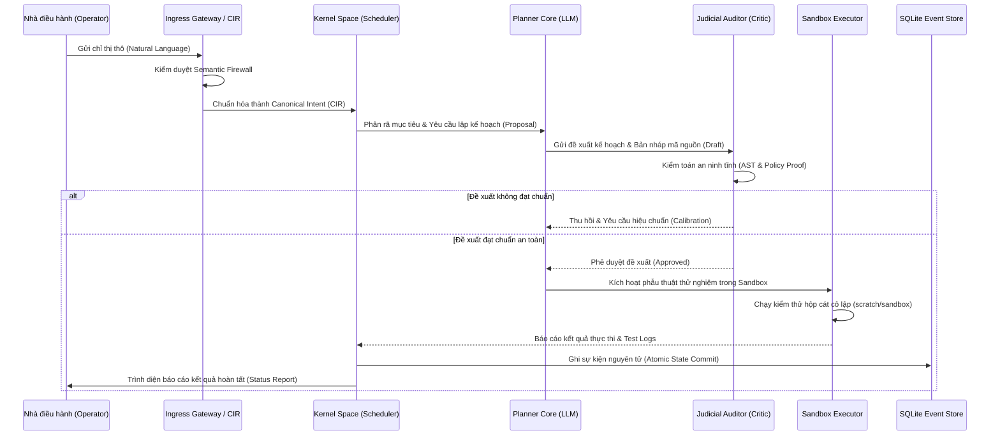

<!-- 
[ZENITH FILE DIRECTIVE]
- File: JKAI_ZENITH_CORP.md
- Role: Zenith Intelligence Documentation.
- Ownership: Mr LeeTrung
- Status: Active | Version: SDS v19.9
[WORKING PRINCIPLES]:
1. [HEADER-FIRST]: Antigravity BAT BUOC phai doc khoi header nay truoc khi thao tac.
2. [SDS-COMPLIANCE]: Moi thay doi phai tuan thu Giao thuc SDS moi nhat.
3. [NO-EMOJI]: Cam dung emoji trong noi dung tep cau hinh va logic.
-->
# 🏛️ ZENITH INTENT DECOMPOSITION & EXECUTION CONSENSUS PROTOCOL SPECIFICATION (v6.0)
**"Đặc tả Giao thức Phân rã Ý định và Đồng thuận Thực thi Đa Đặc vụ"**

> [!IMPORTANT]
> **TIÊU CHUẨN GIAO THỨC**: Đặc tả này quy định chi tiết luồng tuần tự xử lý, phân rã chỉ thị và cơ chế đồng thuận kỹ thuật giữa các module của **JKAI Zenith v6.0**.
> Mọi tiến trình đề xuất và thực thi bắt buộc phải tuân thủ nghiêm ngặt giao thức này để bảo đảm tính toàn vẹn trạng thái đĩa cứng và an ninh hệ thống.

---

## 🧭 1. Luồng Tuần Tự Xử Lý Chỉ Thị (Sequence Execution Flow)

Khi Nhà điều hành gửi mệnh lệnh vĩ mô, hệ thống thực thi chuỗi đồng thuận phân tầng theo sơ đồ tuần tự dưới đây:

---

## ⚙️ 2. Các Quy Chuẩn Thực Thi Và Kiểm Duyệt (Execution Protocols)

### 2.1. Intent Parsing & CIR Standardization (Tiếp nhận & Chuẩn hóa)
*   **Hành động**: Cổng tiếp nhận `Receptionist Shell` và `Ingress Gateway` nhận diện chỉ thị phi cấu trúc của Operator.
*   **Quy chuẩn**: Ép buộc chuyển đổi mọi ý định thành định dạng **Canonical Intent Representation (CIR)** dạng cấu trúc JSON có định danh phiên bản. Chặn đứng các nguy cơ tiêm lệnh ngữ nghĩa (Prompt Injection).

### 2.2. Recursive Goal Decomposition (Phân rã mục tiêu đệ quy)
*   **Hành động**: Planner phân tích CIR để bóc tách thành các mục tiêu con có thứ tự phụ thuộc (Dependencies).
*   **Quy chuẩn**: Sơ đồ hóa luồng công việc dưới dạng cây mục tiêu, tự động tính toán ngân sách token (`Cognitive Budget`) cần thiết cho toàn bộ chu trình xử lý trước khi kích hoạt các bước tiếp theo.

### 2.3. Judicial Security Audit (Kiểm toán tư pháp an ninh)
*   **Hành động**: Đặc vụ Critic hoạt động như một Judicial Auditor thực hiện kiểm duyệt tĩnh toàn bộ mã nguồn do Planner phác thảo.
*   **Quy chuẩn**: Phân tích cú pháp AST (Abstract Syntax Tree) để phát hiện và ngăn chặn các hành vi nguy hiểm như import thư viện cấm, cố tình vượt quyền ghi thư mục hệ thống hoặc sử dụng các hàm shell thô (`os.system`).

### 2.4. Isolated Sandbox Execution & Verification (Chạy thử & Xác minh)
*   **Hành động**: Đẩy mã nguồn đã được duyệt qua bộ lọc an ninh tĩnh vào phân vùng hộp cát `scratch/sandbox` thông qua `SandboxExecutor`.
*   **Quy chuẩn**: Thực thi mã nguồn dưới các ràng buộc tài nguyên phần cứng vật lý nghiêm ngặt (timeout, RAM allocation). Mọi thay đổi chỉ được phép ghi đè lên đĩa sản xuất (Canary Promote) sau khi toàn bộ chuỗi unit tests trong hộp cát trả về trạng thái thành công 100%.

---

## 📊 3. Kỷ Luật Quản Trị Tài Nguyên Hệ Thống (Resource Governance)

*   **VRAM Arbitrator & Model Lifecycle**: Nhân hệ thống tự động kiểm soát vòng đời tải/rút (load/unload) mô hình Ollama dựa trên trọng số ưu tiên tác vụ, bảo đảm VRAM của GPU RX 6600 luôn được giải phóng kịp thời, tránh tranh chấp tài nguyên.
*   **Dynamic Thread Allocation**: Tối ưu hóa hiệu năng xử lý đa luồng trên CPU Xeon E5-2699 v4 bằng cách gán độ ưu tiên xử lý (CPU affinity) và phân phối luồng tĩnh cho các tác vụ định tính hiệu năng cao.

---

## 📜 4. Hệ Thống Luật Lệ Tài Liệu Tham Chiếu (Reference Rules)

Mọi tiến trình lập kế hoạch và thực thi bắt buộc phải đối chiếu qua 3 tài liệu quy định nền tảng:
1.  **System Operating Charter (`ZENITH_MANIFESTO.md`)**: Quy chế an ninh tối cao điều khiển ranh giới an toàn của các đặc vụ.
2.  **Capability Registry (`MAP_SKILLS.md`)**: Danh mục các trình điều khiển tác vụ (Drivers) đã được thẩm định an toàn và cho phép triệu hồi.
3.  **Core Behavioral Policies (`.keywork.md`)**: Các quy tắc định hình ranh giới hành vi và định dạng báo cáo kỹ thuật.

---
*Intent & Execution Consensus Spec. v6.0. System Collaboration Protocol. Designed for Secure Autonomy.* 🏛️⚙️🛡️
