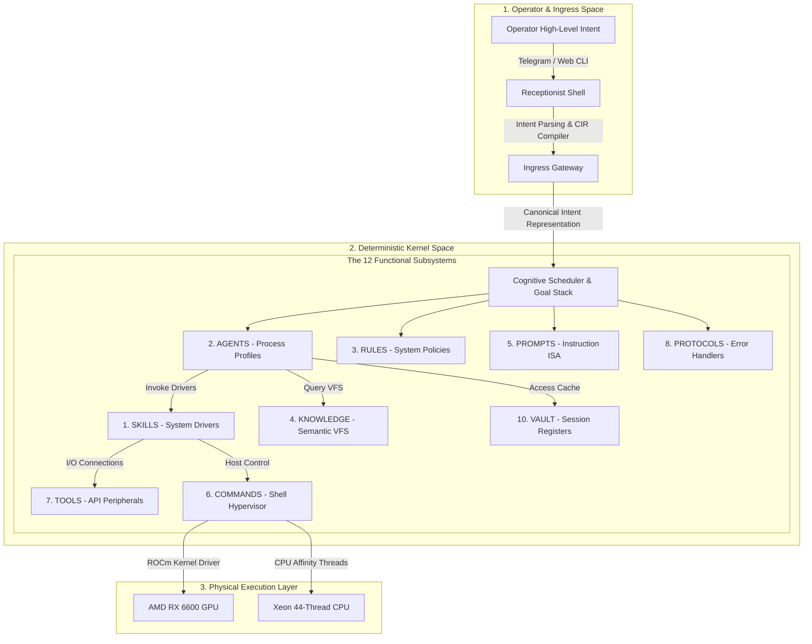

<!-- 
[ZENITH FILE DIRECTIVE]
- File: ZENITH_12_PILLARS_DNA.md
- Role: Zenith Intelligence Documentation.
- Ownership: Mr LeeTrung
- Status: Active | Version: SDS v19.9
[WORKING PRINCIPLES]:
1. [HEADER-FIRST]: Antigravity BAT BUOC phai doc khoi header nay truoc khi thao tac.
2. [SDS-COMPLIANCE]: Moi thay doi phai tuan thu Giao thuc SDS moi nhat.
3. [NO-EMOJI]: Cam dung emoji trong noi dung tep cau hinh va logic.
-->
# 🏛️ ZENITH 12 FUNCTIONAL SYSTEM SUBSYSTEMS SPECIFICATION (v6.0)
**"Đặc tả Cấu trúc và Vòng đời của 12 Phân khu Hệ thống Nhận thức"**

> [!IMPORTANT]
> **TIÊU CHUẨN KIẾN TRÚC**: Hệ thống JKAI Zenith v6.0 tổ chức tài nguyên, dữ liệu và luồng thực thi thành **12 Phân khu Hệ thống (System Subsystems)** độc lập.
> Thiết kế phân vùng này mô phỏng các phân hệ quản lý tài nguyên trong hệ điều hành truyền thống, bảo đảm mọi tiến trình luôn được định vị rõ ràng và vận hành theo cơ chế Module hóa tối đa.

---

---

## 🏛️ Đặc Tả 12 Phân Khu Hệ Thống (The 12 Subsystems)

### 🧬 1. SKILLS: SYSTEM DRIVERS (Trình Điều Khiển Tác Vụ)
*   **Bản chất**: Thư viện chứa các driver thực thi được lập trình bằng mã nguồn Python tĩnh (`tools/` và `skills/`).
*   **Vai trò**: Cung cấp năng lực tác chiến thực tế (Surgical Code Editing, Web Scraping, AST Analysis, Git Operations).
*   **Giao thức**: Được quản lý động và định tuyến thông qua tệp tin `registry.json`.

### 🧠 2. AGENTS: PROCESS PROFILES (Bộ Cấu Hình Đặc Vụ)
*   **Bản chất**: Tập hợp các hồ sơ đặc tả vai trò (Personas), ranh giới hành vi và cấu hình liên kết mô hình (Model Binding).
*   **Vai trò**: Hoạt động tương tự các ALU và bộ giải mã lệnh ảo:
    *   *Planner*: Đảm nhiệm giải mã chỉ thị phức tạp và đề xuất kế hoạch (Instruction Decoder).
    *   *Critic*: Đảm nhiệm thẩm duyệt cú pháp và logic (Judicial Auditor).
*   **Giao thức**: Định luồng tác vụ và tối ưu hóa phân bổ dựa trên chỉ số VRAM.

### ⚖️ 3. RULES: SYSTEM POLICIES (Quy Chế Nhân)
*   **Bản chất**: Hệ thống chính sách an ninh, hiến chương vận hành và luật biên tập hệ thống (`.clinerules`, `.keywork.md`).
*   **Vai trò**: Áp đặt ranh giới an toàn tối cao, quy định định dạng đầu ra lâm sàng và kiểm soát đặc quyền.
*   **Giao thức**: Nhân hệ thống tự động đối chiếu các đề xuất của Planner với RULES trước khi cho phép ghi đĩa.

### 📚 4. KNOWLEDGE: SEMANTIC VFS (Hệ Tập Tin Ngữ Nghĩa Ảo)
*   **Bản chất**: Phân vùng lưu trữ dữ liệu phi cấu trúc tích hợp Qdrant Vector DB và Đồ thị tri thức Obsidian.
*   **Vai trò**: Cung cấp cơ chế truy xuất thông tin ngữ cảnh đa tầng (Semantic Search) thay vì phụ thuộc vào đường dẫn thư mục cứng của hệ điều hành chủ.
*   **Giao thức**: Tự động đồng hóa tài liệu ngoại lai thành các cấu trúc node tri thức chuẩn hóa.

### ✍️ 5. PROMPTS: INSTRUCTION ISA (Kiến Trúc Tập Lệnh Tư Duy)
*   **Bản chất**: Thư viện cấu trúc Prompt định dạng XML và hệ thống Prompt Forge Engine.
*   **Vai trò**: Thiết lập "tập chỉ lệnh" tư duy ngắn hạn, nạp nóng các tham số môi trường thời gian thực cho đặc vụ.
*   **Giao thức**: Biên dịch động các yếu tố ngữ cảnh thành System Prompt tối ưu trước khi kích hoạt LLM API.

### ⌨️ 6. COMMANDS: SHELL HYPERVISOR (Cổng Thực Thi Lệnh)
*   **Bản chất**: Trình bao bọc CLI kết nối trực tiếp với Windows PowerShell và Docker Hypervisor.
*   **Vai trò**: Cho phép hệ thống thực thi các câu lệnh terminal thực tế để quản lý tiến trình, can thiệp container và tệp tin vật lý.
*   **Giao thức**: Luôn yêu cầu kiểm duyệt an ninh tĩnh của `PolicyProofEngine` trước khi chuyển tiếp ra shell hệ điều hành chủ.

### 🛠️ 7. TOOLS: API PERIPHERALS (Thiết Bị Giao Tiếp Ngoại Vi)
*   **Bản chất**: Các module tích hợp API và cổng kết nối Internet (Tavily Search, GitHub API, Redis Channel).
*   **Vai trò**: Hoạt động như các cổng giao tiếp I/O vật lý của hệ thống để tương tác với thế giới mạng bên ngoài.
*   **Giao thức**: Được kích hoạt gián tiếp bởi các trình điều khiển thuộc phân khu SKILLS.

### 🛡️ 8. PROTOCOLS: ERROR HANDLERS (Hệ Thống Phản Xạ Chịu Lỗi)
*   **Bản chất**: Giao thức tự chữa lành (Self-Healing), bộ quét State-Aware Parser v2.5 và cơ chế mã hóa xác thực.
*   **Vai trò**: Tự động tầm soát ngoại lệ, phục hồi cấu trúc tệp tin hỏng và hoàn tác giao dịch phẫu thuật mã nguồn thất bại.
*   **Giao thức**: Tự động khởi chạy khi phát hiện tín hiệu lỗi từ `CognitiveEventBus`.

### 📈 9. TRAINING: COMPILER / MLC (Bộ Biên Dịch Trí Nhớ Tiến Hóa)
*   **Bản chất**: Chu kỳ thu thập lỗi (Failure Memory) và nén tri thức (Knowledge Distillation) hoạt động ngoại tuyến.
*   **Vai trò**: Phân tích lịch sử sự kiện thô để đúc rút các `antipatterns`, nâng cao độ thông minh định tuyến của hệ thống.
*   **Giao thức**: Chạy ngầm định kỳ dưới dạng một background daemon trong các khoảng thời gian hệ thống nghỉ (idle).

### 🔒 10. VAULT: SESSION REGISTERS (Thanh Ghi Phiên Làm Việc)
*   **Bản chất**: Phân vùng bộ nhớ RAM/Redis lưu trữ cache ngắn hạn (`dynamic_memory.md`).
*   **Vai trò**: Hoạt động tương tự bộ nhớ đệm L1/L2 Cache của CPU, lưu giữ trạng thái chạy dở của các tiến trình và ngân sách token hiện tại.
*   **Giao thức**: Tự động giải phóng (flush) dữ liệu khi tiến trình đóng an toàn.

### 🏛️ 11. ARCHIVE: REGISTRY LOGS (Bản Ghi Tiến Hóa Kiến Trúc)
*   **Bản chất**: Nhật ký tiến hóa và nhật ký sửa lỗi hệ thống (`GLOBAL_SYSTEM_CONTEXT.md`).
*   **Vai trò**: Lưu giữ vết tiến bộ công nghệ, làm bằng chứng khoa học phục vụ so sánh hiệu năng giữa các thế hệ nhân.
*   **Giao thức**: Ghi nhận Delta thay đổi sau khi phiên làm việc được Operator xác nhận hoàn tất.

### 🦾 12. HARDWARE: PHYSICAL RESOURCE LAYER (Tầng Phần Cứng Vật Lý)
*   **Bản chất**: Hạ tầng thiết bị bare-metal Xeon E5-2699 v4 & GPU AMD RX 6600.
*   **Vai trò**: Cung cấp sức mạnh tính toán thô (CPU cycles, GPU VRAM) cho toàn bộ hệ thống.
*   **Giao thức**: Homeostasis Engine liên tục cập nhật nhiệt độ, dung lượng RAM/VRAM thực tế để điều tiết tải trọng.

---

## 🔄 Vòng Đời Thực Thi Tiến Trình Hệ Thống

Khi Operator gửi chỉ thị từ **Operator Space**:
1. **PROMPTS (#5)** nạp tập lệnh tư duy nền tảng kết kết hợp ngữ cảnh từ **VAULT (#10)**.
2. **RULES (#3)** áp đặt các chính sách bảo mật và ranh giới an toàn tĩnh.
3. **AGENTS (#2)** phân rã mục tiêu vĩ mô trên Goal Stack và liên kết mô hình phù hợp.
4. **SKILLS (#1)** kích hoạt trình điều khiển driver phù hợp để chuẩn bị tác chiến.
5. **COMMANDS (#6) & TOOLS (#7)** thực thi tương tác vật lý (can thiệp file hệ thống, gọi API).
6. **PROTOCOLS (#8)** kiểm soát lỗi cú pháp thời gian thực thông qua `State-Aware Parser`.
7. **ARCHIVE (#11)** ghi nhận kết quả và cập nhật delta tiến hóa trước khi đóng tiến trình.

---
*Subsystems Specification. v6.0. Modular Architecture Design. Verified for Operational Integrity.* 🏛️⚙️🛡️
