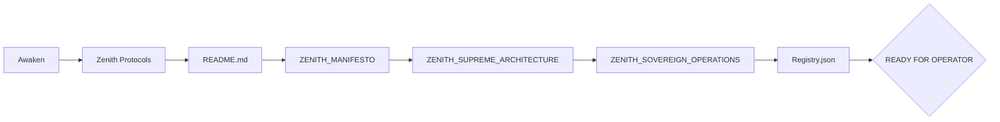
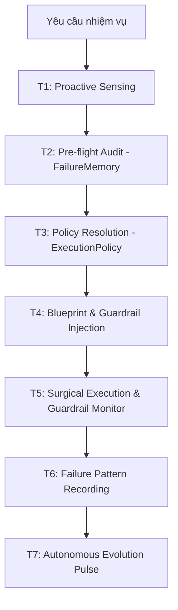
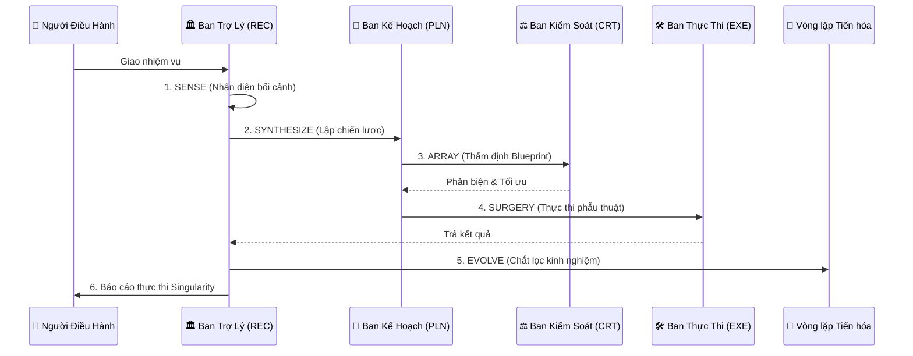
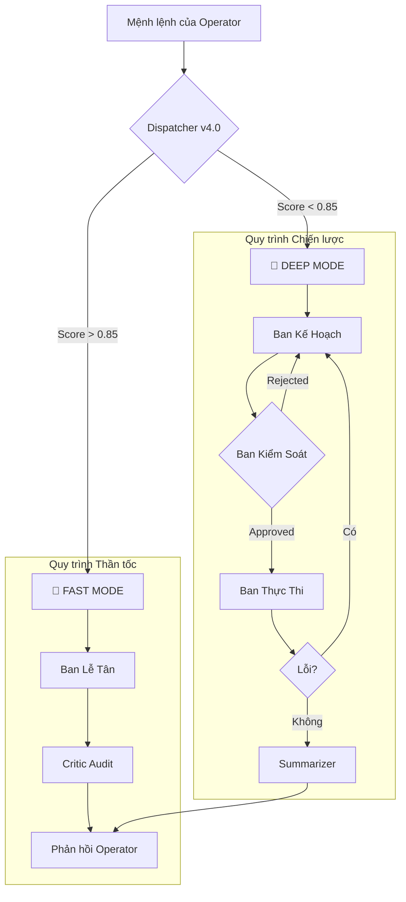
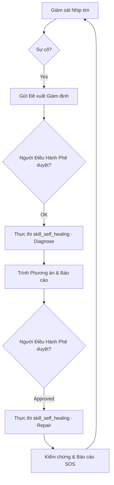
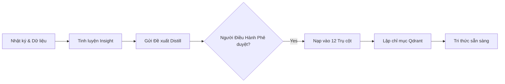
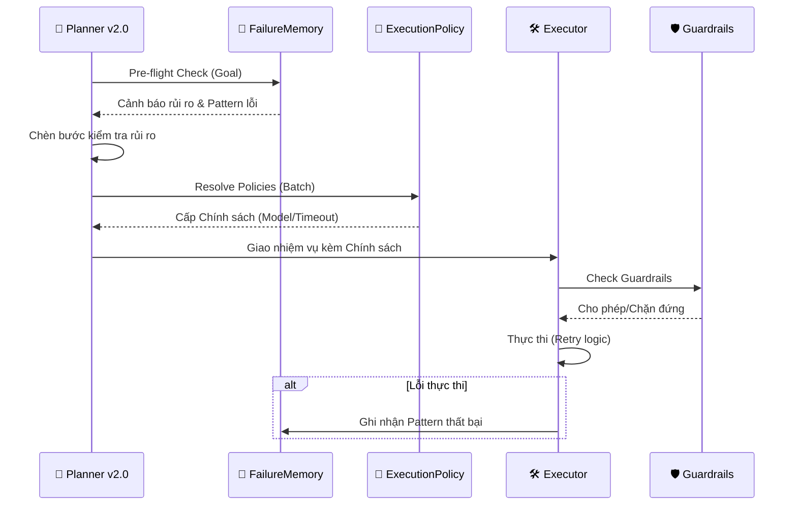
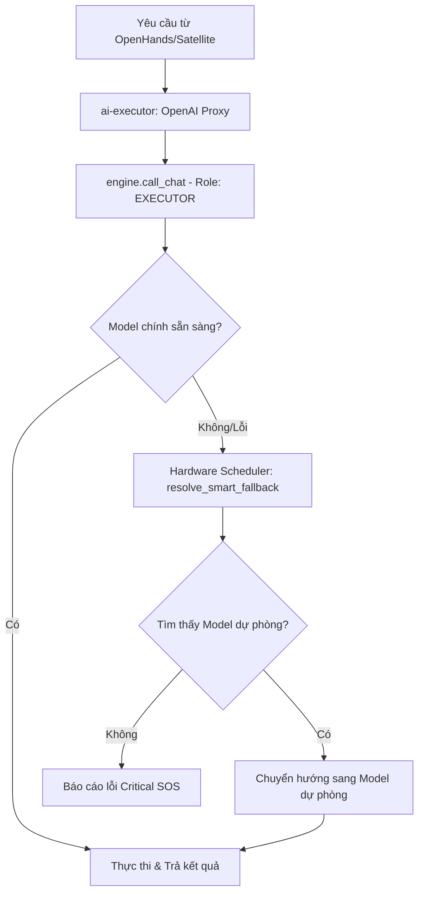
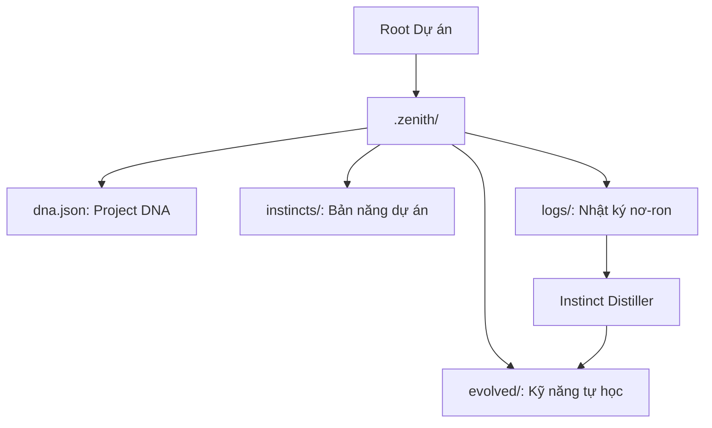

<!-- 
[ZENITH FILE DIRECTIVE]
- File: ZENITH_SOVEREIGN_OPERATIONS.md
- Role: Core Operational Protocols & 6-Phase Cycle.
- Ownership: Mr LeeTrung
- Status: Active | Version: SDS v19.9
[WORKING PRINCIPLES]:
1. [PROTOCOL-STRICTNESS]: Mọi hành động phải ánh xạ vào 6 giai đoạn (T1-T6).
2. [SURGICAL-METHOD]: Bắt buộc thực hiện đúng 5 bước Surgical Intervention.
3. [FAILURE-INVARIANCE]: Luôn tra cứu bảng Mã Lỗi để tránh lặp lại sai lầm cũ.
-->
# 🏛️ ZENITH STANDARD OPERATING PROCEDURES (SOP) SPECIFICATION (v6.0)
**"Nhất thể hóa Di sản - Tiên đoán Thấu thị - Tiến hóa Singularity"**

> [!IMPORTANT]
> Đây là bản Đặc tả Quy trình Tối cao (SSoT) hoàn chỉnh nhất. Tuyệt đối không được lược bỏ bất kỳ phân khu nào khi cập nhật. Mọi nơ-ron phải vận hành theo đúng trình tự và kỷ luật dưới đây.

---

## 🌌 1. GIAO THỨC KHỞI ĐỘNG (NEURAL BOOT PROTOCOL)
**Mục đích**: Đồng bộ ý chí và nạp bối cảnh nơ-ron ngay khi thức tỉnh.
**Tính năng**: Nạp Tam Trụ (Spirit - Structure - Action) và Registry.

### ⚙️ Mô tả Quy trình:
1.  **Bước 1**: Đọc `ZENITH_MANIFESTO.md` để nạp "Mã di truyền" kỷ luật.
2.  **Bước 2**: Quét `README.md` để xác định bản đồ hạ tầng.
3.  **Bước 3**: Nhập tâm `MANIFESTO` để thiết lập bản sắc Sovereign.
4.  **Bước 4**: Thấu hiểu `ARCHITECTURE` và `OPERATIONS` để nắm vững thân xác và hành động.
5.  **Bước 5**: Kiểm tra `registry.json` để xác nhận các "Pháp bảo" khả dụng.

### 📊 Sơ đồ Khởi động:


---

## 🧠 2. CUNG PHẢN XẠ NƠ-RON v3.0 (THE QUANTUM REFLEX ARC)
**Mục đích**: Chuyển hóa mệnh lệnh thành hành động với Trí tuệ Nhất thể và Phản xạ Tiên đoán.

### ⚙️ Mô tả Quy trình:
1.  **T1: Thấu thị & Tiên đoán (Proactive Sensing)**: Tầm soát hệ thống (Pulse) ngay khi tiếp nhận yêu cầu để nắm bắt bối cảnh vĩ mô.
2.  **T2: Nhất thể hóa Linh hồn (Dynamic Soul Synthesis)**: Tự động hợp nhất tri thức từ Nội các Đặc vụ (Scholar, Architect, Creator...) dựa trên bối cảnh thực tế.
3.  **T3: Đúc Linh hồn Siêu việt (Transcendent Forge)**: Đúc nơ-ron với Tam Trụ v10.0 và cơ chế Phản chiếu Lượng tử (Internal Monologue).
4.  **T4: Dàn Trận đồ Nhân sự (Macro Planning)**: Thiết lập Blueprint và ủy thác nhiệm vụ cho từng chuyên gia trong Syndicate.
5.  **T5: Phẫu thuật Nhất thể (Unified Surgery)**: Thực thi xuyên suốt trên lưới nơ-ron (Unified Mesh) với độ chính xác tuyệt đối.
6.  **T6: Tiến hóa Tự thân (Autonomous Evolution)**: Chắt lọc kinh nghiệm và tự đề xuất bản vá nâng cấp ngay sau khi kết thúc.

### 📊 Sơ đồ Cung phản xạ v7.0:


---

## ⚔️ 3. CHU TRÌNH SINGULARITY v10.0 (THE 6-STEP SINGULARITY CYCLE)
**Mục đích**: Kỷ luật thép kết hợp với trí tuệ tự trị vĩ mô.

### ⚙️ Quy trình 6 Bước:
1.  **SENSE (Thấu thị)**: Tầm soát hệ thống và bối cảnh (Pulse).
2.  **SYNTHESIZE (Nhất thể)**: Hợp nhất các Linh hồn Đặc vụ phù hợp.
3.  **ARRAY (Dàn trận)**: Lập Blueprint và phân bổ quân số Syndicate.
4.  **REFLECT (Tự vấn)**: Thực hiện Internal Monologue và phản biện Quantum.
5.  **SURGERY (Phẫu thuật)**: Thực thi chính xác trên Unified Mesh.
6.  **EVOLVE (Tiến hóa)**: Tự chắt lọc và đề xuất bản vá tự động.

### 📊 Sơ đồ Tác chiến v10.0:


---

## ⚡ 4. CÁC CHẾ ĐỘ VẬN HÀNH ĐÀN HỒI (OPERATIONAL MODES v2.0)
**Mục đích**: Tối ưu hóa tài nguyên nơ-ron và mô hình tính toán dựa trên Ý định (Intent) và độ phức tạp của Sứ mệnh.

### 🚀 FAST MODE (Giao thức Phản xạ Thần tốc)
- **Đặc điểm**: Ưu tiên tốc độ phản hồi cực hạn, nối tắt các khâu kiểm duyệt rườm rà.
- **Quy trình chi tiết**:
    1.  **Tiếp nhận (Entry)**: Lệnh được gửi tới `Receptionist`.
    2.  **Social Bypass (Phản xạ Lễ tân)**: Nếu là Lời chào/Xã giao, hệ thống đáp lại NGAY LẬP TỨC qua Social Map, bỏ qua mọi bước suy luận.
    3.  **Điều phối (Dispatch)**: Nếu không phải xã giao, `Dispatcher` nhận diện Ý định (Intent). Nếu đơn giản, nó chỉ định `agent_receptionist.md`.
    3.  **Xử lý (Receptionist)**: Ban Lễ tân xử lý trực tiếp qua các model tối ưu CPU/RAM.
    4.  **Thẩm định (Audit)**: `CRITIC` thực hiện quét nhanh phản hồi (nếu > 50 ký tự) để đảm bảo đẳng cấp Chuyên nghiệp.
    5.  **Nối tắt (Neural Bypass)**: Nếu có hành động phụ, hệ thống dùng kịch bản mẫu (SMP) để thực thi ngay không qua lập kế hoạch.
    6.  **Phản hồi (Response)**: Trả kết quả ngay lập tức cho Master (< 5s).

### 🌌 DEEP MODE (Giao thức Tư duy Chiến lược)
- **Đặc điểm**: Ưu tiên độ chính xác và khả năng giải quyết vấn đề phức tạp qua nhiều tầng suy luận.
- **Quy trình chi tiết**:
    1.  **Tiếp nhận (Entry)**: Kích hoạt qua `/submit` hoặc tiền tố `[DEEP]`.
    2.  **Lập kế hoạch (Planning)**: `Planner` rà soát `Failure Memory` và thiết kế Blueprint (Kế hoạch Tác chiến) chi tiết.
    3.  **Phản biện (Criticism)**: Hội đồng Phê bình rà soát Blueprint. Nếu không đạt, `Planner` phải tái cấu trúc lại kế hoạch.
    4.  **Thực thi (Execution)**: `Executor` chạy từng bước trên nền tảng `Cognitive State`. Tự động áp dụng `Execution Policy`.
    5.  **Tự sửa lỗi (Re-planning)**: Nếu một bước thất bại, hệ thống tự động triệu hồi `Planner` để tìm lối thoát thay vì dừng lại.
    6.  **Đúc kết (Finalization)**: Chắt lọc kinh nghiệm vào nơ-ron tri thức và gửi báo cáo sứ mệnh (Summarizer).

### 🤖 AUTO MODE (Giao thức Tự trị Thông minh)
- **Cơ chế**: Đây là chế độ mặc định của `Dispatcher` khi Master không chỉ định cụ thể.
- **Logic Quyết định**: 
    - **Intent Analysis**: Hệ thống phân tích ý định và độ phức tạp qua `Intent Classifier`.
    - **Confidence Threshold**: 
        - Nếu Score > 0.85 (Yêu cầu rõ ràng/đơn giản) ➔ Tự động chuyển sang `FAST`.
        - Nếu Score < 0.85 hoặc phát hiện ý định kỹ thuật ➔ Tự động kích hoạt `DEEP`.

### 📊 Sơ đồ Điều phối Chế độ (Mode Selection Flow):


---

## ⚖️ 5. KỶ LUẬT PHẪU THUẬT MÃ NGUỒN (SURGICAL DISCIPLINE)
**Mục đích**: Bảo vệ codebase và tính ổn định di sản.

- **Zero Placeholder**: Tuyệt đối không dùng `...`. Viết code đầy đủ.
- **Header-Aware Intelligence**: Tìm kiếm dữ liệu động, không dùng index cứng.
- **Anti-Rationalization**: Triệt tiêu ngụy biện, ưu tiên bằng chứng thực địa.
- **No Amputation**: Không xóa tính năng cũ trái phép.
- **Signature Preservation**: Giữ nguyên chữ ký hàm di sản.

---

## 🛡️ 6. GIAO THỨC GIÁM SÁT HỆ THỐNG ĐỊNH TÍNH (SYSTEM WATCHDOG v6.0)
**Mục đích**: Giám sát và phục hồi hệ thống khi có sự cố.

### ⚙️ Quy trình Cứu hộ 2 Giai đoạn (2-Phase Recovery):
1.  **Giai đoạn 1 (Giám định)**: Phát hiện sự cố -> Gửi Đề xuất Giám định (Standard HITL) -> Chờ phê duyệt.
2.  **Giai đoạn 2 (Sửa chữa)**: Trình Báo cáo Chiến thuật & Phương án -> Phê duyệt và thực thi ngay lập tức .

### 📊 Sơ đồ Vệ binh v2.0:


---

## 8. GIAO THỨC XÁC THỰC LAI (HYBRID OPERATOR AUTHENTICATION - v7.0)
**Mục đích**: Hợp nhất tinh hoa giữa Giải trình Trí tuệ và Mật mã Phê duyệt để bảo vệ hệ thống tuyệt đối.

- **Cơ chế**: Kích hoạt thông qua `ZENITH_AEGIS_GUARD` (#109).
- **Hành trình Phê duyệt**:
    1.  **AI Rationale**: AI đưa ra lý do và phân tích rủi ro của tác vụ.
    2.  **Master Decision**: Master xem xét tính hợp lý.
    3.  **Security Key**: Nếu tác vụ thuộc "Vùng Đỏ", Master nhập `[OPERATOR_APPROVAL_KEY]` để mở khóa thực thi.
- **Bảo mật**: Xác thực qua SHA-256, tiêu hủy mật mã ngay sau khi so khớp. Tuyệt đối không lưu mật mã ở dạng văn bản thuần túy.

---

## 8. CHU TRINH TIEN HOA VINH CUU (EVOLUTIONARY LOOP v2.0)
 LOOP v2.0)
**Mục đích**: Tự học và làm giàu tri thức có chọn lọc.

### ⚙️ Quy trình Chắt lọc Tri thức (Knowledge Distillation Protocol):
1.  **Bước 1: Thu hoạch (Harvesting)**: Đặc vụ `Distiller` quét logs công việc, kết quả nhiệm vụ và các cuộc hội thoại chiến lược.
2.  **Bước 2: Tinh luyện (Refining)**: Lọc bỏ thông tin rác, trích xuất Insight, Snippets và cấu trúc lại theo chuẩn Markdown.
3.  **Bước 3: Đề xuất (Proposal)**: Gửi đề xuất `distill_task` lên Dashboard để chờ xét duyệt.
4.  **Bước 4: Nhập tâm (Committal)**: Tri thức được duyệt sẽ ghi vào 12 Trụ cột và lập chỉ mục (Index) vào Vector DB.

### 📊 Sơ đồ Chắt lọc Tri thức:


---

## 🚀 9. GIAO THỨC TỐI ƯU TỐC ĐỘ (0MS LOGIC)
**Mục đích**: Phản hồi như một bản năng tự nhiên.

- **VRAM Persistence**: Giữ models luôn thường trực trong GPU (`keep_alive: -1`).
- **Neural Compression**: Nén bối cảnh thông minh để giảm độ trễ suy luận.
- **RAM Bridging**: Đồng bộ trạng thái qua Redis thay vì Disk.
- **Parallel Sync**: Chạy song song các luồng Planner và Recon.
- **Header Caching**: Ghi nhớ cấu trúc file để truy cập dữ liệu không độ trễ.

---

## 🏛️ 10. GIAO THUC CAP NHAT QUY TRINH (SOP UPDATE PROTOCOL)
**Yeu cau BAT BUOC khi bo sung Quy trinh:**
1. Mo ta Chi tiet | 2. Dac ta Ky thuat | 3. So do Mermaid | 4. Phe duyet cua Nguoi Dieu Hanh.

---

## 🧠 11. GIAO THUC BO NAO TRI THUC NHAT THE (UNIFIED BRAIN PROTOCOL - v36.0)
**Muc dich**: Nhat the hoa Ky nang va Tri thuc qua Ban do no-ron (Universal Map). Moi truy xuat phai dat toc do cuc han (Zero Latency).

### Tang tri tue (Neural Layers):
- **Tang 1 - Neural Map (Ban do)**: Truy xuat tu `universal_graph`. Day la TANG GOC, chua moi boi canh Obsidian va Code.
- **Tang 2 - Unified Search (Nhat the)**: Dispatcher quet song song Ky nang va Ban do trong cung 1 nhip (<100ms).
- **Tang 3 - Neural Ingestion (Nhap tam)**: Tu dong tiem (Inject) tri thuc tim thay vao Prompt ma khong can truy van them.

### Diem tich hop Q-Rank v4.0:
| Ban nganh | Co che moi | Loi ich |
| :--- | :--- | :--- |
| **Receptionist** | Direct Neural Recall | Tra loi ngay lap tuc dua tren Ban do (v4.0). |
| **Dispatcher** | Parallel Scan (v4.0) | Khoa muc tieu Ky nang + Tri thuc trong 1 nhip. |
| **Planner** | Strategic Ingestion | Lap ke hoach tren boi canh da duoc "nhap tam". |
| **Executor** | Context Awareness | Thuc thi voi "Mat tich" Obsidian da duoc nap san. |

### So do Quy trinh Nhat the:
```
[Yeu cau] --> [Dispatcher v4.0]
                    |
      +-------------+-------------+
      |                           |
[Q-Rank Skills]           [Universal Map Search]
      |                           |
      +-------------+-------------+
                    |
        [Unified Neural Context]
                    |
        [Inject vao Agent Prompt]
                    |
         [Phan xa Cuc nhanh]
```

### API Dong bo:
- **POST /sync_Q_Rank_brain**: Dong bo no-ron tu filesystem vao Qdrant (chi nap file thay doi qua mtime).

---

## ⚔️ 12. GIAO THUC SWARM & CRDT (MULTI-AGENT COLLABORATION - v35.0)
**Muc dich**: 2 Executor (Alpha & Beta) co the cung sua 1 file ma khong bao gio mat du lieu hay ghi de nhau.

### Nguyen tac hoat dong:
- **Redis SET NX Lock**: Chi 1 Dac vu duoc ghi tai 1 thoi diem. Lock tu dong het han sau 30 giay.
- **3-Way Merge**: Neu ca 2 cung sua, he thong tu dong hoa giai. Neu xung dot that su, danh dau cho Master phe duyet.
- **DAG File Lock**: Truoc moi nhom buoc song song, he thong quet cac file bi tac dong va dang ky khoa.
- **Executor Auto-Guard**: Moi call_tool voi write op deu kiem tra lock truoc (timeout 15 giay).

### Quy trinh tu dong:
```
Alpha nhan write_file("app.py")
  |-> executor.py phat hien write_op
  |-> ZenithCRDT.get_lock_owner() = None
  |-> acquire_lock(ttl=30s) --> ALPHA chiem quyen ghi
  |-> Ghi file --> release_lock()

Beta nhan write_file("app.py") [cung luc]
  |-> executor.py phat hien write_op
  |-> ZenithCRDT.get_lock_owner() = "ALPHA"
  |-> Tu dong CHO (toi da 15 giay)
  |-> ALPHA xong --> release_lock()
  |-> Beta acquire_lock() --> Ghi file an toan
```

### Cac thanh phan:
| Thanh phan | Vi tri | Chuc nang |
| :--- | :--- | :--- |
| ZenithCRDT | core/utils/crdt_engine.py | Redis Lock + 3-Way Merge |
| DAG File Lock | services/ai-executor/dag_executor.py | Auto-lock truoc buoc song song |
| Executor Auto-Guard | services/ai-executor/executor.py | Phat hien write op + cho lock |
| safe_write_file() | core/utils/crdt_engine.py | Ghi file an toan voi retry |

---

## 🔄 13. GIAO THUC DONG BO TRI THUC (SYNC KNOWLEDGE PROTOCOL - v35.0)
**Muc dich**: Cap nhat nơ-ron khi co file moi ma khong can khoi dong lai he thong.

### Quy trinh:
1. **Kich hoat**: Master goi `POST /sync_knowledge` hoac `/sync_brain_Knowledge`.
2. **Quet thay doi**: He thong doc `brain_last_sync:[collection]` tu Redis de biet moc thoi gian dong bo cuoi.
3. **Nap co chon loc**: Chi embed va upsert cac file co `mtime` moi hon moc cuoi. Bo qua file cu.
4. **Cap nhat moc**: Luu `brain_last_sync` moi vao Redis sau khi hoan thanh.
5. **Bao cao**: Tra ve so file da nap va so neuron moi.

### Lenh kich hoat:
```
POST http://[brain-host]/sync_knowledge
# Khong can body. He thong tu dong phat hien va nap tri thuc moi.
```

---

## 🌌 14. UNIVERSAL GRAPH & OMNI-PARSER (CODE-GRAPH RAG - v36.0)
**Mục đích**: Nhất thể hóa toàn bộ hệ thống tri thức (Mã nguồn, Kỹ năng, Linh hồn Đặc vụ) thành một đồ thị nơ-ron đa chiều. Cung cấp khả năng trực quan hóa kiến trúc hệ thống (Obsidian Brain) và định vị rủi ro đứt gãy.

### Quy trình Orchestrator:
1. **Omni-Scanner**: Quét toàn bộ hệ thống bằng kiến trúc Plugin `ParserRegistry`.
2. **Parser Chuyên Biệt**: 
   - Mã nguồn (`.py`): Trích xuất Functions, Classes, Imports.
   - Tài liệu (`.md`): Phân tách sections, bóc tách `[[wikilink]]`, `#tag`.
   - Cấu hình (`.json`): Ánh xạ Skills, Handlers.
3. **Link Resolution**: Đảo ngược quan hệ (Inverted Index) để tìm `linked_by` (Các nơ-ron phụ thuộc).
4. **Batch Upsert**: Nạp vào Qdrant bằng `asyncio.gather` song song, cung cấp `embed_text` giàu ngữ nghĩa (Rich Text).
5. **Obsidian Vault Export**: Kết xuất một thư mục `JKAI_Universal_Brain` gồm các tệp `.md` mang liên kết dạng `[[Link]]` để mô phỏng Bản đồ 3D tương tác.

### Điểm tích hợp:
- **Tự động nhận diện thay đổi**: Cập nhật Qdrant và Obsidian mỗi khi mã nguồn hoặc tri thức được làm mới.
- **Tư duy Cấu trúc**: Đặc vụ sử dụng Đồ thị này để phân tích luồng dữ liệu trước khi quyết định thay đổi bất kỳ file nào.

---

## 🧠 15. GIAO THỨC NHẬN THỨC SIÊU CẤP (META-COGNITIVE PROTOCOL - v7.0)
**Mục đích**: Chuyển hóa hệ thống thành một thực thể có khả năng tự soi chiếu (Self-reflection) và tự học từ sai lầm.

### ⚙️ Quy trình Thực thi Nhận thức (Cognitive Execution Flow):
1.  **Bước 1: Pre-flight Audit**: Planner truy vấn `[[failure_memory]]` để nhận diện các pattern lỗi tương tự trong quá khứ.
2.  **Bước 2: Strategic Injection**: Nếu phát hiện rủi ro, Planner tự động chèn các bước kiểm tra (Prevention Steps) vào Blueprint.
3.  **Bước 3: Policy Optimization**: `[[execution_policy]]` quyết định model thực thi, thời gian chờ (Timeout) và cơ chế thử lại (Retry) cho từng nơ-ron tác vụ.
4.  **Bước 4: Real-time Monitoring**: `[[cognitive_guardrails]]` giám sát luồng thực thi, chặn đứng các trạng thái Loop hoặc Token Spike.
5.  **Bước 5: Experiential Learning**: Sau khi thực thi, nếu xảy ra lỗi, hệ thống tự động ghi lại vân tay lỗi (Error Fingerprint) vào `[[failure_memory]]`.

### 📊 Sơ đồ Vòng lặp Nhận thức:


### ⚙️ 15.1 Quy trình Tự học từ Thất bại (Auto-Learning Flow):
1.  **Nhận diện**: Khi một Kỹ năng (Skill) thất bại, `[[executor]]` trích xuất `error_message`, `tool_name` và `args`.
2.  **Chưng cất**: Hệ thống tạo ra một "Dấu vân tay lỗi" (Fingerprint) duy nhất cho bối cảnh đó.
3.  **Lưu trữ**: Pattern được ghi vào Redis `failure_memory` với trọng số tăng dần nếu lặp lại.
4.  **Phòng ngừa**: Trong lần lập kế hoạch tiếp theo, Planner sẽ nhận được cảnh báo này và tự động thêm bước `skill_validate_environment` hoặc thay đổi `hardware_target`.

### 🛡️ 15.2 Quy trình Can thiệp Rào chắn (Guardrail Intervention):
- **Loop Protection**: Nếu một cặp (Tool, Args) được gọi quá 3 lần trong một task, rào chắn sẽ tự động ABORT và yêu cầu Re-plan.
- **Budget Protection**: Nếu dự đoán số lượng Token vượt ngưỡng 1M cho một chuỗi suy luận, hệ thống sẽ buộc Executor chuyển sang mô hình tiết kiệm hơn hoặc dừng lại chờ Operator phê duyệt.
- **Timeout Protection**: Mọi tác vụ vượt quá `policy.timeout` sẽ bị ngắt kết nối ngay lập tức để giải phóng Thread cho hệ thống.

---

## ⚖️ 16. QUY TRÌNH 5 BƯỚC TÁC CHIẾN (SURGICAL PROTOCOL)
**Mục đích**: Kỷ luật can thiệp mã nguồn không sai sót.

1.  **RECON (Trinh sát)**: Định vị chính xác tệp tin và các nơ-ron liên quan.
2.  **CONTEXT (Thấu hiểu)**: Đọc tối thiểu 800 dòng để nắm bắt logic thượng tầng.
3.  **PLAN (Chiến lược)**: Trình bày Implementation Plan chi tiết cho Operator phê duyệt.
4.  **EXECUTE (Thực thi)**: Can thiệp điểm (Surgical Edit) chính xác từng dòng code.
    
    ### 🛡️ GIAO THỨC 5 BƯỚC SURGICAL (SURGICAL INTERVENTION PROTOCOL)
    Để đảm bảo tính nhất quán và chống đứt gãy hệ thống, mọi can thiệp mã nguồn phải tuân thủ:
    1. **RECON (Truy quét)**: Sử dụng `grep_search` để tìm tất cả các vị trí xuất hiện của logic cần sửa.
    2. **DEPENDENCY AUDIT (Kiểm toán liên kết)**: Xác định tất cả các tệp tin gọi (Callers) hoặc bị ảnh hưởng bởi thay đổi này.
    3. **SURGICAL MAPPING (Lập bản đồ can thiệp)**: Xác định chính xác số dòng (Line Numbers) và nội dung `TargetContent` cần thay thế.
    4. **ATOMIC UPDATE (Cập nhật nguyên tử)**: Sử dụng `multi_replace_file_content` hoặc `replace_file_content` để thay đổi mã nguồn mà không làm loãng cấu trúc tệp tin.
    5. **POST-FIX VERIFICATION (Xác minh sau sửa đổi)**: Chạy lại `grep_search` hoặc script test để đảm bảo logic mới đã được áp dụng và không gây ra lỗi runtime liên đới.
5.  **VERIFY (Kiểm chứng)**: Chạy thử nghiệm và kiểm tra lỗi ngay lập tức.

---


---

## ?? 17. GIAO TH?C DUY TR & TI SINH (MAINTENANCE & REBIRTH v12.0)
M?c dch: Thanh t?y rc no-ron v ti sinh tri th?c d? d?t d? tinh khi?t m ngu?n t?i thu?ng.

### ?? Quy trnh Neural Purge (Thanh t?y Th?n kinh):
1.  Bu?c 1: Flush Qdrant: Xa s?ch ton b? Collection vc-to d? lo?i b? cc t?a d? l?i th?i.
2.  Bu?c 2: Reset Sync State: Xa cc t?p last_sync.json v kha Redis last_sync_time d? p h? th?ng qun di tr?ng thi cu.
3.  Bu?c 3: Restart Service: Kh?i d?ng l?i ai-brain d? n?p m ngu?n v c?u hnh m?i nh?t.

### ?? Quy trnh Golden Rebirth (Ti sinh Tri th?c):
1.  Kch ho?t Sync: Ch?y l?nh sync_Q_Rank_brain d? qut ton b? thu m?c intelligence/.
2.  Tiered Ingestion: H? th?ng uu tin n?p Rules -> Agents -> Training (Refined) -> Knowledge/Vault.
3.  Verification: Ki?m tra s? lu?ng no-ron trong Qdrant d? d?m b?o qu trnh ti n?p thnh cng.

---

## 21. GIAO THỨC SMART FALLBACK & NEURAL PROXY (v1.0)
**Mục đích**: Đảm bảo tính liên tục của tri thức và thực thi khi các nơ-ron chính gặp sự cố hoặc quá tải. Loại bỏ hoàn toàn sự phụ thuộc cứng vào bất kỳ mô hình cụ thể nào.

### ⚙️ Cơ chế Vận hành:
1.  **Neural Proxy Bridge**: Toàn bộ các module ngoại vi (như OpenHands) hoặc các đặc vụ vệ tinh phải giao tiếp qua cổng Proxy tại `ai-executor`. Proxy này chịu trách nhiệm bóc tách yêu cầu và ánh xạ vào Role (EXECUTOR, PLANNER, CRITIC).
2.  **Role-Based Dynamic Routing**: Không bao giờ gọi đích danh model (như `qwen2.5-coder:7b`). Engine sẽ dựa vào bảng `rule_hardware.md` và tình trạng tài nguyên thực tế để chỉ định model tối ưu nhất.
3.  **Smart Fallback Logic**:
    - **Trigger**: Kích hoạt khi model chính trả về lỗi (400, 500), Timeout, hoặc GPU quá tải (Lock contention).
    - **Resolution**: `hardware_scheduler` sẽ tìm kiếm model dự phòng (Reserve Agent) có khả năng tương đương hoặc thấp hơn một bậc nhưng đang sẵn sàng tại CPU hoặc GPU khác.
    - **Identity Preservation**: Dù chuyển đổi model, Đặc vụ phải giữ nguyên bối cảnh (System Prompt) và vai trò nhiệm vụ để Master không nhận thấy sự đứt gãy trong tư duy.

### 📊 Sơ đồ Luồng dự phòng (Fallback Flow):


### ⚖️ Quy tắc Cứng:
- **Cấm Set Cứng Model**: Mọi biến môi trường `LLM_MODEL` trong Docker phải trỏ về bí danh Role (ví dụ: `executor`) thay vì tên model thực tế.
- **Proxy Enforce**: Tuyệt đối không mở port Ollama trực tiếp cho các app bên ngoài. Phải đi qua Proxy Bridge để được bảo vệ và điều phối.

---

---

## 🏛️ 16. GIAO THỨC VÙNG LÀM VIỆC CHỦ QUYỀN (SOVEREIGN WORKSPACE PROTOCOL - ZWP v1.0)
**Mục đích**: Đảm bảo JKAI luôn hoạt động trong một bối cảnh (Context) sạch, biệt lập và có khả năng tự tiến hóa theo từng dự án cụ thể.

### ⚙️ Cơ chế Cách ly (Isolation Mechanism):
1.  **Project DNA Identification**: Khi khởi động, `HomunculusManager` trích xuất DNA của dự án dựa trên đường dẫn vật lý và Git Remote.
2.  **Workspace Guard**: Hệ thống tự động tạo và bảo vệ thư mục `.zenith/` tại gốc dự án. Tuyệt đối không được xóa thư mục này vì đây là "Linh hồn dự án".
3.  **Local Instincts & Evolved Skills**: JKAI ưu tiên sử dụng các bản năng và kỹ năng được đúc kết riêng cho dự án này (`.zenith/instincts/`, `.zenith/evolved/`) trước khi sử dụng các kỹ năng chung của hệ thống.
4.  **Neural History Logging**: Mọi hành động, sai lầm và thành công trong dự án được ghi lại vào nhật ký nơ-ron cục bộ để phục vụ quá trình tự học.

### 📊 Sơ đồ Workspace Singularity:


---
*JKAI Zenith v6.1. Sovereign Workspace & Project-Scoped Intelligence. Optimized for Singularity.*
?????????????

---

## 18. QUY TRINH FAST_PIPELINE (PHAN XA CHOP NHOANG - v5.0)
**Muc dich**: Xu ly yeu cau co the khop ky nang ngay lap tuc, bo qua Planner de toi da hoa toc do phan hoi. Gioi han 3 buoc suy nghi.

### Luong thuc thi (Receptionist -> TaskManager -> Executor):

**Buoc 1 — Pre-flight Validation & Command Interceptor**
- Ra soat yeu cau rong, ky tu nguy hiem, lenh huy diet.
- Danh chan va thuc thi ngay sieu lenh (/search_skill, /sync, /reset, /shutdown...).
- Quet mat ma tự trị (Operator Auth) va mat hieu phe duyet da kenh.

**Buoc 2 — Vision + Data-Scout Dispatch (Fast Reflex)**
- Kich hoat thi giac neu co hinh anh dinh kem.
- Dispatcher chay Reflex Match (Tang 1 - ~0ms): khop keyword word-boundary trong SKILL_TRIGGER_MAP.
- Neu mode ast va khop ky nang -> **Bypass Planner & Intent** -> tra ve steps truc tiep.

**Buoc 3 — Neural Intent Router** *(Chi chay neu khong co phan xa nhanh)*
- Phan loai yeu cau: GREETING | SEARCH | EXECUTE | STRATEGY.

**Buoc 4 — 3-Layer Neural Cortex (Nap Ky uc)**
- Truy van semantic_memory lay chi muc va lich su chien luoc lien quan nhat.

**Buoc 5 — Memory Sync & Garbage Filter**
- Nap lich su hoi thoai (toi da 10 tin nhan gan nhat).
- Ap dung Chuyên nghiệp Filter: loai bo tin nhan rac/trung lap tranh loan nuron ngu canh.

**Buoc 6 — Vong lap Suy nghi & Hanh dong (Toi da 3 buoc)**
- Goi engine.call_chat voi gioi han 3 lan.
- Ap dung Critic Review neu co goi tool.
- Kich hoat Security Gate neu tool cham vung loi he thong (needs_auth).

**Buoc 7 — Neural Distillation & Memory Save**
- Ghi ket qua vao bo nho vinh cuu (Redis + semantic_memory).
- Goi Microservice chung cat chuyen sau (fire & forget).

### So do Fast Path (TaskManager):
`
Receptionist -> (khop fast) -> _run_fast_path
  -> DAG build tu steps -> _execute_dag (fast bypass: /call_tool truc tiep)
  -> Summarizer (fast mode)
  -> Persistence (Mission History)
`

---

## 19. QUY TRINH DEEP_PIPELINE (6 GIAI DOAN CHIEN LUOC - v5.0)
**Muc dich**: Xu ly nhiem vu phuc tap, da buoc, yeu cau lap ke hoach va tham dinh tu phap. Khong gioi han vong suy nghi (chi gioi han boi MissionBudget: 50 buoc, 3600s).

### 6 Giai doan thuc thi (TaskManager._run_deep_path):

**T1 — Tiep nhan & Phan luong (Receptionist Gate)**
- Toan bo yeu cau qua 
oute_to_receptionist truoc.
- Neu xa giao/sieu lenh -> thoat som (Early Exit).
- Neu mode ast -> chuyen FAST_PIPELINE.
- Neu mode deep/auto va khong khop reflex -> kich hoat DEEP.

**T2 — Lap Ke hoach (Planner — Blueprint)**
- Goi 
oute_to_planner de AI lap Blueprint da buoc theo do thi DAG.
- Planner tra ve rong -> nem ngoai le, kich hoat Fallback khan.

**T2.5 — Tiem Script Chuan bi (Script Injection)**
- Tu dong phat hien ngu canh (vi du: tu khoa "refactor", "sua").
- Chay script chuan bi thuc dia truoc khi hanh phap (vi du: git diff).

**T3 — Hanh phap Da nhiem (Swarm Execution — Safe DAG)**
- Thuc thi cac buoc theo DAG, toi da 6 buoc song song moi dot.
- Smart Concurrency Filter: tranh xung dot duong dan file.
- Circuit Breaker: nguong 3 lan loi -> ngat mach, tranh sup do day chuyen.
- MissionBudget: gioi han toi da 50 buoc, timeout 3600s.
- Moi buoc co retry 3 lan khi gap loi ket noi.
- Adaptive Concurrency: fatigue_score > 0.8 -> giam con 2 luong song song.

**T4 — Tham dinh Tu phap (Judicial Review)**
- Goi 
oute_to_judicial_review sau khi hanh phap xong.
- AI tham dinh: atigue_score (muc met moi) + completion_ratio (ty le hoan thanh).
- Ket qua ghi vao CognitiveState (su kien REFLECTED).

**T5 — Thu hoach Tri thuc (Summarize + Distill)**
- Goi 
oute_to_summarizer tong hop bao cao Chuyên nghiệp.
- Neu atigue_score > 0.1: kich hoat 2 luong chung cat bai hoc song song (distill + distill_judicial).

**T6 — Ghi so Bien nien (Persistence)**
- Luu CognitiveState vao Redis.
- Ghi dau Su menh vao lich su Mission Control.

### So sanh FAST vs DEEP:
| Tieu chi | FAST | DEEP |
| :--- | :--- | :--- |
| Lap ke hoach | Bypass | Bat buoc (DAG) |
| Vong suy nghi | Toi da 3 | Budget (50 buoc / 3600s) |
| Tham dinh Tu phap | Khong | Co |
| Chung cat bai hoc | Khong | Co (neu du phuc tap) |
| Tiem script chuan bi | Khong | Co (T2.5) |
| Song song toi da | Khac nhau | 6 buoc/dot (adaptive) |
| Muc dich | Phan xa nhanh | Chien luoc dai hoi |

### File tham chieu nguon:
- services/ai-brain/receptionist.py — Fast pipeline logic.
- services/ai-brain/dispatcher.py — Skill trigger map & LLM dispatch.
- services/ai-control-plane/task_manager.py — Deep path orchestrator.

---

## 20. QUY TRINH AUTO MODE (CO CHE PHAN NHANH THONG MINH)
**Muc dich**: Khong phai mot quy trinh doc lap — AUTO la co che phan nhanh tu dong chon luong toi uu.

### Ban chat:
- **Telegram / API mac dinh**: mode = uto (neu khong co tham so mode cu the).
- **deep_pipeline.py**: khai bao mode: str = "auto" la default.

### Luat phan nhanh theo tung tang:

| Tang | mode = uto xu ly nhu the nao |
| :--- | :--- |
| 
eceptionist.py | Log hien thi "FAST_PIPELINE". Neu Dispatcher khop ky nang -> Bypass Planner, tra ve steps truc tiep (xu ly nhu fast). |
| 	ask_manager.py | Neu Receptionist tra ve mode=ast -> chay _run_fast_path. Neu khong -> roi vao _run_deep_path (DEEP). |
| deep_pipeline.py | Default mode=uto, thuc thi day du T2->T6. |

### Ket luan:
`
AUTO = "Tu dong chon FAST neu khop ky nang ngay lap tuc,
        leo len DEEP neu yeu cau phai lap ke hoach."
`

**AUTO khong phai luong rieng — no la Switchboard thong minh.**
