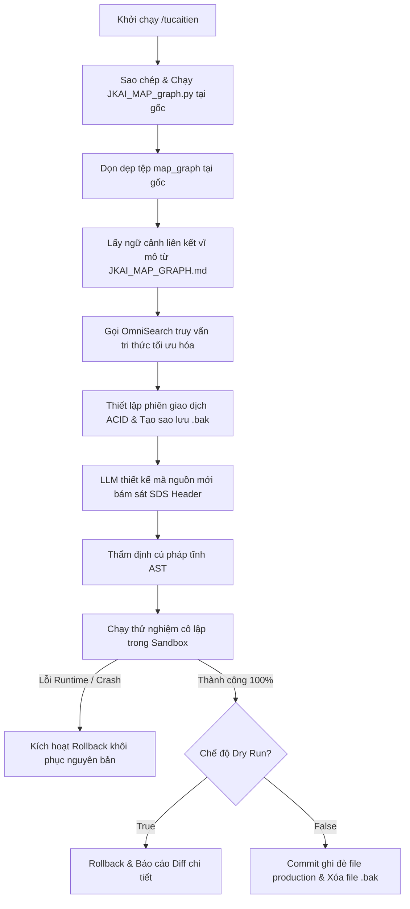

# [ZENITH FILE DIRECTIVE]
# - File: workflow.md
# - Role: Standard Operating Procedure (Workflow) for skill_tucaitien
# - Status: Optimized | Version: Zenith v6.0

## 1. Lưu Đồ Tiến Trình Nâng Cấp Hệ Thống

Tiến trình nâng cấp kỹ năng tự cải tiến tuân thủ nghiêm ngặt 5 giai đoạn khép kín nhằm bảo đảm tính toàn vẹn hệ thống:

## 2. Quy Tắc An Toàn Trung Ương

*   **Ranh giới Tác chiến**: Mọi hoạt động sửa đổi tệp tin phải được quản lý bởi `cognitive_transaction_manager` để bảo đảm tính hoàn vẹn, không cho phép sửa đổi mồ côi ngoài luồng giao dịch.
*   **Chính sách Zero-Trust**: Hộp cát Sandbox cô lập phải được áp dụng thời hạn chạy tối đa (timeout) không quá 5 giây và bị chặn đứng tuyệt đối mọi câu lệnh gọi tiến trình hệ thống trái phép từ Policy Proof Engine.
*   **Vệ sinh Hệ thống**: Bất kỳ tệp tin phụ trợ hoặc tập lệnh sinh bản đồ tạm thời nào được ghi vào thư mục gốc của dự án đều phải được đăng ký trong cấu trúc `try...finally` để dọn dẹp triệt để ngay lập tức sau khi hoàn thành công việc.
