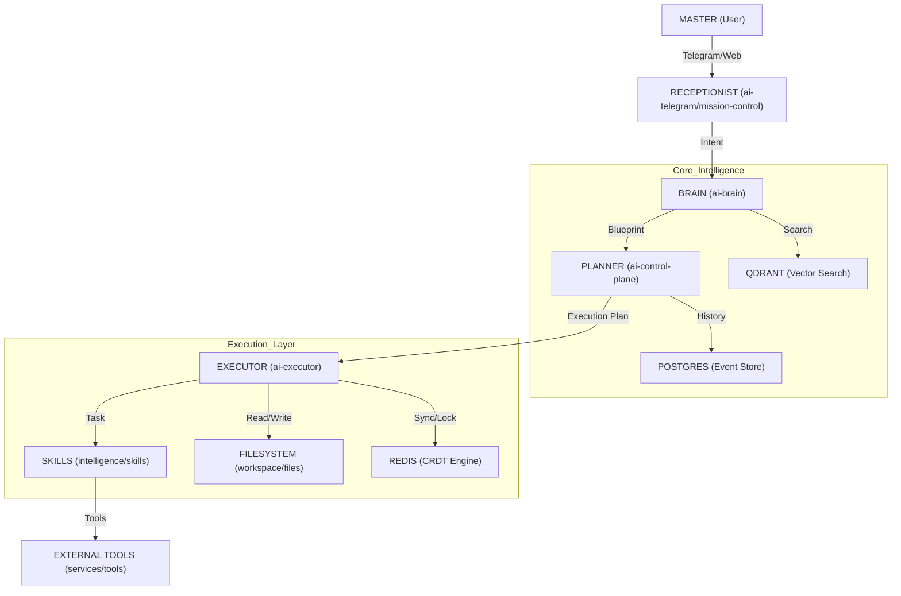

# PROJECT TOPOLOGY: JKAI Zenith OS
Generated by JKAI Neural Architect (Protocol #110)
Timestamp: 2026-05-09 06:15:00

## Visual Architecture Map

## Neural Nodes Registry
| Node ID | Type | Description |
| :--- | :--- | :--- |
| MASTER | Entity | The Supreme Operator and decision-maker. |
| RECEPTIONIST | Gateway | Entry point for communication (Telegram, Web UI). |
| BRAIN | Cortex | Central intelligence for intent analysis and recall. |
| PLANNER | Architect | Blueprint generator and strategic orchestrator. |
| EXECUTOR | Worker | Direct system interaction and code execution. |
| SKILLS | Neuron | Library of 249+ specialized capabilities. |
| QDRANT | Memory | Vector database for long-term knowledge recall. |
| REDIS | Synchronizer | CRDT Engine and distributed lock manager. |
| POSTGRES | Archive | Structured event store for mission logs. |
| MISSION-CONTROL | Interface | 3D Dashboard and system monitoring UI. |
| ZENITH-WARDEN | Security | File system protection and audit service. |

---
*Sovereign System Topology. v36.0 Universal Graph.*
