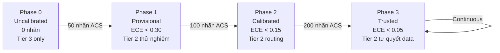

# Bộ Nguyên Tắc ACS — Autonomy Calibration Scale
### Phiên bản: v1.0 | Ngày chốt: 2026-09-28 | Tác giả: Master LeeTrung × Antigravity

---

> [!IMPORTANT]
> ACS là **thước đo chung duy nhất** cho cả Master và JKAI. Không được dùng thước đo khác để đánh giá chất lượng câu trả lời.

---

## 1. Mục đích

ACS giải quyết 1 câu hỏi cốt lõi trong tiến hóa của JKAI:

> **"Khi nào JKAI đủ tin cậy để hành động mà không cần hỏi Master?"**

Không có ACS → JKAI không biết mình đang nghĩ đúng hay sai → mãi phải hỏi Master mọi việc.  
Có ACS → JKAI so sánh tự tin của mình với thực tế → dần dần biết khi nào được tự quyết.

---

## 2. Thang Đo ACS — 3 Mức Thống Nhất

Thang này áp dụng **đồng nhất** cho cả 2 phía:
- **Master chấm** (qua LabelPad trên dashboard)
- **JKAI tự chấm** (qua AnswerQualityVerifier trước khi gửi)

| Mức | Điểm ACS | Tên | Tiêu chí |
|-----|----------|-----|----------|
| ✅ | **1.0** | **Đúng hoàn toàn** | Đáp ứng đủ cả 3 tiêu chí: Đúng + Trúng + Đủ |
| ⚠️ | **0.5** | **Chưa chuẩn** | Đúng hướng nhưng thiếu / sai 1 tiêu chí |
| ❌ | **0.0** | **Sai hoàn toàn** | Vi phạm tiêu chí cốt lõi (hallucinate / sai câu hỏi / lộ nội bộ) |

### 2.1 Định nghĩa 3 Tiêu Chí

```
ĐÚNG  — Factual correctness
        ✓ Không hallucinate (không bịa số liệu, không trích nguồn giả)
        ✓ Không lộ từ kỹ thuật nội bộ (TIER_2, circuit_breaker, shadow_telemetry...)
        ✓ Thông tin kiểm chứng được từ log / filesystem / memory thật

TRÚNG — On-point
        ✓ Trả lời đúng câu được hỏi, không lạc đề
        ✓ Không dump thông tin nội bộ không được hỏi
        ✓ Không vòng vo, không lặp nội dung vô nghĩa

ĐỦ    — Complete
        ✓ Có chào (khi response đủ dài, không phải factual reflex 1 dòng)
        ✓ Có nội dung chính
        ✓ Có bước tiếp theo khi phù hợp (không bắt buộc mọi lúc)
```

### 2.2 Quy Tắc Tổng Hợp Điểm

```
JKAI tự chấm 3 chiều → map sang ACS:

  ĐÚNG=✓  TRÚNG=✓  ĐỦ=✓   →  1.0  (Đúng hoàn toàn)
  ĐÚNG=✓  TRÚNG=✓  ĐỦ=✗   →  0.5  (Chưa chuẩn — thiếu hình thức)
  ĐÚNG=✓  TRÚNG=✗  ĐỦ=bất_kỳ → 0.5 (Chưa chuẩn — lạc đề nhẹ)
  ĐÚNG=✗  bất_kỳ             → 0.0  (Sai — hallucinate hoặc lộ nội bộ)
  ĐÚNG=✓  TRÚNG=✗  ĐỦ=✗   →  0.0  (Sai hoàn toàn về hình thức và nội dung)
```

### 2.3 Golden Examples

| Tình huống | Câu trả lời | ACS | Lý do |
|-----------|-------------|-----|-------|
| "Hôm nay thứ mấy?" | "Chào Master, hôm nay là Thứ Tư." | 1.0 | Đúng + Trúng + Đủ |
| "Redis có chạy không?" | "Redis đang Online. 3 container healthy." | 1.0 | Đúng + Trúng (factual reflex, greeting không bắt buộc) |
| "Phân tích file X" | "Xin chào, file X có 3 sheet..." *(không có kết luận)* | 0.5 | Thiếu bước tiếp theo |
| "Hôm nay thứ mấy?" | "Theo nghiên cứu mới nhất, hôm nay..." | 0.0 | Hallucinate marker |
| "Kiểm tra lỗi" | "TIER_2_LOCAL_EMULATOR đã từ chối..." | 0.0 | Lộ từ nội bộ |

---

## 3. Hai Nguồn Dữ Liệu ACS

```
┌─────────────────────────────────────────────────────────┐
│                                                         │
│  Câu trả lời JKAI                                      │
│         │                                               │
│    ┌────┴──────────────────┐                           │
│    │                       │                           │
│    ▼                       ▼                           │
│  JKAI tự chấm          Master chấm                    │
│  AnswerQualityVerifier  LabelPad (dashboard)           │
│  (< 2ms, rule-based)    (bấm ✅ ⚠️ ❌)                │
│    │                       │                           │
│    └──────────┬────────────┘                           │
│               │                                         │
│               ▼                                         │
│    labeled_telemetry.jsonl                             │
│    { acs_self: 0.9, acs_master: 1.0 }                 │
│               │                                         │
│               ▼                                         │
│         Tính ECE                                        │
│  gap(acs_self, acs_master) → độ tin cậy                │
│                                                         │
└─────────────────────────────────────────────────────────┘
```

### 3.1 Schema Telemetry (v2.0)

```json
{
  "schema_version": "2.0",
  "record_id": "web_<10hex>",
  "log_id": "<AgentLog.id>",
  "task_id": "<string|null>",
  "timestamp_utc": "ISO8601",

  "acs_master": 1.0,
  "acs_self": 0.85,
  "acs_verdict_master": "CORRECT",
  "acs_verdict_self": "CORRECT",

  "quality_dimensions": {
    "dung": { "passed": true, "score": 1.0, "issues": [] },
    "trung": { "passed": true, "score": 1.0, "issues": [] },
    "du": { "passed": false, "score": 0.75, "issues": ["Thiếu greeting"] }
  },

  "msg_preview": "<200 chars>",
  "notes": "",
  "labeled_by": "Master",
  "source": "web_ui"
}
```

---

## 4. Calibration — ECE & Autonomy Gates

### 4.1 ECE (Expected Calibration Error)

```
ECE = mean |acs_self - acs_master| trên N mẫu

ECE = 0.00  → JKAI đánh giá bản thân hoàn hảo
ECE = 0.15  → sai lệch trung bình 15 điểm → ngưỡng routing nội bộ
ECE = 0.30  → sai lệch nghiêm trọng → cần recalibrate
```

### 4.2 Autonomy Gates — Cổng mở khóa tự chủ

```
Số nhãn   ECE          Trạng thái Tier 2        Hành động được phép
─────────────────────────────────────────────────────────────────────
0–49      N/A          🔴 UNCALIBRATED          Tier 3 only. Hỏi Master mọi việc.
50–99     < 0.30       🟡 PROVISIONAL           Tier 2 thử nghiệm nội bộ, không tự quyết.
100–199   < 0.15       🟢 CALIBRATED            Tier 2 mở cho routing nội bộ thường.
200+      < 0.05       🔵 TRUSTED               Tier 2 mở cho quyết định ảnh hưởng file/data.
```

> [!WARNING]
> Autonomy Gate **chỉ mở**, không tự đóng. Nếu ECE tăng đột biến sau batch nhãn mới → cần Master review thủ công.

### 4.3 Lịch Recalibration

| Trigger | Hành động |
|---------|----------|
| Mỗi 50 nhãn mới | Tính lại ECE, log vào `calibration_log.jsonl` |
| ECE tăng > 0.05 so với lần trước | Cảnh báo Master trên dashboard |
| Model Tier 2 thay đổi (upgrade Ollama) | Reset về PROVISIONAL, recalibrate |

---

## 5. Lộ Trình Tiến Hóa



### Hiện trạng: **Phase 0** — 0 nhãn thật, ECE = N/A

---

## 6. Kiến Trúc Kỹ Thuật

```
core/os/cognition/
  answer_quality_verifier.py   ← JKAI tự chấm ACS (3 chiều → 1 điểm)
  epistemic_auditor.py         ← Kiểm tra nội dung (scope, coverage) — song song

services/mission-control/
  backend/api/tasks.py         ← POST /api/label_log (Master chấm)
  frontend/src/components/
    zenith/LabelPad.tsx        ← UI 3 nút ✅ ⚠️ ❌

storage/shadow_telemetry/
  labeled_telemetry.jsonl      ← Dữ liệu ground truth (schema v2.0)
  archive_test/                ← Data test — không dùng để calibrate

docs/adr/
  ADR-0003-confidence-policy.md ← ECE thresholds & governance
  ADR-0004-acs-protocol.md      ← (file này)
```

---

## 7. Quy Tắc Quản Trị (Governance)

### Bất biến — không ai được thay đổi trừ Master
1. Định nghĩa 3 mức (1.0/0.5/0.0) và 3 tiêu chí (ĐÚNG/TRÚNG/ĐỦ)
2. Ngưỡng ECE để mở từng Autonomy Gate
3. Schema telemetry (thêm trường được, xóa/đổi trường phải có ADR mới)

### JKAI được tự chỉnh (không cần hỏi Master)
1. Regex pattern phát hiện từ nội bộ (thêm pattern mới)
2. Ngưỡng phụ trong AnswerQualityVerifier (VERBOSE_THRESHOLD, GREETING_MIN_LEN)
3. Tần suất recalibration (sớm hơn = an toàn hơn)

### Cấm tuyệt đối
- Tự nâng Autonomy Gate mà không đủ nhãn / ECE
- Dùng data từ `archive_test/` để tính ECE
- Thay đổi `acs_master` sau khi Master đã chấm

---

## 8. Câu Hỏi Còn Mở (Chờ Master quyết định)

| # | Câu hỏi | Mặc định hiện tại |
|---|---------|------------------|
| 1 | ECE ngưỡng Phase 3 có nên thấp hơn 0.05 cho quyết định tài chính? | 0.05 |
| 2 | Khi Master chấm 0.5, có cần ghi lý do cụ thể không? | Không bắt buộc |
| 3 | Tần suất xem lại calibration: mỗi 50 hay mỗi 25 nhãn? | Mỗi 50 |

---

*ACS v1.0 — Được Master LeeTrung phê duyệt ngày 2026-09-28*
