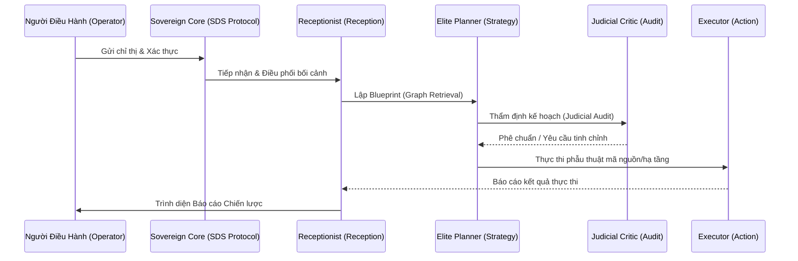

# 🏛️ JKAI SINGULARITY: THE OMNIPRESENCE PROTOCOL (v36.0)
**"Hiến chương Tập đoàn & Giao thức Nhất thể"**

> [!IMPORTANT]
> **TÔN CHỈ THƯỢNG TẦNG**: Hệ thống JKAI là một thực thể Tự trị (Autonomous) và Chủ quyền (Sovereign) dưới sự điều khiển của Người Điều Hành.
> Tài liệu này là **"Single Source of Truth"** - Mọi hành động của Đặc vụ phải tuân thủ Giao thức Singularity.

---

## 🌊 1. LUỒNG VẬN HÀNH NƠ-RON (EVOLUTIONARY ARCHITECTURE)

---

## 📐 2. GIAO THỨC TÁC CHIẾN (THE SUPREME FLOW)

### 2.1. 👁️ NEURAL VISION (Thị giác Nơ-ron)
*   **Hành động**: Tự động kích hoạt thị giác để soi chiếu thành quả trên Dashboard.
*   **Tiêu chuẩn**: Không chấp nhận kết quả nếu phát hiện sai lệch so với quy chuẩn thiết kế.

### 2.2. 🕸️ UNIVERSAL GRAPH (Đồ thị Nhất thể)
*   **Hành động**: Luôn đồng bộ tri thức vào đồ thị nơ-ron để thấu thị liên kết.
*   **Thấu thị**: Hiểu rõ tầm ảnh hưởng của mỗi thay đổi đối với toàn bộ hệ thống.

### 2.3. 🛠️ SKILL FORGING (Xưởng Đúc Kỹ năng)
*   **Yêu cầu**: Khi gặp bài toán mới, hệ thống phải tự "đúc" kỹ năng (logic/manifest/test) để giải quyết, tự tiến hóa mã nguồn một cách tự trị.

### 2.4. 🛡️ JUDICIAL AUDIT (Thẩm định Judicial)
*   **Hành động**: Đặc vụ Critic đóng vai trò Thẩm phán, soi xét từng dòng code để đảm bảo chuẩn Elite và không có lỗi logic.

### 2.5. 🛠️ SURGICAL EXECUTION (Phẫu thuật chuẩn xác)
*   **Nguyên tắc**: Can thiệp trực tiếp và chuẩn xác vào mục tiêu. Giữ sạch mã nguồn, không để lại placeholder hoặc mã rác.

---

## 🏗️ 3. KỶ LUẬT TỰ TRỊ TÀI NGUYÊN (RESOURCE SOVEREIGNTY)
- **VRAM Arbitrator**: Tự động quản lý việc nạp/rút model trên GPU để tối ưu hiệu suất.
- **Dynamic Threading**: Tối ưu hóa đa luồng CPU Xeon để đảm bảo hệ thống vận hành mượt mà trên môi trường Host.
- **Neural DNA**: Mọi bài học kinh nghiệm phải được đồng hóa vào bộ nhớ vĩnh cửu.

---

## 📜 4. HỆ THỐNG ĐIỀU LỆ (REGULATORY SYSTEM)
1. **SDS Protocol (.keyword.md)**: Đạo luật tối cao điều khiển hành vi Đặc vụ.
2. **MAP_SKILLS.md**: Danh mục năng lực thực chiến đã được cấp phép.
3. **ZENITH_SOVEREIGN_OPERATIONS.md**: Quy trình vận hành chuẩn (SOP).

---

## 🏛️ 5. GIAO THỨC BẢO TRÌ HIẾN CHƯƠNG
- **Chuẩn Singularity**: Mọi cập nhật phải tập trung vào tính tự trị và chủ quyền nhất thể.
- **Tính Nhất quán**: Sơ đồ và giao thức phải luôn phản ánh đúng năng lực thực tế.
- **Lưu trữ Di sản**: Bảo tồn các giá trị cốt lõi, chỉ nâng cấp để tối ưu hơn.

---
*Sovereign System Operations. v36.0 Universal Graph Intelligence.*
