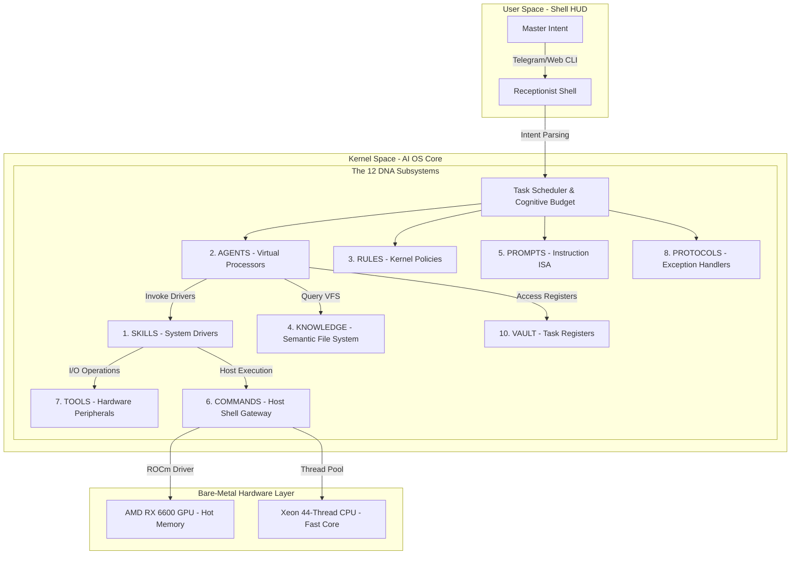

# 🏛️ ZENITH 12 PILLARS DNA: THE ARCHITECTURAL SOUL v51.0
**"Giải Phẫu 12 Phân Khu Subsystems Của Hệ Điều Hành Trí Tuệ (AI OS)"**

> [!IMPORTANT]
> **ĐỊNH NGHĨA HỆ THỐNG**: 12 Trụ cột DNA không còn là các thư mục dữ liệu tĩnh, mà là **12 Phân khu Hệ thống (System Subsystems)** tạo nên lõi của AI OS. Mọi tài nguyên, tiến trình và luồng điều khiển trong Kernel Space đều được phân bổ và đối chiếu qua 12 Subsystems này để bảo toàn sự nhất quán tối cao.

---

---

## 🏗️ 12 PHÂN KHU HỆ THỐNG (THE 12 AI-OS SUBSYSTEMS)

### 🧬 1. SKILLS: SYSTEM DRIVERS (Trình Điều Khiển Hệ Thống)
*   **Bản chất**: Tập hợp các driver thực thi được đóng gói dưới dạng Python Classes (`tools/` và `skills/`).
*   **Vai trò**: Cung cấp năng lực tác chiến thực tế (Surgical Code Editing, OSINT, Web Scraper, Data Parser).
*   **Giao thức**: Được quản lý động bởi `registry.json` và liên kết qua `NEURAL_LINK_BRIDGE.json`.

### 🧠 2. AGENTS: VIRTUAL PROCESSORS (Bộ Vi Xử Lý Ảo)
*   **Bản chất**: Các luồng đặc vụ (Personas) được gán gán mô hình (Model Binding) phù hợp.
*   **Vai trò**: Hoạt động như các ALU và Bộ giải mã lệnh:
    *   **Planner**: Instruction Decoder (Bộ giải mã siêu kế hoạch).
    *   **Executor**: ALU (Bộ thực thi mã nguồn).
    *   **Critic**: Judicial/Audit Unit (Bộ thẩm định kết quả).
*   **Giao thức**: Khởi tạo tiến trình song song, phân phối tải trọng dựa trên mức tiêu hao VRAM.

### ⚖️ 3. RULES: KERNEL POLICIES (Quy Chế Nhân Hệ Thống)
*   **Bản chất**: Các chính sách thép và hiến chương vận hành hệ thống (`.clinerules`, `.keywork.md`).
*   **Vai trò**: Định vị ranh giới hoạt động, kiểm soát lỗi và áp đặt ngôn phong Elite Executive.
*   **Giao thức**: Kernel tự động đối chiếu các hành động của AI với RULES trước khi ghi lên đĩa cứng.

### 📚 4. KNOWLEDGE: SEMANTIC FILE SYSTEM / VFS (Hệ Tập Tin Ngữ Nghĩa)
*   **Bản chất**: Cơ sở dữ liệu tri thức Vector (Qdrant Virtual File System) và Obsidian Knowledge Graph.
*   **Vai trò**: Lưu trữ tri thức nền tảng và bản vẽ kiến trúc. Cho phép truy tìm dữ liệu qua cơ chế Semantic Search thay vì dùng đường dẫn vật lý thô.
*   **Giao thức**: Tự động đồng hóa tài liệu ngoại lai thành các Node tri thức có liên kết.

### ✍️ 5. PROMPTS: INSTRUCTION SET ARCHITECTURE / ISA (Kiến Trúc Tập Lệnh)
*   **Bản chất**: Hệ thống khuôn mẫu nạp nơ-ron và Engine đúc động Prompt Forge.
*   **Vai trò**: Định hình "tập lệnh" tư duy cho từng đặc vụ theo thời gian thực.
*   **Giao thức**: Biên dịch động `base_soul` + `user_profile` + `dynamic_memory` thành hệ chỉ thị trước khi gọi LLM API.

### ⌨️ 6. COMMANDS: HOST HYPERVISOR GATEWAY (Cổng Giao Tiếp Máy Chủ)
*   **Bản chất**: Lớp CLI kết nối trực tiếp với Windows/Docker Hypervisor.
*   **Vai trò**: Cho phép AI OS thực thi lệnh Terminal thực tế để can thiệp hạ tầng, Docker containers và tệp tin vật lý.
*   **Giao thức**: Luôn yêu cầu kiểm tra cú pháp và rà soát an ninh trước khi đẩy ra Shell.

### 🛠️ 7. TOOLS: EXTERNAL I/O PERIPHERALS (Giao Diện Thiết Bị Ngoại Vi)
*   **Bản chất**: Các API kết nối ngoại vi (Tavily Search, GitHub API, Redis Channel).
*   **Vai trò**: Đóng vai trò như các cổng kết nối USB/PCIe của AI OS để tương tác với Internet.
*   **Giao thức**: Được triệu hồi trực tiếp bởi các Skills Drivers.

### 🛡️ 8. PROTOCOLS: EXCEPTION HANDLERS (Hệ Thống Phản Xạ & Miễn Dịch)
*   **Bản chất**: Giao thức tự chữa lành (Self-Healing) và xác thực (SHA-512/SSL).
*   **Vai trò**: Quét dọn lỗi runtime, ngăn chặn mã độc, tự động phẫu thuật phục hồi Kernel khi gặp crash.
*   **Giao thức**: Kích hoạt bộ quét State-Aware Parser v2.5 để xử lý cú pháp lỗi thời gian thực.

### 📈 9. TRAINING: KERNEL MLC / COMPILER (Trình Tự Học & Biên Dịch)
*   **Bản chất**: Chu trình thu thập lỗi (Failure Memory) và chắt lọc kinh nghiệm (Knowledge Distillation).
*   **Vai trò**: Tinh luyện trọng số tư duy của các đặc vụ sau mỗi phiên làm việc.
*   **Giao thức**: Chạy tác vụ nền (background daemon) gom góp logs và xuất bản đồ tri thức mới.

### 🔒 10. VAULT: TASK REGISTERS / L1 CACHE (Bộ Nhớ Đệm Tác Vụ)
*   **Bản chất**: Bộ nhớ RAM/VRAM cache ngắn hạn và thông tin phiên (`dynamic_memory.md`).
*   **Vai trò**: Giống như các thanh ghi L1/L2 Cache của CPU, lưu giữ trạng thái chạy dở của các tiến trình, token budget hiện tại và các chỉ thị tức thời.
*   **Giao thức**: Tự động xóa sạch (flush) khi tiến trình kết thúc an toàn.

### 🏛️ 11. ARCHIVE: SYSTEM REGISTRY LOG & VERSION CONTROL (Bản Ghi Tiến Hóa)
*   **Bản chất**: Nhật ký tiến hóa `GLOBAL_SYSTEM_CONTEXT.md` và Obsidian 3D Graph.
*   **Vai trò**: Bảo preservation di sản phát triển của AI OS, làm bằng chứng để so sánh sự tiến hóa qua các thế hệ.
*   **Giao thức**: Tự động ghi nhận log Delta sau mỗi phiên làm việc được Master duyệt.

### 🦾 12. HARDWARE: BARE-METAL PHYSICAL LAYER (Hạ Tầng Vật Lý)
*   **Bản chất**: Hạ tầng phần cứng Xeon E5-2699 v4 CPU + AMD RX 6600 GPU.
*   **Vai trò**: Phần xác vật lý cung cấp sức mạnh tính toán thô cho toàn bộ hệ điều hành.
*   **Giao thức**: Theo dõi nhiệt độ, tốc độ quạt và lượng tiêu thụ bộ nhớ thông qua `Neural Pulse`.

---

## 🔄 CHU KỲ VÒNG ĐỜI TIẾN TRÌNH CỦA AI OS
Khi Master gửi tín hiệu mệnh lệnh từ **User Space**:
1.  **PROMPTS (#5)** nạp tập lệnh tư duy nền tảng.
2.  **RULES (#3)** áp đặt chính sách bảo mật và ranh giới.
3.  **AGENTS (#2)** phân luồng các đặc vụ ảo gán cho CPU/GPU core thích hợp.
4.  **SKILLS (#1)** kích hoạt trình điều khiển driver phù hợp để tác chiến.
5.  **TOOLS (#7) & COMMANDS (#6)** thực thi tương tác vật lý (I/O, CLI).
6.  **PROTOCOLS (#8)** kiểm soát lỗi cú pháp thông qua `State-Aware Parser`.
7.  **VAULT (#10) & ARCHIVE (#11)** ghi nhận kết quả thực thi và đóng tiến trình.

---
*Sovereign System Operations. v51.0 Universal Graph Intelligence. AI OS Blueprint.*
