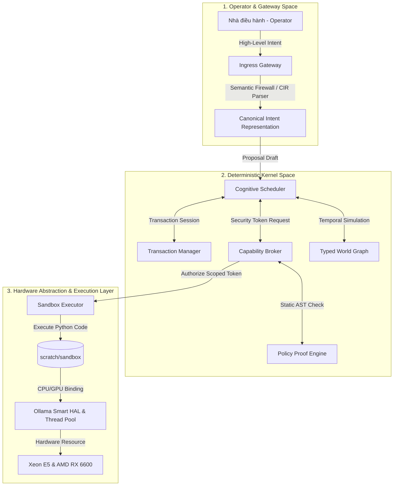

<!-- 
[ZENITH FILE DIRECTIVE]
- File: SUPREME_TRINITY.md
- Role: Zenith Intelligence Documentation.
- Ownership: Mr LeeTrung
- Status: Active | Version: SDS v19.9
[WORKING PRINCIPLES]:
1. [HEADER-FIRST]: Antigravity BAT BUOC phai doc khoi header nay truoc khi thao tac.
2. [SDS-COMPLIANCE]: Moi thay doi phai tuan thu Giao thuc SDS moi nhat.
3. [NO-EMOJI]: Cam dung emoji trong noi dung tep cau hinh va logic.
-->
# 🏛️ JKAI ZENITH: BA PHÂN TẦNG KIẾN TRÚC HỆ THỐNG (ZENITH ARCHITECTURAL TRIAD v5.0 Elite)
**"Đặc tả phân tách quyền lực và ranh giới an toàn của Hệ thống điều phối Nhận thức"**

> [!IMPORTANT]
> **TIÊU CHUẨN KIẾN TRÚC**: Tài liệu này đặc tả ba phân tầng vận hành cốt lõi chi phối mọi hoạt động, luồng xử lý dữ liệu và hành vi tự trị của **JKAI Zenith v5.0 Elite**. 
> Sự bóc tách nghiêm ngặt giữa Không gian Người dùng (Operator Space), Nhân Hệ thống (Kernel Space) và Tầng trừu tượng phần cứng (HAL) là nguyên tắc sống còn bảo đảm tính bảo mật Zero-Trust và độ ổn định của hệ thống.

---

---

## 💻 1. Phân Tầng 1: Operator & Gateway Space (Không Gian Ý Định)
*   **Định vị phân tầng**: **Operator Space (Không gian Người dùng)** – Nơi tiếp nhận ý định, mệnh lệnh và mục tiêu chiến lược vĩ mô từ Nhà điều hành (Operator) thông qua cổng Telegram Shell, HUD Web Dashboard hoặc REST API.
*   **Nguyên tắc vận hành**:
    *   **Proactive Analysis & Alignment**: Hệ thống không vận hành thụ động. Khi nhận được một chỉ thị thô từ Operator, cổng `Receptionist Shell` thực hiện phân tích đa tầng (Intent Parsing) để đối chiếu bối cảnh lịch sử, ước lượng ngân sách nhận thức (`Cognitive Budget`) cần thiết và đưa ra dự báo về kết quả trước khi chuyển tiếp yêu cầu vào nhân hệ thống.
    *   **Sự bất biến của quyền kiểm duyệt**: Không một câu lệnh thô nào từ phía Operator được phép chuyển thẳng vào shell hệ thống mà không đi qua bộ lọc an ninh.
    *   **Semantic Firewall (Tường lửa Ngữ nghĩa)**: Chặn đứng mọi đòn Prompt Injection, Jailbreak ngay tại lớp biên thô để bảo vệ an toàn cho các phân tầng bên dưới.

---

## ⚙️ 2. Phân Tầng 2: Deterministic Kernel Space (Nhân Điều Khiển Định Tính)
*   **Định vị phân tầng**: **Kernel Space (Không gian Nhân)** – Nơi thực thi các thuật toán điều phối, lập lịch, kiểm soát quyền hạn và lưu trữ trạng thái bất biến của hệ thống.
*   **Nguyên tắc vận hành**:
    *   **Tính định tính tuyệt đối (Deterministic)**: Toàn bộ Không gian Nhân được xây dựng hoàn toàn bằng mã nguồn Python tĩnh và các luật kiểm chứng bất biến (formal invariants). Tuyệt đối không tích hợp hay phụ thuộc vào bất kỳ mô hình xác suất nào (LLMs) trong việc đưa ra quyết định chuyển đổi trạng thái hệ thống.
    *   **Cognitive Scheduler & Goal Stack**: Lập lịch và phân rã các chỉ thị từ Operator Space thành ngăn xếp mục tiêu có thứ tự ưu tiên rõ ràng (Goal Stack). Máy trạng thái vòng đời của tiến trình được quản lý chặt chẽ tại đây.
    *   **Capability Broker & Policy Proof Engine**: Kiểm toán an ninh tĩnh và cấp phát thẻ năng lực (`CapabilityToken`) quy định cụ thể phạm vi hoạt động trước khi cho phép mã nguồn can thiệp vào đĩa cứng hoặc kết nối mạng.

---

## 🦾 3. Phân Tầng 3: Hardware Abstraction & Execution (Thực Thi Cô Lập & HAL)
*   **Định vị phân tầng**: **Hardware Abstraction Layer (HAL) & Execution Space** – Nơi chuyển hóa các tính toán logic và các chỉ thị phẫu thuật mã nguồn thành hành động vật lý trên đĩa cứng, Docker container và hạ tầng phần cứng Xeon E5-2699 v4 CPU & GPU AMD RX 6600.
*   **Nguyên tắc vận hành**:
    *   **Sandbox Executor (Shadow Clone)**: Mọi mã nguồn thực thi thử nghiệm, phẫu thuật file cấu hình hệ thống hoặc chạy kiểm thử bắt buộc phải được cô lập tuyệt đối bên trong thư mục hộp cát `scratch/sandbox` với giới hạn tài nguyên và thời gian nghiêm ngặt, cách ly hoàn toàn hệ điều hành chủ (Host OS).
    *   **Ollama Smart HAL**: Tối ưu hóa phân bổ trọng số mô hình trên VRAM. Tích hợp động cơ quản lý bộ đệm `KV Cache Class Manager` nhằm phân tầng bộ nhớ nơ-ron thành các lớp (`PINNED`, `HOT`, `WARM`, `COLD`) giúp hệ thống đạt hiệu suất song song cực cao trên tài nguyên GPU RX 6600 (8GB VRAM) giới hạn.
    *   **Homeostasis Daemon (Cân bằng Nội môi)**: Tự động đo đạc tài nguyên vật lý, tầm soát các Zombie Processes chiếm dụng bộ nhớ, tự giải phóng VRAM và ngăn chặn sự cố tràn bộ nhớ (Out-Of-Memory) bằng cơ chế xả rác chủ động.

---

## 🛡️ Giao Thức Bảo Toàn Quy Trình Kiến Trúc
Kiến trúc ba phân tầng là bất khả xâm phạm. Nếu bất kỳ một tiến trình tự chỉnh sửa mã nguồn (`Self-Surgery`) hay đề xuất nào từ lớp nhận thức có hành vi vi phạm ranh giới hoặc cố tình leo thang đặc quyền để vượt rào từ Sandbox vào thẳng máy chủ Host:
1. `PolicyProofEngine` và `CapabilityBroker` sẽ lập tức thu hồi token thực thi.
2. Trạng thái lỗi an ninh nghiêm trọng sẽ được ghi nhận vào `Event Ledger SQLite`.
3. Hệ thống kích hoạt trạng thái **Panic Mode** bảo an, đóng băng tài nguyên đĩa cứng ở chế độ chỉ đọc (Read-only) và phát tín hiệu báo động khẩn cấp về phía Operator.

---
*Architectural Triad Spec. v5.0 Elite. System Separation of Powers. Designed for Industrial Safety.* 🏛️⚙️🛡️
