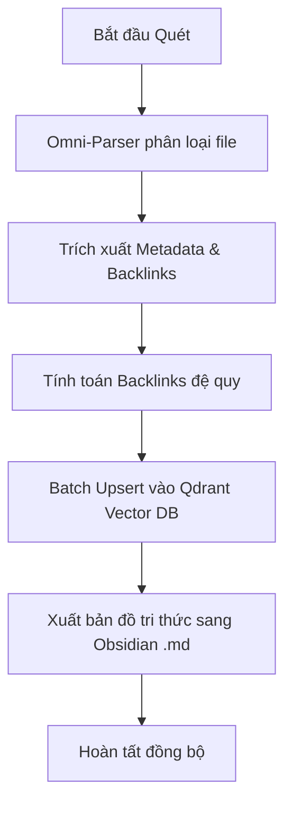

# Universal Graph & Omni-Parser (skill_universal_graph)

## 🌟 TỔNG QUAN
# 🕸️ Kỹ năng: Universal Graph & Omni-Parser
**ID**: `skill_universal_graph`
**Type**: `CORE`

## 1. Giới thiệu
Kỹ năng này cho phép hệ thống "thấu thị" cấu trúc nơ-ron của chính mình thông qua việc xây dựng một Đồ thị Tri thức Nhất thể. Nó sử dụng bộ quét `Omni-Parser` để phân tích các tệp tin đa định dạng và tạo ra các liên kết ngữ nghĩa giữa chúng.

## 2. Luồng thực thi (Workflow)

## 3. Đầu vào (Inputs)
- `directories`: (Optional) Danh sách các thư mục cần quét.
- `obsidian_vault`: (Optional) Đường dẫn tới kho Obsidian để xuất file.

## 4. Đầu ra (Outputs)
- `stats`: Thống kê số lượng node đã quét và liên kết đã tạo.
- `status`: Trạng thái thành công/thất bại.

## 5. Ứng dụng
- Giúp hệ thống hiểu được tầm ảnh hưởng của một tệp tin thông qua số lượng backlinks.
- Cung cấp bối cảnh cấu trúc (Structural Context) cho các truy vấn RAG.
- Cho phép Người Điều Hành quan sát "bộ não" hệ thống qua Obsidian 3D Graph View.

## 🛠️ PHÁC ĐỒ VẬN HÀNH (OPERATIONAL PROTOCOL)
### 🔍 Phase 1: Investigation (Thẩm định)
- Xác minh tham số đầu vào dựa trên Schema.
- Kiểm tra bối cảnh hệ thống liên quan.

### 🚀 Phase 2: Action (Thực thi)
- Triệu hồi logic thực thi trong `logic.py`.
- Trả về kết quả và chắt lọc kinh nghiệm.

---
## ⚠️ SAI LẦM THƯỜNG GẶP (COMMON PITFALLS)
- Chưa ghi nhận.

---
*TRUNG THÀNH - CHÍNH XÁC - TỐI THƯỢNG* 💎🦾
